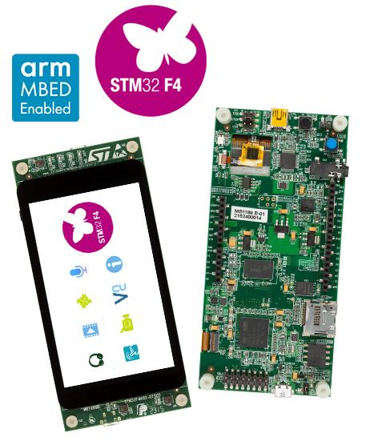

# STM32F469-ST-DISCO 开发板 BSP 说明

## 简介

本文档是石河子大学陈庭伟同学为 STM32F469-ST-DISCO 开发板提供的 BSP (板级支持包) 说明。

主要内容如下：

- 开发板资源介绍
- BSP 快速上手
- 进阶使用方法

通过阅读快速上手章节开发者可以快速地上手该 BSP，将 RT-Thread 运行在开发板上。在进阶使用指南章节，将会介绍更多高级功能，帮助开发者利用 RT-Thread 驱动更多板载资源。

## 开发板介绍

STM32F469-ST-DISCO 是 ST 推出的一款基于 ARM Cortex-M4 内核的开发板，最高主频为 180Mhz，该开发板具有丰富的板载资源，可以充分发挥 STM32F469 的芯片性能。

开发板外观如下图所示：



该开发板常用 **板载资源** 如下：

- MCU：STM32F469NIH6U，主频 180MHz，2048KB FLASH ，384KB (包含64KB 的 CCM) RAM
- 外部 RAM：型号25Q128A，16MB
- 外部 FLASH：型号7LL12D9NOR，16MB
- 常用外设
  - LED：4个，LD1（绿色，PG6），LD2（橙色，PD4），LD3（红色，PD5），LD4（蓝色，PK3）
  - 按键：1个，USER（兼具唤醒功能，PA0）
  - LCD：4寸800×480TFT屏
  - 音频：SAI音频DAC
- 常用接口：Arduino UNO V3 接口、MicroSD 卡接口、音频接口、LCD 接口、I2C 接口等
- 调试接口，板载的 ST-LINK/V2-1 SWD 下载

开发板更多详细信息请参考 ST 的 [STM32F469-ST-DISCO 开发板介绍](https://www.st.com/content/st_com/en/products/evaluation-tools/product-evaluation-tools/mcu-mpu-eval-tools/stm32-mcu-mpu-eval-tools/stm32-discovery-kits/32f469idiscovery.html)。

## 外设支持

本 BSP 目前对外设的支持情况如下：

| **板载外设** | **支持情况** | **备注** |
| :-----: | :-----: | :-----: |
| SDRAM  | 支持 | 16MB |
| LCD | 支持 | MIPI屏，otm8009a |
| SDCARD | 支持 | 支持热插拔，插拔检测间隔为200ms |
| TOUCH | 支持 | ft6206 |
| **片上外设** | **支持情况** | **备注** |
| GPIO  | 支持 |  |
| USART | 支持 | USART3 |
| SPI | 支持 | SPI3 |
| QSPI | 支持 |  |
| I2C | 支持 | 软件I2C |
| FLASH | 支持 | 已适配 [FAL](https://github.com/RT-Thread-packages/fal) |
| SDIO | 支持 |  |
| USB Device | 支持 |  |
| **扩展模块** | **支持情况** | **备注** |
| 暂无 | 暂不支持 | 暂不支持 |

## 使用说明

使用说明分为如下两个章节：

- 快速上手

    本章节是为刚接触 RT-Thread 的新手准备的使用说明，遵循简单的步骤即可将 RT-Thread 操作系统运行在该开发板上，看到实验效果 。

- 进阶使用

    本章节是为需要在 RT-Thread 操作系统上使用更多开发板资源的开发者准备的。通过使用 ENV 工具对 BSP 进行配置，可以开启更多板载资源，实现更多高级功能。


### 快速上手

本 BSP 为开发者提供 MDK4、MDK5 和 IAR 工程，并且支持 GCC 开发环境。下面以 MDK5 开发环境为例，介绍如何将系统运行起来。

#### 硬件连接

使用数据线连接开发板到 PC，打开电源开关。

#### 编译下载

双击 project.uvprojx 文件，打开 MDK5 工程，编译并下载程序到开发板。

> 工程默认配置使用 st-link 仿真器下载程序，在通过 st-link 连接开发板的基础上，点击下载按钮即可下载程序到开发板

#### 运行结果

下载程序成功之后，系统会自动运行，LED (LD1，绿色) 闪烁。

连接开发板对应串口到 PC , 在终端工具里打开相应的串口（115200-8-1-N），复位设备后，可以看到 RT-Thread 的输出信息:

```bash
 \ | /
- RT -     Thread Operating System
 / | \     4.0.1 build Apr  9 2019
 2006 - 2019 Copyright by rt-thread team
msh >
```
### 进阶使用

此 BSP 默认只开启了 GPIO 和 串口3 的功能，如果需使用 SD 卡、Flash 等更多高级功能，需要利用 ENV 工具对BSP 进行配置，步骤如下：

1. 在 bsp 下打开 env 工具。

2. 输入`menuconfig`命令配置工程，配置好之后保存退出。

3. 输入`pkgs --update`命令更新软件包。

4. 输入`scons --target=mdk4/mdk5/iar` 命令重新生成工程。

本章节更多详细的介绍请参考 [STM32 系列 BSP 外设驱动使用教程](../docs/STM32系列BSP外设驱动使用教程.md)。

## 注意事项

- STM32F469NIH6U 这款芯片，RAM大小为 384KB，但是这 384KB 中有 64KB 是 CCM data RAM。在修改 `board.h` 文件和链接脚本文件的时候不能以 384KB 来配置，而应该以 (384 - 64)KB 即 320KB 来配置。
- 在 STM32CubeMX 软件中配置 USART3 时候，引脚要映射为 PB10 和 PB11。

## 联系人信息

维护人:

-  [WillianChan](https://github.com/willianchanlovegithub)

