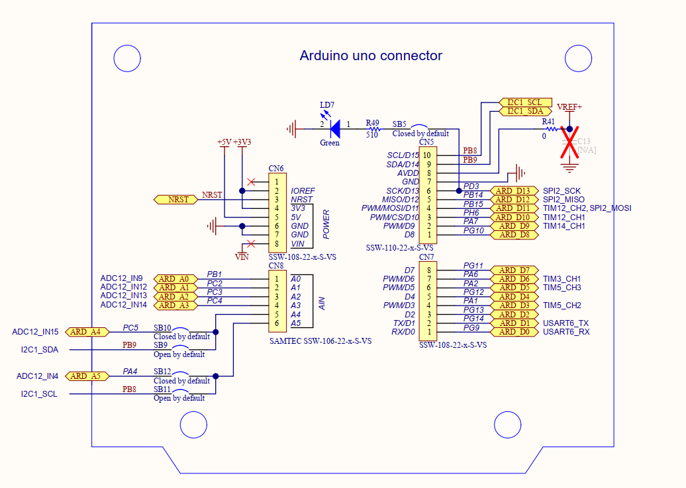

# STM32F469 Discovery开发板的Arduino生态兼容说明

[English](README.md) | **中文**

## 1 RTduino - RT-Thread的Arduino生态兼容层

STM32F469 Discovery开发板已经完整适配了[RTduino软件包](https://github.com/RTduino/RTduino)，即RT-Thread的Arduino生态兼容层。用户可以按照Arduino的编程习惯来操作该BSP，并且可以使用大量Arduino社区丰富的库，是对RT-Thread生态的极大增强。更多信息，请参见[RTduino软件包说明文档](https://github.com/RTduino/RTduino)。

### 1.1 如何开启针对本BSP的Arduino生态兼容层

Env 工具下敲入 menuconfig 命令，或者 RT-Thread Studio IDE 下选择 RT-Thread Settings：

```Kconfig
Hardware Drivers Config --->
    Onboard Peripheral Drivers --->
        [*] Compatible with Arduino Ecosystem (RTduino)
```

## 2 Arduino引脚排布



该BSP遵照Arduino UNO板的引脚排列方式，详见 [pins_arduino.c](pins_arduino.c) 和 [pins_arduino.h](pins_arduino.h)。

| Arduino引脚编号           | STM32引脚编号 | 5V容忍 | 备注                                            |
| --------------------- | --------- | ---- | --------------------------------------------- |
| 0 (D0)                | PG9       | 是    | Serial-Rx，默认被RT-Thread的UART设备框架uart3接管        |
| 1 (D1)                | PG14      | 是    | Serial-Tx，默认被RT-Thread的UART设备框架uart3接管        |
| 2 (D2)                | PG13      | 是    |                                               |
| 3 (D3)                | PA1       | 是    | PWM2-CH2，默认被RT-Thread的PWM设备框架pwm2接管           |
| 4 (D4)                | PG12      | 是    |                                               |
| 5 (D5)                | PA2       | 是    | PWM2-CH3，默认被RT-Thread的PWM设备框架pwm2接管           |
| 6 (D6)                | PA6       | 是    | PWM3-CH1，默认被RT-Thread的PWM设备框架pwm3接管           |
| 7 (D7)                | PG11      | 是    |                                               |
| 8 (D8)                | PG10      | 是    |                                               |
| 9 (D9)                | PA7       | 是    | PWM3-CH2，默认被RT-Thread的PWM设备框架pwm3接管           |
| 10 (D10)              | PH6       | 是    | PWM12-CH1，默认被RT-Thread的PWM设备框架pwm12接管         |
| 11 (D11)              | PB15      | 是    | PWM12-CH2，默认被RT-Thread的PWM设备框架pwm12接管         |
| 12 (D12)              | PB14      | 是    |                                               |
| 13 (D13, LED_BUILTIN) | PD3       | 是    | 板载用户LED1                                      |
| 14 (D14)              | PB9       | 是    | I2C-SDA，被RT-Thread的I2C设备框架i2c1总线接管            |
| 15 (D15)              | PB8       | 是    | I2C-SCL，被RT-Thread的I2C设备框架i2c1总线接管            |
| 16 (D16)              | PA0       | 是    | 板载用户按键                                        |
| 17（D17）               | PG6       | 是    | 板载用户LED2                                      |
| 18（D18）               | PD4       | 是    | 板载用户LED3                                      |
| 19（D19）               | PD5       | 是    | 板载用户LED4                                      |
| 20（D20）               | PK3       | 是    | 板载用户LED5                                      |
| A0                    | PB1       | 是    | ADC1-CH9，默认被RT-Thread的ADC设备框架adc1接管           |
| A1                    | PC2       | 是    | ADC1-CH12，默认被RT-Thread的ADC设备框架adc1接管          |
| A2                    | PC3       | 是    | ADC1-CH13，默认被RT-Thread的ADC设备框架adc1接管          |
| A3                    | PC4       | 是    | ADC1-CH14，默认被RT-Thread的ADC设备框架adc1接管          |
| A4                    | PC5       | 是    | ADC1-CH15，默认被RT-Thread的ADC设备框架adc1接管          |
| A5                    | PA4       | 是    | ADC1-CH4，默认被RT-Thread的ADC设备框架adc1接管           |
| A6                    | --        |      | 芯片内部参考电压 ADC1-CH17，默认被RT-Thread的ADC设备框架adc1接管 |
| A7                    | --        |      | 芯片内部温度 ADC1-CH16，默认被RT-Thread的ADC设备框架adc1接管   |

> 注意：
> 
> 1. 驱动舵机和analogWrite函数要选择不同定时器发生的PWM信号引脚，由于STM32的定时器4个通道需要保持相同的频率，如果采用相同的定时器发生的PWM分别驱动舵机和analogWrite，可能会导致舵机失效。

> 参考资料
> 
> 1. [STM32F469 Discovery官方资料](https://www.st.com/zh/evaluation-tools/32f469idiscovery.html#documentation)

## 3 通信

### 3.1 I2C总线

本BSP的I2C总线是板上丝印的 `SCL/D15` 和 `SDA/D14` 引脚，这两个引脚是被RT-Thread I2C设备框架接管的，不需要直接操控这两个引脚，直接引用`#include <Wire.h>`（Arduino官方I2C头文件）即可使用。

### 3.2 SPI总线

目前本BSP不支持使用Arduino的SPI功能。

### 3.3 串口

本BSP通过 `Serial.` 方法调用 `uart3` 串口设备。详见[例程](https://github.com/RTduino/RTduino/blob/master/examples/Basic/helloworld.cpp)。

### 3.4 USB虚拟串口

本BSP支持USB虚拟串口，如果需要使用，可以手动使能。详见[例程](https://github.com/RTduino/RTduino/tree/master/examples/USBSerial)。

```Kconfig
RT-Thread online packages --->
    Arduino libraries --->
        [*] RTduino: Arduino Ecological Compatibility Layer
            [*] Enable USB Serial
```
