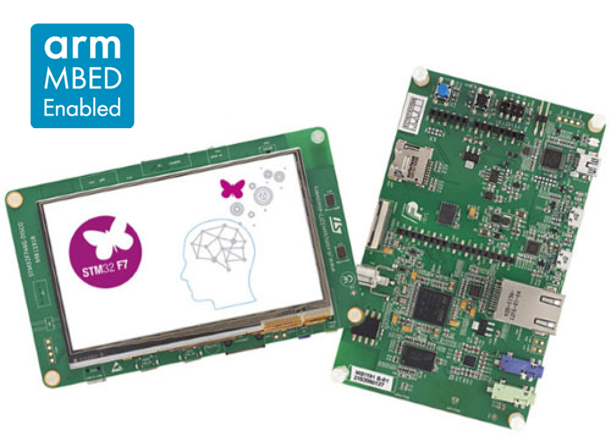

# STM32F746-st-disco 开发板 BSP 说明

## 简介

本文档为 jinsheng 为 STM32F746-disco 开发板提供的 BSP (板级支持包) 说明。

主要内容如下：

- 开发板资源介绍
- BSP 快速上手
- 进阶使用方法

通过阅读快速上手章节开发者可以快速地上手该 BSP，将 RT-Thread 运行在开发板上。在进阶使用指南章节，将会介绍更多高级功能，帮助开发者利用 RT-Thread 驱动更多板载资源。

## 开发板介绍

STM32F746-disco 是 ST 推出的一款基于 ARM Cortex-M7 内核的开发板，最高主频为 216Mhz，该开发板具有丰富的板载资源，可以充分发挥 STM32F746 的芯片性能。

开发板外观如下图所示：



该开发板常用 **板载资源** 如下：

- MCU：STM32f746，主频 216MHz，1MB FLASH ，340KB RAM
- 常用外设
  - LED：1个，LED1（绿色，PI1）
  - 按键：2个，Reset 和 User。
- 调试接口，ST-LINK/V2-1

开发板更多详细信息请参考官网 [stm32f746-disco 开发板介绍](https://www.st.com/en/evaluation-tools/32f746gdiscovery.html)。

主芯片更多详细信息请参考官网 [stm32f746 芯片资料](https://www.st.com/en/microcontrollers/stm32f746ng.html)。

## 外设支持

本 BSP 目前对外设的支持情况如下：

| **板载外设**      | **支持情况** | **备注**                              |
| :----------------- | :----------: | :------------------------------------- |
| USB 转串口   |     支持     |              UART1                  |
| QSPI Flash        |   支持    |           QSPI1                            |
| 以太网            |   支持    |            RMII                   |
| SDRAM             |  支持     |            SDRAM1                           |
| SD卡              |   支持   |            SD 4bits               |
| 4.3寸电容屏       |   支持   |            LTDC                   |
| MEMS麦克风        |   暂不支持   |                               |

| **片上外设** | **支持情况** |               **备注**                |
| :----------------- | :----------: | :------------------------------------- |
| GPIO         |     支持     |   PA0, PA1... PK7 ---> PIN: 0, 1...168 |
| UART         |     支持     |              UART1                  |
| TIMER        |     支持     |              Timer11                  |
| SPI               |  暂不支持    | 即将支持                        |
| QSPI              |  支持    | QSPI1                        |
| I2C               |  暂不支持    | 即将支持                        |
| FLASH             |  支持    |                         |
| WDT               |  支持    |                         |
| SDIO              |   支持   |                               |
| USB Device        |   暂不支持   | 即将支持                              |
| USB Host          |   暂不支持   | 即将支持                              |
| SAI               |   暂不支持   | 即将支持                              |

## 使用说明

使用说明分为如下两个章节：

- 快速上手

    本章节是为刚接触 RT-Thread 的新手准备的使用说明，遵循简单的步骤即可将 RT-Thread 操作系统运行在该开发板上，看到实验效果 。

- 进阶使用

    本章节是为需要在 RT-Thread 操作系统上使用更多开发板资源的开发者准备的。通过使用 ENV 工具对 BSP 进行配置，可以开启更多板载资源，实现更多高级功能。


### 快速上手

本 BSP 为开发者提供 MDK4、MDK5 和 IAR 工程，并且支持 GCC 开发环境。下面以 MDK5 开发环境为例，介绍如何将系统运行起来。

#### 硬件连接

使用数据线连接开发板到 PC，打开电源开关。

#### 编译下载

双击 project.uvprojx 文件，打开 MDK5 工程，编译并下载程序到开发板。

> 工程默认配置使用 st-link 仿真器下载程序，在通过 st-link 连接开发板的基础上，点击下载按钮即可下载程序到开发板

#### 运行结果

下载程序成功之后，LED 闪烁。

连接开发板对应串口到 PC ，在终端工具里打开相应的串口（115200-8-1-N），复位设备后，可以看到 RT-Thread 的输出信息:

```bash
 \ | /
- RT -     Thread Operating System
 / | \     4.0.0 build Jan 30 2019
 2006 - 2018 Copyright by rt-thread team
msh >
```

### 进阶使用

此 BSP 默认只开启了 GPIO 和 串口1 的功能，更多高级功能，需要利用 ENV 工具对 BSP 进行配置，步骤如下：

1. 在 bsp 下打开 env 工具。

2. 输入 `menuconfig` 命令配置工程，配置好之后保存退出。

3. 输入 `pkgs --update` 命令更新软件包。

4. 输入 `scons --target=mdk4/mdk5/iar` 命令重新生成工程。

本章节更多详细的介绍请参考 [STM32 系列 BSP 外设驱动使用教程](../docs/STM32系列BSP外设驱动使用教程.md)。

## 注意事项

暂无

## 联系人信息

维护人:
- [jinsheng](https://github.com/jinsheng20)
