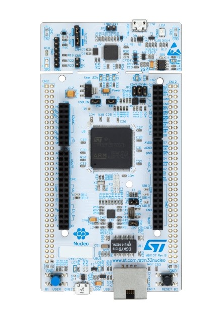

# STM32F746-Nucleo BSP Introduction

[中文](README_zh.md) 

## MCU: STM32F746ZG @216MHz, 1MB FLASH,  320KB RAM

The STM32 Nucleo-144 board provides an affordable and flexible way for  users to try out new concepts and build prototypes by choosing from the  various combinations of performance and power consumption features,  provided by the STM32 microcontroller. For the compatible boards, the  internal or external SMPS significantly reduces power consumption in Run mode. 

The ST Zio connector, which extends the ARDUINO® Uno V3 connectivity, and the ST morpho headers provide an easy means of expanding the functionality of the Nucleo open development platform  with a wide choice of specialized shields.

The STM32 Nucleo-144 board does not require any separate probe as it integrates the ST-LINK debugger/programmer.

The STM32 Nucleo-144 board comes with the STM32 comprehensive free  software libraries and examples available with the STM32Cube MCU  Package. 

#### KEY FEATURES

- Common features 
  -  STM32 microcontroller in LQFP144 package 
  -  3 user LEDs 
  -  2 user and reset push-buttons 
  -  32.768 kHz crystal oscillator 
  -  Board connectors:SWDST Zio expansion connector including ARDUINO® Uno V3ST morpho expansion connector 
  -  Flexible power-supply options: ST-LINK, USB VBUS or external sources 
  -  On-board ST-LINK debugger/programmer with USB re-enumeration capability: mass storage, Virtual COM port, and debug port 
  -  Comprehensive free software libraries and examples available with the STM32Cube MCU Package 
  -  Support of a wide choice of Integrated Development Environments (IDEs) including IAR™, Keil®, and STM32CubeIDE 
- Board-specific features 
  -  External or internal SMPS to generate Vcore logic supply 
  -  Ethernet compliant with IEEE-802.3-2002 
  -  USB OTG full speed or device only 
  -  Board connectors:USB with Micro-AB or USB Type-C™Ethernet RJ45 
  -  Arm® Mbed Enabled™ compliant 

## Maintained By

[BruceOu](https://github.com/Ouxiaolong/)  <ouxiaolong@bruceou.cn>

## Translated By
> ouxiaolong@bruceou.cn
>
> https://github.com/Ouxiaolong/

