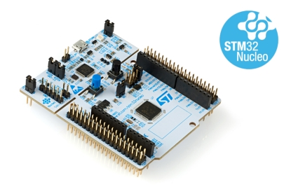

# STM32G071 BSP

## 简介

本文档为 STM32G070RB-Nucleo 开发板的 BSP (板级支持包) 说明。

主要内容如下：

- 开发板资源介绍
- BSP 快速上手
- 进阶使用方法

通过阅读快速上手章节开发者可以快速地上手该 BSP，将 RT-Thread 运行在开发板上。在进阶使用指南章节，将会介绍更多高级功能，帮助开发者利用 RT-Thread 驱动更多板载资源。

## 开发板介绍

STM32G070RB-Nucleo 开发板是 ST 官方推出的一款基于 ARM Cortex-M0+ 内核的开发板，最高主频为 64Mhz，该开发板具有丰富的扩展接口，可以方便验证 STM32G070RB 的芯片性能。

开发板外观如下图所示：



该开发板常用 **板载资源** 如下：

- MCU：STM32G070RB，主频 64MHz，128KB FLASH ，36KB RAM
- 外部 RAM：无
- 外部 FLASH：无
- 常用外设
  - 按键：1个，user（兼具唤醒功能，PC13）
- 常用接口：USB 转串口、arduino 接口等
- 调试接口，标准 SWD

开发板更多详细信息请参考 ST 的 [NUCLEO 开发板介绍](https://www.st.com/content/st_com/en/products/evaluation-tools/product-evaluation-tools/mcu-eval-tools/stm32-mcu-eval-tools/stm32-mcu-nucleo/nucleo-g070rb.html)。

## 外设支持

本 BSP 目前对外设的支持情况如下：

| **板载外设**      | **支持情况** |           **备注**                |
| :----------------- | :----------: | :------------------------------------- |
| ST-LINK 虚拟串口 |     支持     |          使用 USART2               |
| **片上外设**  | **支持情况** |               **备注**                 |
| GPIO         |     支持     | PA0, PA1... PC15 ---> PIN: 0, 1...47  |
| UART         |     支持     |             USART1/2/3                |
| TIM          |     支持     |               TIM1/3                  |
| PWM          |     支持     |                                       |
| SPI          |     支持     |               SPI1/2                  |
| I2C          |     支持     |               软件 I2C                |
| ADC          |     支持     |                                       |
| WDT          |     支持     |                                       |
| FLASH | 支持 | 已适配 [FAL](https://github.com/RT-Thread-packages/fal) |
| RTC          |   暂不支持    |           详见注意事项                   |

## 使用说明

使用说明分为如下两个章节：

- 快速上手

    本章节是为刚接触 RT-Thread 的新手准备的使用说明，遵循简单的步骤即可将 RT-Thread 操作系统运行在该开发板上，看到实验效果 。

- 进阶使用

    本章节是为需要在 RT-Thread 操作系统上使用更多开发板资源的开发者准备的。通过使用 ENV 工具对 BSP 进行配置，可以开启更多板载资源，实现更多高级功能。

### 快速上手

本 BSP 为开发者提供 MDK5 和 IAR 工程，并且支持 GCC 开发环境。下面以 MDK5 开发环境为例，介绍如何将系统运行起来。

#### 硬件连接

使用数据线连接开发板到 PC，打开电源开关。

#### 编译下载

双击 project.uvprojx 文件，打开 MDK5 工程，编译并下载程序到开发板。

> 将工程使用的仿真器设置为ST-Link并安装仿真器好驱动程序以后，将开发板连接到PC，点击下载按钮即可下载程序到开发板。

#### 运行结果

下载程序成功之后，系统会自动运行。

连接开发板对应串口到 PC , 在终端工具里打开相应的串口（115200-8-1-N），复位设备后，可以看到 RT-Thread 的输出信息:

```bash
 \ | /
- RT -     Thread Operating System
 / | \     4.0.2 build Jul  1 2020
 2006 - 2019 Copyright by rt-thread team
msh >
```

### 进阶使用

此 BSP 默认只开启了 GPIO 和 UART 的功能，如果需使用 SPI，I2C 等更多高级功能，需要利用 ENV 工具对BSP 进行配置，步骤如下：

1. 在 bsp 下打开 env 工具。

2. 输入`menuconfig`命令配置工程，配置好之后保存退出。

3. 输入`pkgs --update`命令更新软件包。

4. 输入`scons --target=mdk5/iar` 命令重新生成工程。

本章节更多详细的介绍请参考 [STM32 系列 BSP 外设驱动使用教程](../docs/STM32系列BSP外设驱动使用教程.md)。

## 注意事项

- G0系列RTC驱动有点问题，详见论坛 [该贴](https://www.rt-thread.org/qa/thread-424601-1-2.html)

## 联系人信息

维护人:

-  [NU-LL](https://github.com/NU-LL)
