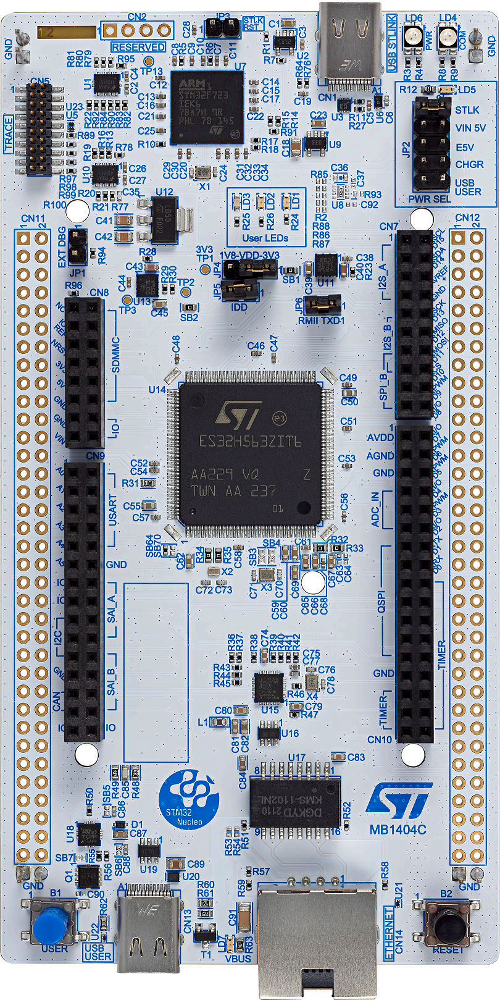

# **NUCLEO-STM32H563ZI** BSP Introduction

## 简介

本文档为 yuanzihao为 NUCLEO-STM32H563ZIT6  开发板提供的 BSP (板级支持包) 说明。

主要内容如下：

- 开发板资源介绍
- BSP 快速上手
- 注意事项及参考资料

通过阅读快速上手章节开发者可以快速地上手该 BSP，将 RT-Thread 运行在开发板上。

## 开发板介绍

NUCLEO-STM32H563ZIT6是 ST 推出的一款基于 ARM Cortex-M33 内核的开发板，最高主频为 250Mhz，2 MB Flash，640 KB RAM，该开发板具有丰富的板载资源，可以充分发挥 STM32H563ZIT6的芯片性能。

开发板外观如下图所示（板载TYPE-C接口的STLINK-V3哦）：



该开发板常用 **板载资源** 如下：

- MCU：STM32H563ZI，高性能，Arm Cortex-M33带有TrustZone，MCU带有2 MB Flash，640 KB RAM，250 MHz CPU，375 DMIPS (Dhrystone 2.1)
- 通用特性
  - 采用LQFP144封装的STM32 微控制器
  - 3个用户LED
  - 2个用户按钮和复位按钮
  - 32.768 kHz晶体振荡器
  - 板连接器：SWDST Zio扩展连接器，包括ARDUINO® Uno V3ST morpho扩展连接器
  - 灵活的供电选项：ST-LINK、USB VBUS或外部电源
  - 具有USB重新枚举功能的板上ST-LINK调试器/编程器：大容量存储器、虚拟COM端口和调试端口
  - 提供了全面的免费软件库和例程，可从STM32Cube MCU软件包获得
  - 支持多种集成开发环境（IDE），包括IAR™、Keil®、和STM32CubeIDE

开发板更多详细信息请参考 ST [STM32H563ZI](https://www.st.com/zh/microcontrollers-microprocessors/stm32h563zi.html)。

硬件框图如下：


## 外设支持

本 BSP 目前对外设的支持情况如下：

| **板载外设**                     | **支持情况** | **备注** |
| :------------------------------- | :----------: | :------- |
| USB 转 串口(板载**STLINK-V3EC**) |     支持     |          |
| **片上外设**                     | **支持情况** | **备注** |
| GPIO                             |     支持     |          |
| UART                             |     支持     | UART3    |
| PWM                              |     支持     |          |
| ADC                              |     支持     |          |


## 使用说明

使用说明分为如下两个章节：

- 快速上手

  本章节是为刚接触 RT-Thread 的新手准备的使用说明，遵循简单的步骤即可将 RT-Thread 操作系统运行在该开发板上，看到实验效果 。

- 进阶使用

  本章节是为需要在 RT-Thread 操作系统上使用更多开发板资源的开发者准备的。通过使用 ENV 工具对 BSP 进行配置，可以开启更多板载资源，实现更多高级功能。


### 快速上手

本 BSP 为开发者提供 MDK5 和 IAR 工程，并且支持 GCC 开发环境。下面以 MDK5 开发环境为例，介绍如何将系统运行起来。

#### 硬件连接

使用Type-C数据线连接开发板到 PC。

#### 编译下载

双击 project.uvprojx 文件，打开 MDK5 工程，编译并下载程序到开发板。

> 工程默认配置使用 ST_LINK 仿真器下载程序，在通过 ST_LINK 连接开发板的基础上，点击下载按钮即可下载程序到开发板

#### 运行结果

下载程序成功之后，系统会自动运行，LED1闪烁。

连接开发板对应串口到 PC , 在终端工具里打开相应的串口（115200-8-1-N），复位设备后，可以看到 RT-Thread 的输出信息:

```bash
 \ | /
- RT -     Thread Operating System
 / | \     5.0.1 build Aug 27 2023 20:47:55
 2006 - 2022 Copyright by RT-Thread team
do components initialization.
initialize rti_board_end:0 done
initialize rt_work_sys_workqueue_init:0 done
initialize finsh_system_init:0 done
msh >
```

### 进阶使用

此 BSP 默认只开启了 GPIO 和 UART1 的功能，如果需使用更多高级功能，需要利用 ENV 工具对BSP 进行配置，步骤如下：

1. 在 bsp 下打开 env 工具。

2. 输入`menuconfig`命令配置工程，配置好之后保存退出。

3. 输入`pkgs --update`命令更新软件包。

4. 输入`scons --target=mdk4/mdk5/iar` 命令重新生成工程。

本章节更多详细的介绍请参考 [STM32 系列 BSP 外设驱动使用教程](../docs/STM32系列BSP外设驱动使用教程.md)。

## 注意事项

- 调试串口为 UART3 ，映射说明（详情看STM32Cubemx中的配置）：

  ```c
  PD8     ------> USART3_TX（T_VCP_TX）
  PD9     ------> USART3_RX（T_VCP_RX）
  ```

* MDK版本最好使用比较新的版本的，本次搭建是在MDK5.36版本下进行的。

## 参考资料：   

1. [STM32H563-NUCLEO原理图下载](https://www.st.com/resource/en/schematic_pack/mb1404-h563zi-c01-schematic.pdf)
2. [STM32H563官方介绍页](https://www.st.com/en/microcontrollers-microprocessors/stm32h563zi.html)
3. [STM32H563-NUCLEO开发板手册](https://www.st.com/resource/en/user_manual/um3115-stm32h5-nucleo144-board-mb1404-stmicroelectronics.pdf)

## 联系人信息

维护人:

- [yuanzihao](https://github.com/zihao-yuan/), 邮箱：[y@yzh.email](mailto:y@yzh.email)
