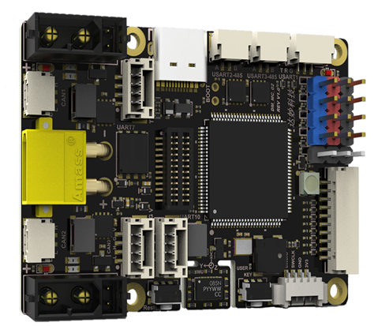
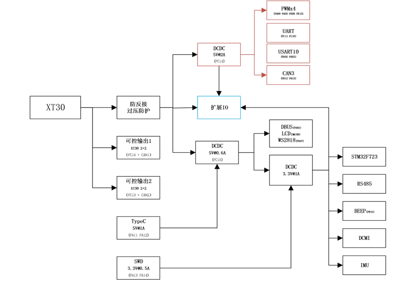

# STM32H723 DM-MC02 开发板 BSP 说明

## 简介

本文档为 `stm32h723-DM-MC02` BSP 的使用说明。

当前 BSP 按 **第一阶段 BSP** 目标整理，仅保证：

- GPIO 驱动可用
- UART1 控制台可用
- FinSH / MSH 可正常进入


## 开发板介绍

DM-MC02 是一块面向电机开发与控制场景的控制板，基于 STM32H7 高性能微控制器设计，集成了多路电机控制、通信、传感与扩展接口资源，可用于电机控制、运动控制以及嵌入式功能验证等场景。

根据板卡说明书，开发板主要硬件参数如下：

- MCU：`STM32H723VGT6`
- 内核：`Arm Cortex-M7`
- 片上 FLASH：`1MB`
- 片上 SRAM：`564KB`
- BSP 默认堆内存区域：AXI SRAM `320KB`（`0x24000000` 起）
- 外部高速时钟：`24MHz HSE`
- 供电电压：`12V ~ 24V`，支持 `6S` 供电
- 板载电源：`5V / 2A`
- 可控电源：每路持续 `5A`
- 尺寸：`56 x 40 mm`
- 重量：约 `19.5g`

开发板外观如下图所示：



该开发板常用 **板载资源** 如下：

- 调试串口：`x1`，当前 BSP 默认使用 `UART1` 作为 FinSH 控制台
- SWD：`x1`
- GPIO：芯片片上 GPIO 资源可用
- CANFD：`x3`，最高 `5Mbps`
- RS485：`x2`，最高 `10Mbps`
- 串口：`x3`
- PWM：`x4`
- IMU：`x1`，`BMI088`
- QSPI Flash：`8Mb`，`W25Q64JV`
- 按键：`x2`
- 蜂鸣器：`x1`
- WS2812 灯板：`x1`
- USB：`x1`
- SBUS：`x1`
- LCD 扩展口：`x1`，`SPI + IIC`
- DCMI 接口：`x1`，`24Pin` 无需转换
- 扩展接口：`x1`，提供 `2` 路串口、`1` 路 SPI、`1` 路 IIC
- 可控电源：`x2`，PMOS 输出（XT30 2+2）

当前 BSP 第一阶段已实际启用并验证的资源主要为：

- 调试串口：`UART1`（`PA9/PA10`）
- 调试接口：`SWD`
- GPIO 驱动

## 外设支持

本 BSP 当前对外设的支持情况如下：

| **类别** | **外设** | **支持情况** | **备注** |
| :-- | :-- | :--: | :-- |
| 板载外设 | 调试串口 | 支持 | 使用 `UART1` 作为 FinSH 控制台 |
| 片上外设 | GPIO | 支持 | 已打开 `RT_USING_PIN` |
| 片上外设 | UART | 支持 | 默认启用 `UART1` |
| 板载外设 | CANFD | 暂不支持 | 板上提供 `3` 路接口，建议第二阶段补充 |
| 板载外设 | RS485 | 暂不支持 | 板上提供 `2` 路接口，建议第二阶段补充 |
| 板载外设 | QSPI Flash | 暂不支持 | 板载 `W25Q64JV` |
| 板载外设 | IMU | 暂不支持 | 板载 `BMI088` |
| 板载外设 | 蜂鸣器 | 暂不支持 | 建议第二阶段补充 |
| 板载外设 | 按键 | 暂不支持 | 板载 `2` 个按键 |
| 板载外设 | WS2812 | 暂不支持 | 第一阶段 BSP 不启用 |
| 板载外设 | LCD 扩展口 | 暂不支持 | `SPI + IIC` |
| 板载外设 | DCMI 接口 | 暂不支持 | `24Pin` 接口 |
| 片上外设 | 其他外设 | 暂不支持 | 建议在第二阶段按驱动分别补充 |

## 使用说明

使用说明分为如下两个章节：

- 快速上手
- 进阶使用

### 快速上手

本 BSP 当前提供 `MDK5` 工程，并支持通过 Env 工具重新生成 `IAR` 工程及 `GCC` 构建环境。下面以 MDK5 开发环境为例，介绍如何将系统运行起来。

**请注意！！！**

在首次编译前，请先在 Env 中执行以下命令更新软件包：

```bash
pkgs --update
```

#### 硬件连接

1. 为开发板提供 `12V ~ 24V` 电源输入，或使用SWD供电
2. 使用 `SWD` 调试器连接开发板。
3. 将 `UART1` 串口连接到 PC。
4. 打开串口终端，参数设置为 `115200-8-1-N`。

#### 编译下载

双击 `project.uvprojx`，打开 MDK5 工程，编译并下载程序到开发板。

> 工程默认使用 `SWD` 方式下载，连接调试器后即可完成程序烧录。

#### 运行结果

下载完成并复位后，串口终端可看到类似输出：

```bash
 \ | /
- RT -     Thread Operating System
 / | \     5.3.0 build xxx xx xxxx xx:xx:xx
 2006 - 2024 Copyright by RT-Thread team
msh >
```

出现 `msh >` 即表示第一阶段 BSP 的串口控制台已正常工作。

### 进阶使用

此 BSP 当前默认只开启了 `GPIO` 和 `UART1`。若需要使用更多板载资源或片上外设，建议通过 Env 工具进行配置，并按第二阶段 BSP 的方式逐项补充，步骤如下：

1. 在 BSP 目录打开 Env。
2. 执行 `menuconfig` 配置工程。
3. 执行 `pkgs --update` 更新软件包。
4. 执行 `scons --target=mdk5` 重新生成 MDK5 工程。
5. 如需 IAR 工程，执行 `scons --target=iar`。
6. 如需验证 GCC，直接执行 `scons` 编译。

如果需要验证发布工程，可额外执行：

```bash
scons --dist
```

随后进入生成的 `dist/project` 目录，再执行一次 `scons` 验证发布工程可正常独立编译。

更多说明可参考：

- [STM32 系列 BSP 制作教程](../docs/STM32系列BSP制作教程.md)
- [STM32 系列 BSP 外设驱动使用教程](../docs/STM32系列BSP外设驱动使用教程.md)

## 注意事项

- 本板板载灯为 `WS2812`，不适合作为第一阶段 BSP 的基础运行示例，因此不做LED闪烁循环。
- 经实际测试，`WS2812` 与当前相关软件包的兼容性仍需进一步验证，因此建议作为第二阶段内容单独适配和提交。
- 本板支持多种供电方式，可通过type-c，XT30接口，swd等方式供电。具体电源树如下：

- 提交前建议至少完成以下验证：
	- `scons`
	- `scons --target=iar`
	- `scons --dist`

## 联络方式

moment-NEW 1838088566@qq.com