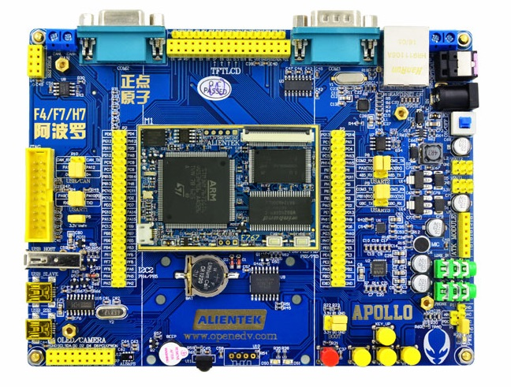

# STM32H723 DM-MC02 开发板 BSP 说明

## 简介

本文档为 `stm32h723-DM-MC02` BSP 的使用说明。

当前 BSP 按 **第一阶段 BSP** 目标整理，默认仅保证：

- GPIO 驱动可用
- UART1 控制台可用
- FinSH / MSH 可正常进入

板载 `WS2812` 不纳入第一阶段 BSP 示例。

## 开发板介绍

DM-MC02 是一块基于 STM32H7 的控制板，当前 BSP 已确认并使用的硬件资源如下：

- MCU：`STM32H723VGT6`
- 片上 FLASH：`1MB`
- BSP 默认堆内存区域：AXI SRAM `320KB`（`0x24000000` 起）
- 外部高速时钟：`24MHz HSE`
- 调试串口：`UART1`（`PA9/PA10`）
- 调试接口：`SWD`
- 板载灯：`WS2812`（第一阶段 BSP 未启用）

开发板外观如下图所示：



## 外设支持

本 BSP 当前支持情况如下：

| **类别** | **外设** | **支持情况** | **备注** |
| :-- | :-- | :--: | :-- |
| 板载外设 | 调试串口 | 支持 | 使用 `UART1` 作为 FinSH 控制台 |
| 板载外设 | WS2812 | 暂不支持 | 第一阶段 BSP 不启用 |
| 片上外设 | GPIO | 支持 | 已打开 `RT_USING_PIN` |
| 片上外设 | UART | 支持 | 默认启用 `UART1` |
| 片上外设 | 其他外设 | 暂不支持 | 建议在第二阶段按驱动分别补充 |

## 使用说明

使用说明分为如下两个章节：

- 快速上手
- 进阶使用

### 快速上手

当前目录已提供 `MDK5` 工程，并保留 `IAR`/`GCC` 的生成支持。

**请注意！！！**

首次编译前，请先在 Env 中执行以下命令更新软件包：

```bash
pkgs --update
```

#### 硬件连接

1. 使用 `SWD` 调试器连接开发板。
2. 将 `UART1` 串口连接到 PC。
3. 打开串口终端，参数设置为 `115200-8-1-N`。

#### 编译下载

双击 `project.uvprojx`，使用 MDK5 编译并下载程序。

#### 运行结果

下载完成并复位后，串口终端可看到类似输出：

```bash
 \ | /
- RT -     Thread Operating System
 / | \     5.3.0 build xxx xx xxxx xx:xx:xx
 2006 - 2024 Copyright by RT-Thread team
msh >
```

出现 `msh >` 即表示第一阶段 BSP 的串口控制台已正常工作。

### 进阶使用

此 BSP 当前默认只开启了 `GPIO` 和 `UART1`。如果后续需要支持更多外设，建议按第二阶段 BSP 的方式逐项补充，步骤如下：

1. 在 BSP 目录打开 Env。
2. 执行 `menuconfig` 配置工程。
3. 执行 `pkgs --update` 更新软件包。
4. 执行 `scons --target=mdk5` 重新生成 MDK5 工程。
5. 如需 IAR 工程，执行 `scons --target=iar`。
6. 如需验证 GCC，直接执行 `scons` 编译。

更多说明可参考：

- [STM32 系列 BSP 制作教程](../docs/STM32系列BSP制作教程.md)
- [STM32 系列 BSP 外设驱动使用教程](../docs/STM32系列BSP外设驱动使用教程.md)

## 注意事项

- 第一阶段 BSP 的目标是 **GPIO + 串口 + FinSH**，不建议在此阶段加入 `WS2812`、板载功能演示或复杂驱动逻辑。
- 如果后续要支持 `WS2812`，建议作为第二阶段内容单独实现和提交。
- `board.c` 中的时钟配置应与 `board/CubeMX_Config/CubeMX_Config.ioc` 保持一致。