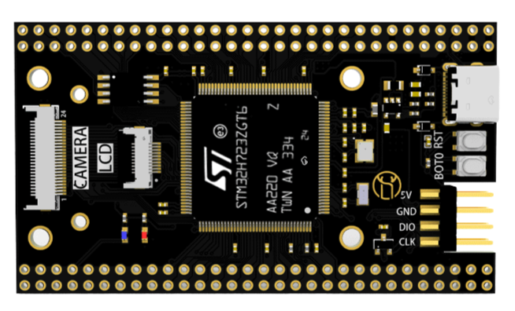

# 鹿小班STM32H723 开发板 BSP 说明

## 简介

本文档为 Pcb-yun为 鹿小班STM32H723（LXB723ZG-P1） 开发板提供的的 BSP (板级支持包) 说明。

主要内容如下：

- 开发板资源介绍
- BSP 快速上手
- 进阶使用方法

通过阅读快速上手章节开发者可以快速地上手该 BSP，将 RT-Thread 运行在开发板上。在进阶使用指南章节，将会介绍更多高级功能，帮助开发者利用 RT-Thread 驱动更多板载资源。

## 开发板介绍

LXB723ZG-P1 是 鹿小班 推出的一款基于 ARM Cortex-M7 内核的开发板，最高主频为550MHz。
开发板集成资源包括：W25Q64 8MB OSPI Flash（可供用户自行使用）、SPI屏幕与8位DCMI摄像头FPC底座（需自行购买相应配件）、自弹式TF卡座、Type-C接口、108个引出IO接口、复位按键和BOOT按键（无自定义按键）。

开发板外观如下图所示：



该开发板常用 **板载资源** 如下：

- MCU：STM32H723ZGT6，主频 550MHz，1MB FLASH ，564K RAM
- 外部 FLASH：W25Q64，8MB
- 常用外设
  - LED：1个，DS0（蓝色，PG7）
- 常用接口：Type-C接口、TF卡接口、8位DCMI摄像头接口（FPC）、SPI屏幕接口（FPC）
- 调试接口：标准SWD接口

开发板更多详细信息请参考 [鹿小班STM32H723ZGT6核心板](https://item.taobao.com/item.htm?abbucket=17&id=831139393305&mi_id=0000Hr_7YuvNzXkf9ukTHb3zeHF5wgFLDumgDHyYZNYGbIs&ns=1&priceTId=2150419217612182188817937e1045&skuId=5739335367823&spm=a21n57.sem.item.1.47ef3a43Uq2LAX&utparam=%7B%22aplus_abtest%22%3A%229add53b62022488d347cf05287760183%22%7D&xxc=taobaoSearch)。

## 外设支持

本 BSP 目前对外设的支持情况如下：

| **板载外设**        | **支持情况** | **备注**                               |
| :----------------- | :----------: | :------------------------------------- |
| OSPI Flash         |   暂不支持    | OSPI1                                  |
| TF卡               |   暂不支持    | SDMMC1                                 |
| SPI屏幕            |   暂不支持    | SPI6                                   |
| DCMI摄像头         |   暂不支持    |                                        |

| **片上外设**       | **支持情况**  | **备注**                               |
| :----------------- | :----------: | :------------------------------------- |
| GPIO               |     支持     |                                        |
| UART               |     支持     |                                        |


## 使用说明

使用说明分为如下两个章节：

- 快速上手

    本章节是为刚接触 RT-Thread 的新手准备的使用说明，遵循简单的步骤即可将 RT-Thread 操作系统运行在该开发板上，看到实验效果 。

- 进阶使用

    本章节是为需要在 RT-Thread 操作系统上使用更多开发板资源的开发者准备的。通过使用 ENV 工具对 BSP 进行配置，可以开启更多板载资源，实现更多高级功能。


### 快速上手

本 BSP 为开发者提供 MDK5工程，并且支持 GCC 开发环境。下面以 MDK5 开发环境为例，介绍如何将系统运行起来。

**请注意！！！**

在执行编译工作前请先在BSP目录下打开ENV工具，执行以下指令（该指令用于拉取必要的HAL库及CMSIS库，否则无法通过编译）：

```bash
pkgs --update
```

#### 硬件连接

开发板将调试接口单独引出（SWD、LPUART1），根据需要连接到调试器即可。

#### 编译下载

双击 project.uvprojx 文件，打开 MDK5 工程，编译并下载程序到开发板。

> 工程默认配置使用 CMSIS_DAP 仿真器下载程序，在通过 CMSIS_DAP 连接开发板的基础上，点击下载按钮即可下载程序到开发板

#### 运行结果

下载程序成功之后，系统会自动运行，LED闪烁。

连接开发板对应串口到 PC , 在终端工具里打开相应的串口（115200-8-1-N），复位设备后，可以看到 RT-Thread 的输出信息:

```bash
 \ | /
- RT -     Thread Operating System
 / | \     5.2.2 build Oct 23 2025 18:41:53
 2006 - 2024 Copyright by RT-Thread team
msh >
```
### 进阶使用

此 BSP 默认只开启了 GPIO 和 串口1 的功能，如果需使用更多高级功能，需要利用 ENV 工具对BSP 进行配置，步骤如下：

1. 在 bsp 下打开 env 工具。

2. 输入`menuconfig`命令配置工程，配置好之后保存退出。

3. 输入`pkgs --update`命令更新软件包。

4. 输入`scons --target=mdk5` 命令重新生成工程。

本章节更多详细的介绍请参考 [STM32 系列 BSP 外设驱动使用教程](../docs/STM32系列BSP外设驱动使用教程.md)。

## 注意事项

- 调试串口为 低功耗串口1 映射说明

    PA9     ------> LPUART1_TX

    PA10    ------> LPUART1_RX

## 联系人信息

维护人:

-  [Pcb-yun](https://github.com/Pcb-yun)