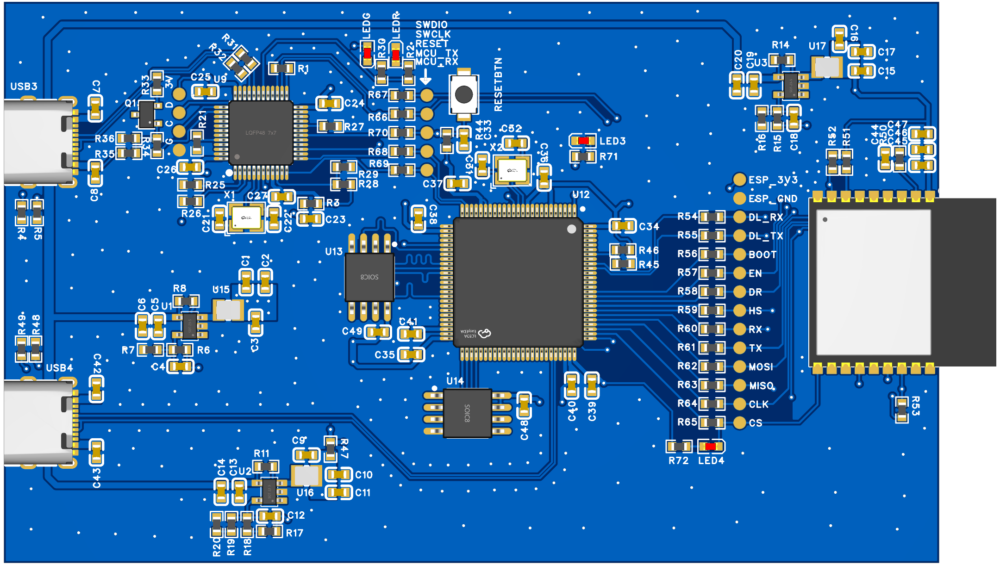

# STM32H730-EspHostedEVB开发板BSP说明

## 简介

本文档 为**STM32H730-EspHostedEVB**开发板提供的 BSP (板级支持包) 说明。

主要内容如下：

- 开发板资源介绍
- BSP 快速上手
- 进阶使用方法

通过阅读快速上手章节开发者可以快速地上手该 BSP，将 RT-Thread 运行在开发板上。在进阶使用指南章节，将会介绍更多高级功能，帮助开发者利用 RT-Thread 驱动更多板载资源。

## 开发板介绍

**STM32H730-EspHostedEVB**是本人用于测试及调试`ESP-Hosted`而制作的一块测试板。

开发板外观如下图所示：



该开发板常用 **板载资源** 如下：

- MCU：STM32H730VBT6
  - 主频 550MHz
  - 432KB RAM, 64KB ITCM, 128KB DTCM, 32KB I-Cache, 32KB D-Cache
  - 128KB FLASH, QSPI Flash, SPI Flash, Support XiP & OTFDEC

- Network Adapter: ESP32-C3-WROOM-02， 使用ESP-Hosted固件
- Debugger: ST-Link V2-1

开发板更多详细信息请参考

* [OSHWHUB](https://oshwhub.com/baobaoa/stm32h730_esp-hosted_evb)
* [GITHUB](https://github.com/kaidegit/ESPHostedEVB)

## 外设支持

本 BSP 目前对外设的支持情况如下：

| **板载外设** |    **支持情况**    | **备注**         |
| :----------- | :----------------: | :--------------- |
| LED          |                    |                  |
| QSPI  FLASH  | 不支持也不建议操作 | 用于运行程序     |
| SPI  FLASH   |       待支持       |                  |
| ESP32-C3     |       待支持       | WIFI & BLUETOOTH |
| **片上外设** |    **支持情况**    | **备注**         |
| GPIO         |        支持        |                  |
| UART         |        支持        | UART2            |
| SPI          |        支持        | SPI              |
| QSPI         |       不支持       | 已被占用         |
| USB          |       待支持       |                  |

## 使用说明

使用说明分为如下两个章节：

- 快速上手

  本章节是为刚接触 RT-Thread 的新手准备的使用说明，遵循简单的步骤即可将 RT-Thread 操作系统运行在该开发板上，看到实验效果 。

- 进阶使用

  本章节是为需要在 RT-Thread 操作系统上使用更多开发板资源的开发者准备的。通过使用 ENV 工具对 BSP 进行配置，可以开启更多板载资源，实现更多高级功能。

### 快速上手

#### 硬件连接

使用数据线连接靠上的USB-C。

MDK：

#### 编译下载

双击 project.uvprojx 文件，打开 MDK5 工程，编译并下载程序到开发板。

> 工程默认配置使用 STLink下载程序，在通过 STLink连接开发板的基础上，点击下载按钮即可下载程序到开发板

#### 运行结果

下载程序成功之后，系统会自动运行，观察开发板上 LED 的运行效果，红色 LED 常亮、绿色 LED 会周期性闪烁。

连接开发板对应串口到 PC , 在终端工具里打开相应的串口（115200-8-1-N），复位设备后，可以看到 RT-Thread 的输出信息:

```bash
 \ | /
- RT -     Thread Operating System
 / | \     5.2.0 build Feb  3 2025 13:14:21
 2006 - 2024 Copyright by RT-Thread team
msh >
```

GCC：

可以使用命令行进行编译，下载

```shell
mkdir build
scons --target=cmake --project-name=EspHostedEVBDemo
cd build 
cmake .. -G Ninja
ninja -j8
ninja flash
```

也可生成cmake后使用CLion打开

```shell
scons --target=cmake --project-name=EspHostedEVBDemo
clion .
```

串口输出信息

```shell
... some bootloader log...
\ | /
- RT -     Thread Operating System
 / | \     5.2.0 build Feb  3 2025 13:16:15
 2006 - 2024 Copyright by RT-Thread team
msh >
```

### 进阶使用

此 BSP 默认只开启了 GPIO 和 串口2 的功能，如果需使用更多高级功能，需要利用 ENV 工具对BSP 进行配置，步骤如下：

1. 在 bsp 下打开 env 工具。

2. 输入`menuconfig`命令配置工程，配置好之后保存退出。

3. 输入`pkgs --update`命令更新软件包。

4. 输入`scons --target=mdk5/cmake` 命令重新生成工程。

本章节更多详细的介绍请参考 [STM32 系列 BSP 外设驱动使用教程](../docs/STM32系列BSP外设驱动使用教程.md)。

## 注意事项

- 由于下载算法还未制作完，暂GCC为使用外部Flash，MDK为使用内部Flash。

- 调试串口为串口2，默认接到STLink。

- Bootloader下载：参考[ESPHostedEVB/Software/Bootloader at main · kaidegit/ESPHostedEVB](https://github.com/kaidegit/ESPHostedEVB/tree/main/Software/Bootloader)， 可使用**STM32CubeProgrammer**下载。

- STLink固件下载：参考oshwhub各项目教程。

- ESP-Hosted固件下载：参考[esp-hosted/esp_hosted_fg/README.md at master · espressif/esp-hosted](https://github.com/espressif/esp-hosted/blob/master/esp_hosted_fg/README.md)

- 外部 flash 下载算法
  - OpenOCD：所需cfg已提供。
  - MDK： TODO
  - CubeProg： TODO


## 联系人信息

维护人:

-  [kaidegit (Kai)](https://github.com/kaidegit)