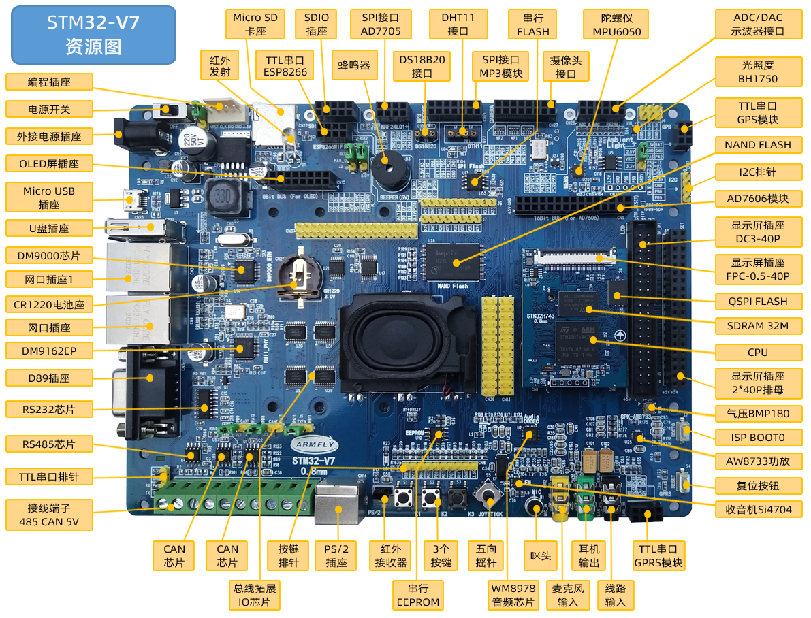

# STM32H743-armfly-V7 开发板 BSP说明

## 简介

本文档为 STM32H743-armfly-V7 开发板的 BSP (板级支持包) 说明。

主要内容如下：

- 开发板资源介绍
- BSP 快速上手
- 进阶使用方法

通过阅读快速上手章节开发者可以快速地上手该 BSP，将 RT-Thread 运行在开发板上。在进阶使用指南章节，将会介绍更多高级功能，帮助开发者利用 RT-Thread 驱动更多板载资源。

## 开发板介绍

STM32-V7开发板 是安富莱推出的一款基于 ARM Cortex-M7 内核的开发板，最高主频为 400Mhz，该开发板具有丰富的板载资源，可以充分发挥 STM32H743 的芯片性能。

开发板外观如下图所示：



该开发板常用 **主板硬件配置** 如下：

1. CPU型号 STM32H743XIH6/TFBGA240, Flash 2MB，RAM 1MB，主频480MHz

2. SDRAM：32位总线宽度，容量32MB

3. QSPI Flash ： 4线总线宽度，容量32MB，支持XIP，即可运行程序

4. NAND Flash ： 8位总线宽度，容量128MB

5. 串行EEPROM：容量16KB

6. SPI串行FLASH: 容量8MB

7. 显示器接口：RGB 24bit、I2C触摸、背光可调

8. 双网口：1个DM9162 PHY芯片（CPU内置MAC）,一个DM9000AEP，挂在FMC总线16bit

9. USB口：1个USB HOST 全速，1个USB Device 全速

10. RS485接口1个

11. RS232接口1个（DB9和TTL UART排针引出）

12. CAN接口2个，跳线可配置

13. SD卡插座1个，SDIO排母插座一个（2个TTL串口）

14. 音频部分：WM8978高保真I2S全双工CODEC，板载高音质音腔扬声器，咪头一个可录音，FM收音机SI4704一个

15. PS2键盘/鼠标接口1个

16. 红外接收器一个，红外发射器一个

17. 蜂鸣器一个（和红外发射器二选一）

18. MPU6050加速度计. 陀螺仪一个

19. 光照度芯片BH1750一个

20. BMP180气压传感器一个

21. 3个独立按键. 一个5向摇杆

22. 摄像头接口一个

23. ADC. DAC接口（可外接示波器模块）

24. 扩展排母接口：SPI. TTL串口. I2C，可外接 (和V5. V6开发外扩模块完全兼容）

\- AD7705（TM7705）双路16位ADC采集

\- VS1053B MP3模块

\- GPS模块 （TTL串口）

\- GPRS模块（TTL串口）

\- 串口WiFi模块（ESP8266）

\- OLED模块(8bit并行总线)

\- AD7606 模块 16位ADC 8路同步

\- ADS1256 8路24位ADC数据采集模块

\- DAC8501双路DAC模块(0-5V)

\- DAC8563双路DAC模块( -10V -> +10V)

\- AD9833模块 DDS波形发生器 三角波 正弦波 方波

25. 预留有若干5V和3.3V扩展输出IO (挂在32位总线，速度快，占用GPIO资源少）

开发板更多详细信息请参考安富莱 [STM32-V7开发板介绍](https://armfly.taobao.com/index.htm)。

## 外设支持

本 BSP 目前对外设的支持情况如下：

| **板载外设**      | **支持情况** | **备注**                              |
| :----------------- | :----------: | :------------------------------------- |
| **片上外设**      | **支持情况** | **备注**                              |
| GPIO              |     支持     |                                      |
| UART              |     支持     | PA9,PA10                                     |

## 使用说明

使用说明分为如下两个章节：

- 快速上手

    本章节是为刚接触 RT-Thread 的新手准备的使用说明，遵循简单的步骤即可将 RT-Thread 操作系统运行在该开发板上，看到实验效果 。

- 进阶使用

    本章节是为需要在 RT-Thread 操作系统上使用更多开发板资源的开发者准备的。通过使用 ENV 工具对 BSP 进行配置，可以开启更多板载资源，实现更多高级功能。


### 快速上手

本 BSP 为开发者提供 MDK4、MDK5 和 IAR 工程，并且支持 GCC 开发环境。下面以 MDK5 开发环境为例，介绍如何将系统运行起来。

#### 硬件连接

使用USB转TTL（DB9）线连接开发板到 PC，使用JLINK加安富莱JTAG转SWD转接板接入开发板，插入电源线，打开电源开关。

#### 编译下载

双击 project.uvprojx 文件，打开 MDK5 工程，编译并下载程序到开发板。

> 工程默认配置使用 JLINK 仿真器下载程序，在通过 JLINK 连接开发板的基础上，点击下载按钮即可下载程序到开发板

#### 运行结果

下载程序成功之后，系统会自动运行（没有LED）。

连接开发板对应串口到 PC , 在终端工具里打开相应的串口（115200-8-1-N），复位设备后，可以看到 RT-Thread 的输出信息:

```bash
 \ | /
- RT -     Thread Operating System
 / | \     4.0.4 build Aug  3 2021
 2006 - 2021 Copyright by rt-thread team
msh >
```
### 进阶使用

此 BSP 默认只开启了 GPIO 和 串口1 的功能，如果需使用更多高级功能，需要利用 ENV 工具对BSP 进行配置，步骤如下：

1. 在 bsp 下打开 env 工具。

2. 输入`menuconfig`命令配置工程，配置好之后保存退出。

3. 输入`pkgs --update`命令更新软件包。

4. 输入`scons --target=mdk4/mdk5/iar` 命令重新生成工程。

本章节更多详细的介绍请参考 [STM32 系列 BSP 外设驱动使用教程](../docs/STM32系列BSP外设驱动使用教程.md)。

## 注意事项

- 调试串口为串口1 映射说明

    PA10     ------> USART1_RX

    PA9     ------> USART1_TX 

## 联系人信息

维护人:

-  [bkk](https://github.com/ghmoai )