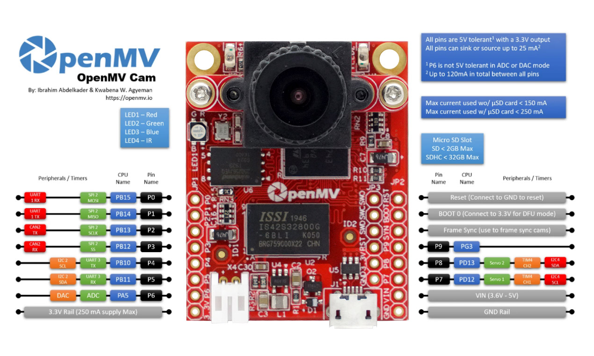

# OPENMV4-H7-PLUS 开发板的 BSP 说明

## 简介

本文档为 OPENMV官方H7-PLUS开发板的 BSP (板级支持包) 说明。

主要内容如下：

- 开发板资源介绍
- BSP 快速上手
- 进阶使用方法

通过阅读快速上手章节开发者可以快速地上手该 BSP，将 RT-Thread 运行在开发板上。在进阶使用指南章节，将会介绍更多高级功能，帮助开发者利用 RT-Thread 驱动更多板载资源。

## 开发板介绍

OPENMV4-H7-PLUS 是 OPENMV公司推出的一款针对 STM32H7系列设计的 Cortex-M7  开发板。

开发板外观如下图所示：



该开发板常用 **板载资源** 如下：

- MCU：STM32H743IIK6，主频 480MHz，2MB FLASH ，1M RAM , Core Mark Score: 2400
- 常用外设
  - RGB：3个，LED_R （红色，PC0）, LED_G(绿色，PC1), LED_B（蓝色，PC2），
  - SRAM:   32MB 
  - QSPI FLASH: 32MB 
- 调试接口，标准 SWD

开发板更多详细信息请参考 [OpenMV4 H7 Plus开发板介绍](https://singtown.com/product/50812/openmv4-h7-plus/)。

## 外设支持

本 BSP 目前对外设的支持情况如下：

| **片上外设**      | **支持情况** | **备注**                              |
| :----------------- | :----------: | :------------------------------------- |
| GPIO              |     支持     |                                        |
| USART             |     支持     | USART1(PB14 TX)(PB15 RX) |
| SDRAM | 支持 | IS42S32800  BANK1 |
| QSPI FLASH | 支持 | W25Q256JV |
| SDIO | 支持 | USD-1040310811 |
| USBCDC | 支持 |  |
| RTC | 支持 | |
| CAMERA | 支持 | OV5640 |
| DCMI | 支持 |  |
| I2C | 支持 | I2C1(PB8 SCL)(PB9 SDA); I2C2 (PB10 SCL)(PB11 SDA) |

## 使用说明

使用说明分为如下两个章节：

- 快速上手

    本章节是为刚接触 RT-Thread 的新手准备的使用说明，遵循简单的步骤即可将 RT-Thread 操作系统运行在该开发板上，看到实验效果 。

- 进阶使用

    本章节是为需要在 RT-Thread 操作系统上使用更多开发板资源的开发者准备的。通过使用 ENV 工具对 BSP 进行配置，可以开启更多板载资源，实现更多高级功能。


### 快速上手

本 BSP 为开发者提供 MDK4、MDK5 和 IAR 工程，并且支持 GCC 开发环境。下面以 MDK5 开发环境为例，介绍如何将系统运行起来。

#### 硬件连接

使用数据线连接开发板到 PC，打开电源开关。

#### 编译下载

双击 project.uvprojx 文件，打开 MDK5 工程，编译并下载程序到开发板。

> 工程默认配置使用 ST-LINK 仿真器下载程序，在通过  ST-LINK 连接开发板的基础上，点击下载按钮即可下载程序到开发板

#### 运行结果

下载程序成功之后，系统会自动运行，红色的 LED_R 以 500MS 周期闪烁。

串口通信需要使用USB转TTL连接USART1。在终端工具里打开相应的串口（115200-8-1-N）, 复位设备后，可以看到 RT-Thread 的输出信息:

```bash
 \ | /
- RT -     Thread Operating System
 / | \     4.0.2 build Oct  2 2019
 2006 - 2019 Copyright by rt-thread team
msh >
```
注意：由于BSP默认开启USBCDC，与shell的交互需通过虚拟串口。

### 进阶使用

此 BSP 默认开启了 GPIO 、 USART1、QSPI FLASH、USBCDC和CAMERA的功能，如果需使用更多高级功能，需要利用 ENV 工具对BSP 进行配置，步骤如下：

1. 在 bsp 下打开 env 工具。
2. 输入`menuconfig`命令配置工程，配置好之后保存退出。
3. 输入`pkgs --update`命令更新软件包。
4. 输入`scons --target=mdk4/mdk5/iar` 命令重新生成工程。

本章节更多详细的介绍请参考 [STM32 系列 BSP 外设驱动使用教程](../docs/STM32系列BSP外设驱动使用教程.md)。

## 注意事项

- 开机时如果不能打印 RT-Thread 版本信息，请重新选择 PC 端串口调试软件的串口号或将 BSP 中串口的 GPIO 速率调低

## 联系人信息

维护人:

-  [super_mcu] 邮箱：<super_mcu@qq.com>