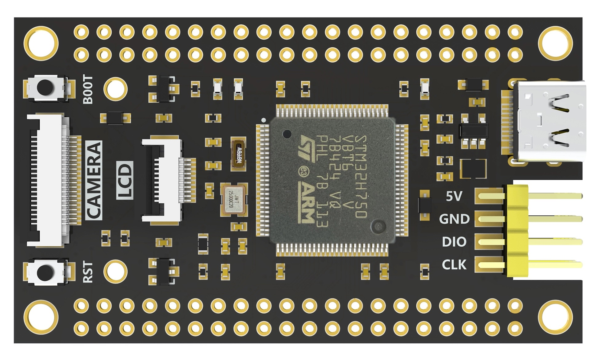

# FANKE FK750M1-VBT6 开发板 BSP 说明

## 简介

本文档为 FANKE FK750M1-VBT6 开发板的 BSP (板级支持包) 说明。

主要内容如下：

- 开发板资源介绍
- BSP 快速上手
- 进阶使用方法

通过阅读快速上手章节开发者可以快速地上手该 BSP，将 RT-Thread 运行在开发板上。在进阶使用指南章节，将会介绍更多高级功能，帮助开发者利用 RT-Thread 驱动更多板载资源。

## 开发板介绍

FK750M1-VBT6 是 FANKE 推出的一款基于 ARM Cortex-M7 内核的核心板，最高频率为480Mhz，具有128KB ROM、1MB RAM，外接 8MB QSPI Flash，板载资源如下：

* 外扩 W25Q64，容量 8M 字节
* 1 个复位按键，1 个用户按键
* 1 个 BOOT 按键
* 1 个用户 LED
* 1 个 Type C 接口
* 1 个 TF 卡接口
* 1 个SPI 液晶和摄像头接口
* 引出 73 个 IO 口

开发板外观如下图所示：



## 外设支持

本 BSP 目前对外设的支持情况如下：

| **板载外设** | **支持情况** | **备注** |
| :----------------- | :----------------: | :------------: |
| TF Card            |       待支持       |                |
| QSPI Flash         |       待支持       |    W25Q64JV    |
| OV2640 Camera      |        支持        |                |
| OV5640 Camera      |       待支持       |                |
| 0.96' LCD          |       待支持       |     160*80     |
| 1.14' LCD          |       待支持       |    240*135    |
| 1.30' LCD          |        支持        |    240*240    |
| 1.54' LCD          |       待支持       |    240*240    |
| 1.69' LCD          |       待支持       |    240*280    |
| 2.00' LCD          |       待支持       |    240*320    |
| **片上外设** | **支持情况** | **备注** |
| GPIO               |        支持        |                |
| UART               |        支持        |     USART1     |
| SPI                |        支持        |                |
| RTC                |        支持        |                |
| USB Device         |       待支持       |                |

## 使用说明

使用说明分为如下两个章节：

- 快速上手

  本章节是为刚接触 RT-Thread 的新手准备的使用说明，遵循简单的步骤即可将 RT-Thread 操作系统运行在该开发板上，看到实验效果 。
- 进阶使用

  本章节是为需要在 RT-Thread 操作系统上使用更多开发板资源的开发者准备的。通过使用 ENV 工具对 BSP 进行配置，可以开启更多板载资源，实现更多高级功能。

### 快速上手

本 BSP 为开发者提供 MDK5 和 IAR 工程，并且支持 GCC 开发环境。下面以 MDK5 开发环境为例，介绍如何将系统运行起来。

#### 硬件连接

使用数据线连接开发板到 PC。使用 usb 转串口工具连接 PA9 ( USART1_TX ) 和 PA10 ( USART1_RX )。

#### 编译下载

双击 project.uvprojx 文件，打开 MDK5 工程，编译并下载程序到开发板。

#### 运行结果

下载程序成功之后，系统会自动运行，LED闪烁。

连接开发板对应串口到 PC , 在终端工具里打开相应的串口（115200-8-1-N），复位设备后，可以看到 RT-Thread 的输出信息:

```bash
 \ | /
- RT -     Thread Operating System
 / | \     5.0.0 build Mar 22 2023 00:10:44
 2006 - 2022 Copyright by RT-Thread team
msh />
```

### 进阶使用

此 BSP 默认只开启了 GPIO 和 串口1 的功能，如果需使用更多高级功能，需要利用 ENV 工具对BSP 进行配置，步骤如下：

1. 在 bsp 下打开 env 工具。
2. 输入 `menuconfig` 命令配置工程，配置好之后保存退出。
3. 输入 `pkgs --update` 命令更新软件包。
4. 输入 `scons --target=mdk4/mdk5/iar` 命令重新生成工程。

本章节更多详细的介绍请参考 [STM32 系列 BSP 外设驱动使用教程](../docs/STM32系列BSP外设驱动使用教程.md)。

## 注意事项

- 目前仅测试 V1.1 版本硬件，较老的 V1.0 暂未测试
- 默认仅开启 LCD 功能，此时生成的固件大小约为 110k 左右，如果开启其他功能固件超过 128k ，可以通过如下方式：

  1. H750 实际上可以使用片内 2M ram，但是 128k 后 ST 不保证可用性，此时可以：
     1. 在 keil 中芯片选为 H743 ，此时会出现 2MB Flash 的下载算法，选择此下载算法下载程序
     2. bsp\stm32\stm32h750-weact-ministm32h7xx 目录下会提供一份 h750 的 keil 内部 ram 的下载算法，可以采用下载算法
  2. 通过 bootloader 从片外 qspi flash 启动
- 调试串口为串口1 映射说明

  PA9     ------> USART1_TX

  PA10     ------> USART1_RX

## 联系人信息

维护人:

- [NU-LL](https://github.com/NU-LL)
