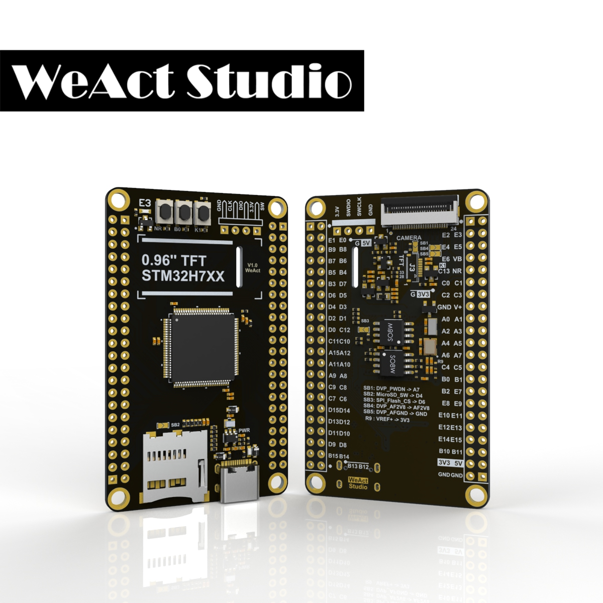

# WeAct Studio STM32H7xx Core Board开发板 BSP 说明

## 简介

本文档为 WeAct Studio STM32H7xx Core Board 开发板的 BSP (板级支持包) 说明。

主要内容如下：

- 开发板资源介绍
- BSP 快速上手
- 进阶使用方法

通过阅读快速上手章节开发者可以快速地上手该 BSP，将 RT-Thread 运行在开发板上。在进阶使用指南章节，将会介绍更多高级功能，帮助开发者利用 RT-Thread 驱动更多板载资源。

## 开发板介绍

STM32H7xx Core Board 是 WeAct Studio 推出的一款基于 ARM Cortex-M7 内核的核心板，最高频率为480Mhz，具有128KB ROM（实际上 2MB ROM 可用）、1MB RAM，外接8MB SPI Flash和8MB QSPI Flash，所具有的按键和接口如下：

* 2*22 Pin 2.54mm I/O x 2
* 4 Pin 2.54mm SW x 1
* USB C (type C) x 1
* MicroSD TF x 1
* 8Bit DCMI x 1
* User Key K1 (PC13) x 1
* NRST Key x 1
* BOOT0 Key x 1

开发板外观如下图所示：



开发板更多详细信息请参考[STM32H7xx Core Board](https://github.com/WeActTC/MiniSTM32H7xx)。

## 外设支持

本 BSP 目前对外设的支持情况如下：

| **板载外设**     | **支持情况** |         **备注**         |
| :--------------- | :----------: | :----------------------: |
| 0.96' ST7735 TFT |     支持     |           SPI1           |
| TF Card          |    待支持    |                          |
| SPI Flash        |     支持     | W25Q64JV、Littlefs、SPI1 |
| QSPI Flash       |    待支持    |    W25Q64JV、Littlefs    |
| OV7670 Camera    |    待支持    |                          |
| OV2640 Camera    |    待支持    |                          |
| OV7725 Camera    |    待支持    |                          |
| OV5640-AF Camera |    待支持    |                          |
| **片上外设**     | **支持情况** |         **备注**         |
| GPIO             |     支持     |                          |
| UART             |     支持     |          USART1          |
|                  |     支持     |        SPI1、SPI4        |
| USB Device       |    待支持    |          USB HS          |


## 使用说明

使用说明分为如下两个章节：

- 快速上手

    本章节是为刚接触 RT-Thread 的新手准备的使用说明，遵循简单的步骤即可将 RT-Thread 操作系统运行在该开发板上，看到实验效果 。

- 进阶使用

    本章节是为需要在 RT-Thread 操作系统上使用更多开发板资源的开发者准备的。通过使用 ENV 工具对 BSP 进行配置，可以开启更多板载资源，实现更多高级功能。


### 快速上手

本 BSP 为开发者提供 MDK5 和 IAR 工程，并且支持 GCC 开发环境。下面以 MDK5 开发环境为例，介绍如何将系统运行起来。

#### 硬件连接

使用数据线连接开发板到 PC。使用 usb 转串口工具连接 PB14(USART1_TX) 和 PB15(USART1_RX)。

#### 编译下载

双击 project.uvprojx 文件，打开 MDK5 工程，编译并下载程序到开发板。

> 具体下载方法可以参考 WeAct Studio 提供的[STM32 下载烧录教程以及问题汇总](http://www.weact-tc.cn/2019/11/30/STM32Download/#more)
>
> 注意：需要按照[该文档](https://github.com/WeActTC/MiniSTM32H7xx/blob/master/SDK/QSPI_Flasher/README.md)添加flash支持

#### 运行结果

下载程序成功之后，系统会自动运行，LED闪烁。

连接开发板对应串口到 PC , 在终端工具里打开相应的串口（115200-8-1-N），复位设备后，可以看到 RT-Thread 的输出信息:

```bash
 \ | /
- RT -     Thread Operating System
 / | \     5.0.0 build Oct 15 2022 16:28:21
 2006 - 2022 Copyright by RT-Thread team
msh />
```
### 进阶使用

此 BSP 默认只开启了 GPIO 和 串口1 的功能，如果需使用更多高级功能，需要利用 ENV 工具对BSP 进行配置，步骤如下：

1. 在 bsp 下打开 env 工具。

2. 输入`menuconfig`命令配置工程，配置好之后保存退出。

3. 输入`pkgs --update`命令更新软件包。

4. 输入`scons --target=mdk4/mdk5/iar` 命令重新生成工程。

本章节更多详细的介绍请参考 [STM32 系列 BSP 外设驱动使用教程](../docs/STM32系列BSP外设驱动使用教程.md)。

## 注意事项

- 如果固件超过 128k ，且使用 Keil 下载请注意：
  - 在 keil 中芯片选为 H743 ，此时会出现 2MB Flash 的下载算法，选择此下载算法下载程序
  - 将该文件夹下 STM32H7x_2048.FLM 放到 `Keil安装目录\Keil_v5\ARM\Flash` 中，并选择此下载算法
  - 其余方式下载代码情况类似
- 调试串口为串口1 映射说明

    PB14     ------> USART1_TX

    PB15     ------> USART1_RX

## 联系人信息

维护人:

-  [NU-LL](https://github.com/NU-LL )