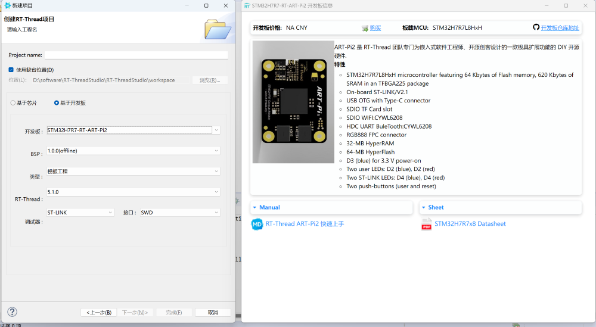

## 简介

中文页 | [English Page](README.md)

sdk-bsp-stm32h7r-realthread-artpi2 是 RT-Thread 团队对 ART-Pi 开发板所作的支持包，也可作为用户开发使用的软件SDK，让用户可以更简单方便的开发自己的应用程序。

ART-Pi2 是 RT-Thread 团队专门为嵌入式软件工程师、开源创客设计的一款极具扩展功能的 DIY 开源硬件。


## 目录结构

```
$ sdk-bsp-stm32h7r-realthread-artpi2
├── README.md
├── RealThread_STM32H7R-ART-Pi2.yaml
├── debug
├── documents
│   ├── coding_style_cn.md
│   ├── RT-Thread 编程指南.pdf
│   ├── board
│   └── figures
├── libraries
│   ├── STM32H7RSxx_HAL_Driver
│   ├── drivers
│   └── touchgfx_lib
├── projects
│   ├── art_pi_blink_led
│   ├── art_pi_bootloader
│   ├── art_pi2_lvgl_demo
│   ├── art_pi2_touchgfx
│   ├── art_pi2_sdcard
│   └── art_pi_wifi
├── rt-thread
└── tools
```

- RealThread_STMH7R-ART-Pi.yaml
    描述 ART-Pi 的硬件信息
- documents
    图纸，文档，图片以及 datasheets 等
- libraries
    STM32H7 固件库，通用外设驱动，touchgfx 库等
- projects
    示例工程文件夹，包含出厂程序，网关程序等
- rt-thread
    rt-thread 源码
- tools
    wifi 固件，MDK下载算法等

## 使用说明

sdk-bsp-stm32h7r-realthread-artpi 支持 MDK 开发和 RT-Thread Studio 开发；

### STM32CubeProg 软件

下载最新版本的软件：[STM32CubeProg - 意法半导体](https://www.st.com.cn/zh/development-tools/stm32cubeprog.html#get-software)

### RT-Thread Studio 开发

1. 请下载 v2.2.9 版本 Studio：[下载地址](https://download-redirect.rt-thread.org/download/studio/RT-Thread_Studio_2.2.9-setup-x86_64_202412161335.exe)；

2. 拷贝 [org.rt-thread.studio.common.core_1.0.128.jar](tools/studio/) 文件，替换上面安装的 Studio 目录下 `plugins` 文件夹内的同名文件即可；

（上面步骤会在下一个Studio版本修复）

3. 打开 RT-Thread Studio 的包管理器，安装 ART-Pi2 SDK 资源包；


4. 安装完成后，选择 `文件→新建→RT-Thread 项目→基于开发板` 选择 ART-Pi2 开发板即可；



### MDK 开发

1. 安装较新版本MDK：[MDK-ARM Version 5.41 Product Update](https://www.keil.com/update/sw/mdk/5.41)；

2. 安装STM32H7R-MDK芯片pack包：[Keil.STM32H7RSxx_DFP.1.0.0.pack](./tools/mdk_pack/Keil.STM32H7RSxx_DFP.1.0.0.pack)；

3. 将  `tools\download_algorithm\flm\ART-Pi2_winbond_64MB.FLM` 下载算法拷贝到 `MDK安装目录\Core\ARM\Flash` 下 ；

为了避免 SDK 在持续更新中，每一个 `projects` 都创建一份 `rt-thread` 文件夹 和 `libraries` 文件夹导致的 SDK 越来越臃肿，所以这些通用文件夹被单独提取了出来。这样就会导致直接打开 `MDK` 的工程编译会提示缺少上述两个文件夹的文件，我们有两个方法来解决这个问题：

**方法一：**

1. 双击 `project` 目录下的 `mklinks.bat` 文件，如 `sdk-bsp-stm32h7r-realthread-artpi2\projects\art_pi2_blink_led` 目录下的 `mklinks.bat`

2. 查看 `sdk-bsp-stm32h7r-realthread-artpi2\projects\art_pi2_blink_led` 目录下是否有 `rt-thread` 和 `libraries` 的文件夹图标
3. 使用 [ENV-2.0](https://club.rt-thread.org/ask/article/af8952fcf0ca464b.html) 工具执行 scons --target=mdk5 更新 MDK5 工程文件

**方法二**

1. 在 [ART-Pi SDK仓库](https://github.com/RT-Thread-Studio/sdk-bsp-stm32h7r-realthread-artpi2) 下载 SDK

2. 进入工程目录。如：sdk-bsp-stm32h7r-realthread-artpi2\projects\art_pi2_blink_led

3. 使用 [ENV-2.0](https://club.rt-thread.org/ask/article/af8952fcf0ca464b.html) 工具执行 mklink 命令，分别为 `rt-thread` 及 `libraries` 文件创建符号链接

    ```
    E:\project\sdk-bsp-stm32h7r-realthread-artpi2\projects\art_pi2_blink_led>mklink /D rt-thread ..\..\rt-thread
    symbolic link created for rt-thread <<===>> ..\..\rt-thread
    
    E:\project\sdk-bsp-stm32h7r-realthread-artpi2\projects>mklink /D libraries ..\..\libraries
    symbolic link created for libraries <<===>> ..\..\libraries
    
    E:\project\sdk-bsp-stm32h7r-realthread-artpi2\projects>
    ```

4. 使用 [ENV-2.0](https://club.rt-thread.org/ask/article/af8952fcf0ca464b.html) 工具执行 scons --target=mdk5 更新 MDK5 工程文件


## ART-Pi 交流平台

ART-Pi  是一个开源创意硬件平台，期待有更多的小伙伴能一起发现更多的乐趣，在使用过程中若您有任何的想法和建议，建议您通过以下方式来联系到我们。

RT-Thread [社区论坛](https://club.rt-thread.org)。

ART-Pi 官方交流 QQ 群(1016035998)。


## 贡献代码

如果您对 ART-Pi 感兴趣，并有一些好玩的项目愿意与大家分享，欢迎给我们贡献代码，您可以参考 [ART-Pi 代码贡献手册](https://github.com/RT-Thread-Studio/sdk-bsp-stm32h7r-realthread-artpi/blob/master/documents/UM5004-RT-Thread%20ART-Pi%20%E4%BB%A3%E7%A0%81%E8%B4%A1%E7%8C%AE%E6%89%8B%E5%86%8C.md) 。

## 参与项目

可以参与哪些项目：

- 维护现有 SDK 仓库代码
- 提交工程代码可以合并到 SDK 仓库
- 提交展示工程，代码无法合并到 SDK 仓库，但是代码开源在其他地方
- 提交扩展板
- 撰写专栏文章