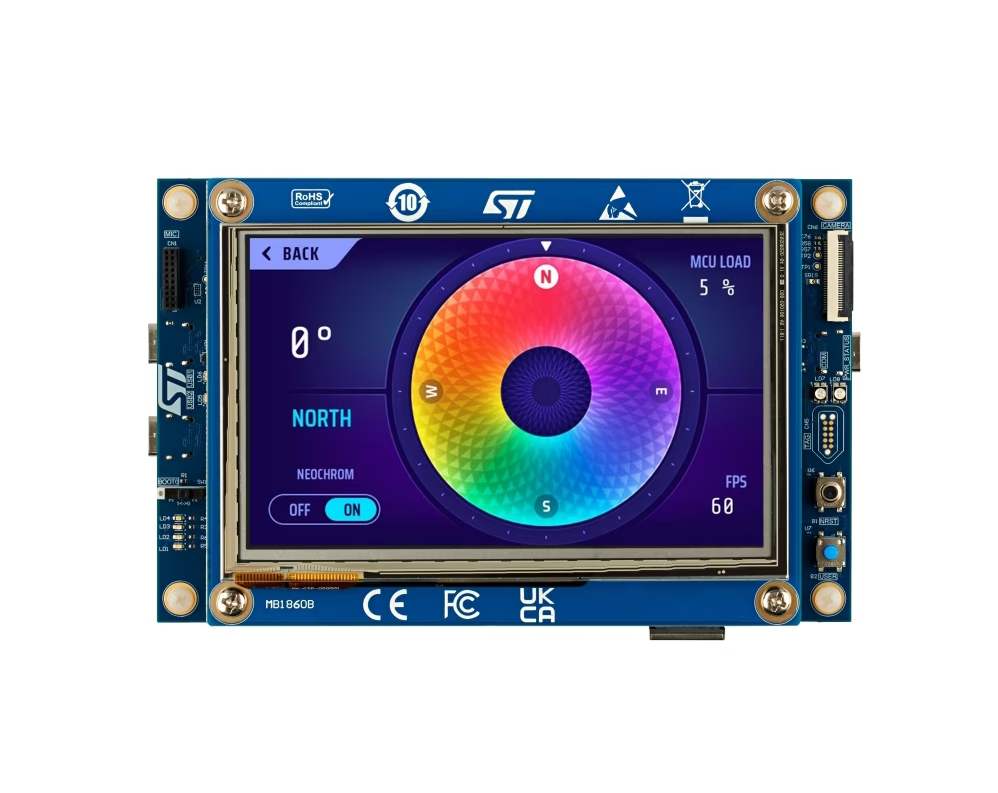

**中文** | [English](README_en.md)

# STM32H750-artpi 开发板 BSP 说明

## 简介

本文档 为 STM32H7S78-DK 开发板提供的 BSP (板级支持包) 说明。

主要内容如下：

- 开发板资源介绍
- BSP 快速上手
- 进阶使用方法

通过阅读快速上手章节开发者可以快速地上手该 BSP，将 RT-Thread 运行在开发板上。在进阶使用指南章节，将会介绍更多高级功能，帮助开发者利用 RT-Thread 驱动更多板载资源。

## 开发板介绍

STM32H7S78-DK 是 ST 官方推出的一款基于 ARM Cortex-M7 内核的开发板，最高主频为 600Mhz，该开发板具有丰富的板载资源，可以充分评估 STM32H7S7 的芯片性能。

开发板外观如下图所示：



该开发板常用 **板载资源** 如下：

- MCU：STM32H7S7，主频 550MHz，64KB FLASH, 456KB RAM
- 常用接口：USB 转串口、USB OTG
- 调试接口，标准 ST-LINK V3

开发板更多详细信息请参考 [STM32H7S78-DK](https://www.st.com/en/evaluation-tools/stm32h7s78-dk.html)。


## 外设支持

本 BSP 目前对外设的支持情况如下：

| **板载外设** | **支持情况** | **备注** |
| :----------- | :----------: | :------- |
| LED          |     支持     | 一个绿灯 |
| **片上外设** | **支持情况** | **备注** |
| GPIO         |     支持     |          |
| UART         |     支持     | UART4    |
| SPI          |    待支持    | SPI      |


## 使用说明

使用说明分为如下两个章节：

- 快速上手

    本章节是为刚接触 RT-Thread 的新手准备的使用说明，遵循简单的步骤即可将 RT-Thread 操作系统运行在该开发板上，看到实验效果 。

- 进阶使用

    本章节是为需要在 RT-Thread 操作系统上使用更多开发板资源的开发者准备的。通过使用 ENV 工具对 BSP 进行配置，可以开启更多板载资源，实现更多高级功能。


### 快速上手

本 BSP 为开发者提供 MDK5 工程，并且支持 GCC 开发环境。下面以 MDK5 开发环境为例，介绍如何将系统运行起来。

#### 硬件连接

使用数据线连接开发板的ST-Link端口到 PC，并确保板子上的供电跳线配置妥当。

#### 编译下载

双击 project.uvprojx 文件，打开 MDK5 工程，编译并下载程序到开发板。

> 工程默认配置使用 ST_LINK 仿真器下载程序，在通过 ST_LINK 连接开发板的基础上，点击下载按钮即可下载程序到开发板

#### 运行结果

下载程序成功之后，系统会自动运行，LED闪烁。

连接开发板对应串口到 PC , 在终端工具里打开相应的串口（115200-8-1-N），复位设备后，可以看到 RT-Thread 的输出信息:

```bash
[I/board] System Clock information
[I/board] SYSCLK_Frequency = 550000000
[I/board] HCLK_Frequency   = 275000000
[I/board] PCLK1_Frequency  = 137500000
[I/board] PCLK2_Frequency  = 137500000
[I/board] XSPI1_Frequency  = 200000000
[I/board] XSPI2_Frequency  = 200000000

 \ | /
- RT -     Thread Operating System
 / | \     5.1.0 build Apr 10 2024 14:32:06
 2006 - 2024 Copyright by RT-Thread team
msh >

```
### 进阶使用

此 BSP 默认只开启了 GPIO 和 串口4 的功能，如果需使用更多高级功能，需要利用 ENV 工具对BSP 进行配置，步骤如下：

1. 在 bsp 下打开 env 工具。

2. 输入`menuconfig`命令配置工程，配置好之后保存退出。

3. 输入`pkgs --update`命令更新软件包。

4. 输入`scons --target=mdk4/mdk5/iar` 命令重新生成工程。

本章节更多详细的介绍请参考 [STM32 系列 BSP 外设驱动使用教程](../docs/STM32系列BSP外设驱动使用教程.md)。

## 注意事项

- 调试串口为串口4 映射说明

    PD0  ------> USART4_RX

    PD1 ------> USART4_TX 

- Bootloader 损坏 或 缺失

    如遇到程序下载后，板子跑不起来的情况，请先检查bootloader是否未烧录过，或是因为擦除片内flash导致了丢失。若 bootloader 缺失，则需要重新烧写目录下 h7s7_disco_bootloader.bin 文件到芯片内部flash；在连接开发板至 PC 后，使用STM32CubeProgrammer工具（ST官方下载工具），将 h7s7_disco_bootloader.bin 导入到该工具的下载界面下，并执行下载 ，断开连接并手动复位MCU后，此时应该就可以执行片外跳转了。

    此 bin 文件由STM32H7RS SDK 内示例工程构建生成，如果外部的Flash型号有修改，则可以参考ST的该示例进行修改。
    

## 联系人信息

RT-Thread [社区论坛](https://club.rt-thread.org/)。

-  ART-Pi 官方交流 QQ 群(1016035998)。

## 贡献代码

此工程尚在初始阶段，BSP尚未完善，如果您对该项目感兴趣，并有一些好玩的项目愿意与大家分享，欢迎给我们贡献代码。