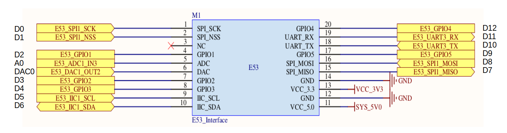

# STM32L431-BearPi开发板的Arduino生态兼容说明

## 1 RTduino - RT-Thread的Arduino生态兼容层

STM32L431-BearPi开发板已经完整适配了[RTduino软件包](https://github.com/RTduino/RTduino)，即RT-Thread的Arduino生态兼容层。用户可以按照Arduino的编程习惯来操作该BSP，并且可以使用大量Arduino社区丰富的库，是对RT-Thread生态的极大增强。更多信息，请参见[RTduino软件包说明文档](https://github.com/RTduino/RTduino)。

### 1.1 如何开启针对本BSP的Arduino生态兼容层

Env 工具下敲入 menuconfig 命令，或者 RT-Thread Studio IDE 下选择 RT-Thread Settings：

```Kconfig
Hardware Drivers Config --->
    Onboard Peripheral Drivers --->
        [*] Compatible with Arduino Ecosystem (RTduino)
```

## 2 Arduino引脚排布



该BSP遵照E53接口的引脚排列方式，详见 [pins_arduino.c](pins_arduino.c) 和 [pins_arduino.h](pins_arduino.h)。

| Arduino引脚编号           | STM32引脚编号 | 5V容忍 | 备注                                            |
| --------------------- | --------- | ---- | --------------------------------------------- |
| 0 (D0)                | PA1       | 是    | SPI-SCK,默认被RT-Thread的SPI设备框架spi1接管            |
| 1 (D1)                | PA4       | 否    | SPI-SS,默认被RT-Thread的SPI设备框架spi1接管             |
| 2 (D2)                | PA0       | 是    |                                                      |
| 3 (D3)                | PB9       | 是    |                                                      |
| 4 (D4)                | PB8       | 是    | PWM16-CH1，默认被RT-Thread的PWM设备框架pwm16接管         |
| 5 (D5)                | PB6       | 是    | I2C-SCL，被RT-Thread的I2C设备框架i2c1总线接管            |
| 6 (D6)                | PB7       | 是    | I2C-SDA，被RT-Thread的I2C设备框架i2c1总线接管            |
| 7 (D7)                | PA6       | 是    | SPI-MISO，默认被RT-Thread的SPI设备框架spi1接管           |
| 8 (D8)                | PA12      | 是    | SPI-MOSI，默认被RT-Thread的SPI设备框架spi1接管           |
| 9 (D9)                | PC9       | 是    |                                                      |
| 10 (D10)              | PC4       | 是    | Serial3-Tx，默认被RT-Thread的UART设备框架uart3接管       |
| 11 (D11)              | PC5       | 是    | Serial3-Rx，默认被RT-Thread的UART设备框架uart3接管       |
| 12 (D12)              | PA8       | 是    | PWM1-CH1，默认被RT-Thread的PWM设备框架pwm1接管           |
| A0                    | PC2       | 是    | ADC1-CH3，默认被RT-Thread的ADC设备框架adc1接管           |
| DAC0                  | PA5       | 否    | DAC1-CH2，默认被RT-Thread的DAC设备框架dac1接管           |

> 注意：
> 
> 1. 可能是由于开发板厂商的疏忽，E53标准中，规定17号脚(RTduino的9号脚D9)应该具备输出PWM波的功能，但是通过相关资料了解到，该引脚PC9并不具备PWM的功能，所以目前这个引脚只能做普通GPIO处理。
