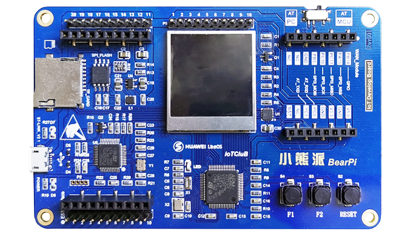

# STM32L431RCT6 小熊派开发板 BSP说明

## 简介

本文档为 Mculover666 为小熊派开发板提供的 BSP (板级支持包) 说明。

主要内容如下：

- 开发板资源介绍
- BSP 快速上手
- 进阶使用方法

通过阅读快速上手章节开发者可以快速地上手该 BSP，将 RT-Thread 运行在开发板上。在进阶使用指南章节，将会介绍更多高级功能，帮助开发者利用 RT-Thread 驱动更多板载资源。

## 开发板介绍

小熊派开发板是 IoT Club 推出的一款可玩性极高的物联网开发板，采用 ARM Cortex-M4 内核，主控芯片为ST超低功耗系列 STM32L431RCT6，主频可达 80Mhz，该开发板最大的特点是可以根据需求灵活的进行扩展：

- 传感器扩展板（标准E53接口）
  - 智慧农业
  - 智慧路灯
  - 智慧城市
  - 智慧物流
- 通信扩展板
  - NB-iot
  - 2G/3G/4G
  - WIFI

开发板外观如下图所示：



该开发板常用 **板载资源** 如下：

- MCU：STM32L431RCT6，主频 80MHz，256KB FLASH ，64KB RAM
- 外部 FLASH：W25Q64，8MB
- 常用外设
  - LED：1个，LED0（蓝色，PC13）
  - 按键：2个，KEY1（兼具唤醒功能，PA0），KEY2（PC13）
  - TFTLCD 显示屏：1个（ST7789驱动，SPI接口，240*240分辨率）
- 常用接口：USB 转串口、SD 卡接口、以太网接口、LCD 接口等
- 调试接口：板载 ST LINK V2.1（ST-LINK Micro USB 接口）

开发板更多详细信息请参考物联网俱乐部 iot-club [小熊派开发板介绍](https://iot-club.taobao.com/index.htm)。

## 外设支持

本 BSP 目前对外设的支持情况如下：

| **板载外设**      | **支持情况** | **备注**                              |
| :----------------- | :----------: | :------------------------------------- |
| USB 转串口        |     支持     |         板载ST-LINK转串口              |
| SD卡              |   支持   |                                       |
| SPI Flash         |     支持     |         使用QSPI接口                              |
| EEPROM        |     支持     |             AT24C02                   |
| 光照强度传感器     |   支持   |                BH1750                       |
| 无源蜂鸣器              |   支持   |                                       |
| 气体检测传感器              |   支持   |     MQ-2                                  |
| 温湿度传感器              |   支持   |     SHT30                                  |
| 补光灯              |   支持   |                                       |
| 贴片无刷电机              |   支持   |                                       |
| 贴片GPS模块              |   支持   |                                       |
| 以太网            |     暂不支持     |                                       |
| CAN               |   暂不支持   |                                       |
| **片上外设**      | **支持情况** | **备注**                              |
| GPIO              |     支持     |  |
| UART              |     支持     | UART1                          |
| LPUART              |     暂不支持     | LPUART1                             |
| SPI               |     暂不支持     | SPI1/2                              |
| I2C               |     暂不支持     | I2C1/2/3                              |
| SDIO              |   暂不支持   |     即将支持                  |
| RTC               |   暂不支持   | 即将支持                              |
| PWM               |   暂不支持   | 即将支持                              |
| USB Device        |   暂不支持   | 即将支持                              |
| USB Host          |   暂不支持   | 即将支持                              |
| IWG               |   暂不支持   | 即将支持                              |
| **扩展模块**      | **支持情况** | **备注**                              |
|     ESP8266 模块      |   暂不支持   |    即将支持                                  |
|     M26 模块      |   暂不支持   |    即将支持                                  |
|     BC35-G 模块      |   暂不支持   |    即将支持                                  |

## 使用说明

使用说明分为如下两个章节：

- 快速上手

    本章节是为刚接触 RT-Thread 的新手准备的使用说明，遵循简单的步骤即可将 RT-Thread 操作系统运行在该开发板上，看到实验效果 。

- 进阶使用

    本章节是为需要在 RT-Thread 操作系统上使用更多开发板资源的开发者准备的。通过使用 ENV 工具对 BSP 进行配置，可以开启更多板载资源，实现更多高级功能。


### 快速上手

本 BSP 为开发者提供 MDK4、MDK5 和 IAR 工程，并且支持 GCC 开发环境。下面以 MDK5 开发环境为例，介绍如何将系统运行起来。

#### 硬件连接

使用数据线连接开发板到 PC，打开电源开关。

#### 编译下载

双击 project.uvprojx 文件，打开 MDK5 工程，编译并下载程序到开发板。

> 工程默认配置使用 ST-LINK 仿真器下载程序，在通过 USB 连接开发板的基础上，点击下载按钮即可下载程序到开发板

#### 运行结果

下载程序成功之后，系统会自动运行，观察开发板上LED的运行效果，蓝色的用户LED会闪烁。

将开发板右上角的选择开关拨至 **AT-MCU** 一侧，连接开发板对应串口到 PC , 在终端工具里打开相应的串口（115200-8-1-N），复位设备后，可以看到 RT-Thread 的输出信息:

```bash
 \ | /
- RT -     Thread Operating System
 / | \     4.0.2 build Aug 24 2019
 2006 - 2019 Copyright by rt-thread team
msh >
```
### 进阶使用

此 BSP 默认只开启了 GPIO 和 串口1 的功能，如果需使用 SD 卡、Flash 等更多高级功能，需要利用 ENV 工具对BSP 进行配置，步骤如下：

1. 在 bsp 下打开 env 工具。

2. 输入`menuconfig`命令配置工程，配置好之后保存退出。

3. 输入`pkgs --update`命令更新软件包。

4. 输入`scons --target=mdk4/mdk5/iar` 命令重新生成工程。

本章节更多详细的介绍请参考 [STM32 系列 BSP 外设驱动使用教程](../docs/STM32系列BSP外设驱动使用教程.md)。

## 注意事项

无。

## 联系人信息

维护人:

-  [Mculover666](https://github.com/Mculover666), 邮箱：<2412828003@qq.com>