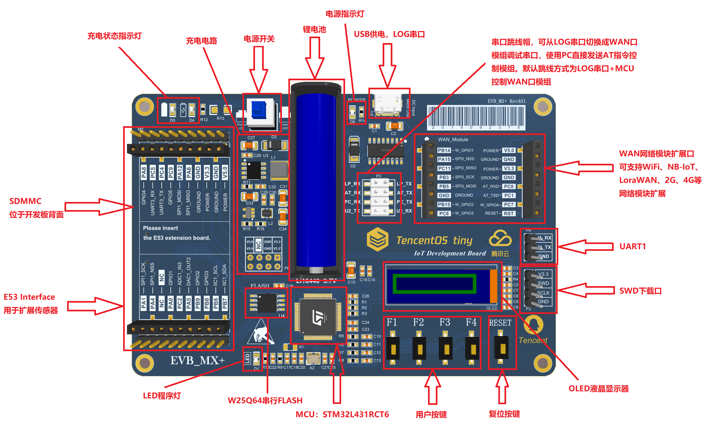

# stm32l431-tencentos-tiny BSP

## 简介

本文档为TencentOS-tiny-EVB_MX+开发板的BSP (板级支持包) 说明。

主要内容如下：

- 开发板资源介绍
- BSP 快速上手
- 进阶使用方法

通过阅读快速上手章节开发者可以快速地上手该 BSP，将 RT-Thread 运行在开发板上。在进阶使用指南章节，将会介绍更多高级功能，帮助开发者利用
RT-Thread 驱动更多板载资源。

## 开发板介绍

腾讯物联网终端操作系统（TencentOStiny）是腾讯面向物联网领域开发的实时操作系统，具有低功耗，低资源占用，模块化，安全可靠等特点，可有效提升物联网终端产品开发效率。TencentOS
tiny 提供精简的 RTOS 内核，内核组件可裁剪可配置，可快速移植到多种主流 MCU (如STM32全系列)
及模组芯片上。而且，基于RTOS内核提供了丰富的物联网组件，内部集成主流物联网协议栈（如CoAP/MQTT/TLS/DTLS/LoRaWAN/NB-IoT
等），可助力物联网终端设备及业务快速接入腾讯云物联网平台

开发板外观如下图所示：



该开发板常用 **板载资源** 如下：

- MCU：STM32L431RCT6，主频 80MHz，256KB FLASH ，64KB RAM
- 外部 FLASH：型号，8MB
- 常用外设
    - LED：1个，DS0（绿色，PC13）
    - 按键：4个，K0（PB12），K1（PB2），K2（PC10），K3（PB13）
- 常用接口：USB 转串口、SD 卡接口、IIC屏幕接口等
- 调试接口，标准 SWD

开发板更多详细信息请参考IoTCluB [短小精练地介绍短小精炼的TencentOS tiny](https://mp.weixin.qq.com/s/-4ag_kjMdbapLrlnzGxhkA)。

## 外设支持

本 BSP 目前对外设的支持情况如下：

| **板载外设**       | **支持情况**  | **备注**                                |
|:---------------|:---------:|:--------------------------------------|
| USB 转串口        |    支持     | 默认Finsh串口输出端，连接至UART2                 |
| QSPI Flash      |   支持    |                                       |
| SD卡            |   支持    |                                       |
| **片上外设**       | **支持情况**  | **备注**                                |
| GPIO           |    支持     | PA0, PA1... PK15 ---> PIN: 0, 1...176 |
| UART           |    支持     | LPUART1/UART2/x                       |
| SPI            |   支持    | SPI1/3                              |
| I2C            |   支持    | 软件 I2C                                |
| SDIO           |   支持    |                                   |
| RTC            |   支持    |    LSE                               |
|ADC|支持|ADC1,(E53 LAN Interface)
|DAC |支持|DAC1,(E53 LAN Interface)
| **扩展模块**       | **支持情况**  | **备注**                                |
| GPS模块          |   暂不支持    | 即将支持                                  |
| BC35-G模块       |   暂不支持    | 即将支持                                  |
| ESP8266-WIFI模块 |   暂不支持    | 即将支持                                  |

## 使用说明

使用说明分为如下两个章节：

- 快速上手

  本章节是为刚接触 RT-Thread 的新手准备的使用说明，遵循简单的步骤即可将 RT-Thread 操作系统运行在该开发板上，看到实验效果 。

- 进阶使用

  本章节是为需要在 RT-Thread 操作系统上使用更多开发板资源的开发者准备的。通过使用 ENV 工具对 BSP
  进行配置，可以开启更多板载资源，实现更多高级功能。

### 快速上手

本 BSP 为开发者提供 MDK4、MDK5 和 IAR 工程，并且支持 GCC 开发环境。下面以 MDK5 开发环境为例，介绍如何将系统运行起来。

#### 硬件连接

使用数据线连接开发板到 PC，打开电源开关。

#### 编译下载

双击 project.uvprojx 文件，打开 MDK5 工程，编译并下载程序到开发板。

> 工程默认配置使用ST-Link仿真器下载程序，在通过ST-Link连接开发板的基础上，点击下载按钮即可下载程序到开发板

#### 运行结果

下载程序成功之后，系统会自动运行，LED0(PC13) 会闪烁。

连接开发板对应串口到 PC , 在终端工具里打开相应的串口（115200-8-1-N），复位设备后，可以看到 RT-Thread 的输出信息:

```bash
 \ | /
- RT -     Thread Operating System
 / | \     5.0.1 build Mar 14 2024 00:07:47
 2006 - 2022 Copyright by RT-Thread team
do components initialization.
initialize rti_board_end:0 done
initialize finsh_system_init:0 done
msh >
```

### 进阶使用

此 BSP 默认只开启了 GPIO 和 UART2 的功能，如果需使用 SD 卡、Flash 等更多高级功能，需要利用 ENV 工具对BSP 进行配置，步骤如下：

1. 在 bsp 下打开 env 工具。

2. 输入`menuconfig`命令配置工程，配置好之后保存退出。

3. 输入`pkgs --update`命令更新软件包。

4. 输入`scons --target=mdk4/mdk5/iar` 命令重新生成工程。

本章节更多详细的介绍请参考 [STM32 系列 BSP 外设驱动使用教程](../docs/STM32系列BSP外设驱动使用教程.md)。

## 注意事项

- 连接USB转串口前请务必确认已安装CH340驱动。

## 联系人信息

维护人:

- 张瑞轩, 邮箱：3478985297@qq.com
