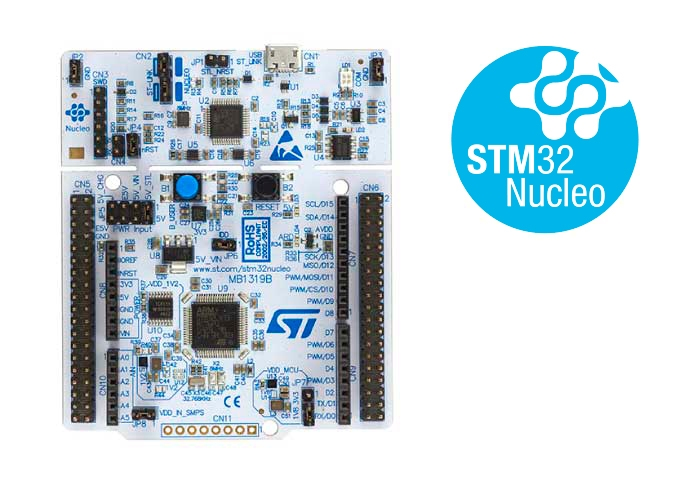

# NUCLEO-L433RC 开发板 BSP 说明

## 简介

本文档为ST官方 NUCLEO-L433RC 开发板的 BSP (板级支持包) 说明。

主要内容如下：

- 开发板资源介绍
- BSP 快速上手
- 进阶使用方法

通过阅读快速上手章节开发者可以快速地上手该 BSP，将 RT-Thread 运行在开发板上。在进阶使用指南章节，将会介绍更多高级功能，帮助开发者利用 RT-Thread 驱动更多板载资源。

## 开发板介绍

对于 NUCLEO-L433RC，内核是 Cortex-M4，绿色的 Nucleo 标志显示了这款芯片是低功耗系列，板载 ST-LINK/V2-1 调试器/编程器，迷你尺寸，mirco USB 接口，可数的外设，Arduino™ nano 兼容的接口。

开发板外观如下图所示：



该开发板常用 **板载资源** 如下：

- MCU：STM32L433RC，主频 80MHz，256KB FLASH ，64KB RAM。
- 常用外设
  - LED：4个，USB communication(LD1 双色)，USB overcurrent(LD2 红色)，power LED(LD3 绿色)，user LED(LD4 绿色)
  - 按键：2 个，USER and RESET 。
- 常用接口：USB 转串口、Arduino Uno 和 ST morpho 两类扩展接口
- 调试接口：板载 ST-LINK/V2-1 调试器。

快速入门：[STM32 Nucleo板软件开发工具入门](https://www.st.com/resource/zh/user_manual/dm00105928-getting-started-with-stm32-nucleo-board-software-development-tools-stmicroelectronics.pdf)

原理图下载：[NUCLEO-L433RC-P schematic](https://www.st.com/resource/en/schematic_pack/nucleo-l433rc-p_sch.zip)

开发板更多详细信息请参考【STMicroelectronics】 [NUCLEO-L433RC-P](https://www.st.com/content/st_com/zh/products/evaluation-tools/product-evaluation-tools/mcu-mpu-eval-tools/stm32-mcu-mpu-eval-tools/stm32-nucleo-boards/nucleo-l433rc-p.html)。

## 外设支持

本 BSP 目前对外设的支持情况如下：

| **片上外设**      | **支持情况** | **备注**                              |
| :----------------- | :----------: | :------------------------------------ |
| GPIO              |     支持     | PA0, PA1... PH1 ---> PIN: 0, 1...63    |
| UART              |     支持     | UART1, UART2                           |
| SPI               |     支持     | SPI1                                   |
| RTC               |     支持     | 支持外部晶振和内部低速时钟             |


## 使用说明

使用说明分为如下两个章节：

- 快速上手

    本章节是为刚接触 RT-Thread 的新手准备的使用说明，遵循简单的步骤即可将 RT-Thread 操作系统运行在该开发板上，看到实验效果 。

- 进阶使用

    本章节是为需要在 RT-Thread 操作系统上使用更多开发板资源的开发者准备的。通过使用 ENV 工具对 BSP 进行配置，可以开启更多板载资源，实现更多高级功能。


### 快速上手

本 BSP 为开发者提供 MDK5 和 IAR 工程，并且支持 GCC 开发环境。下面以 MDK5 开发环境为例，介绍如何将系统运行起来。

#### 硬件连接

使用数据线连接开发板到 PC，打开电源开关。

#### 编译下载

双击 project.uvprojx 文件，打开 MDK5 工程，编译并下载程序到开发板。

> 工程默认配置使用 ST-LINK 仿真器下载程序，在通过 microUSB 连接开发板的基础上，点击下载按钮即可下载程序到开发板

#### 运行结果

下载程序成功之后，系统会自动运行，观察开发板上 LED 的运行效果，红色 LD1 和 绿色 LD3 常亮、绿色 LD4 会周期性闪烁。

USB 虚拟 COM 端口默认连接串口 2，在终端工具里打开相应的串口（115200-8-1-N），复位设备后，可以看到 RT-Thread 的输出信息:

```bash
 \ | /
- RT -     Thread Operating System
 / | \     4.0.0 build Jan  9 2019
 2006 - 2018 Copyright by rt-thread team
msh >
```
### 进阶使用

此 BSP 默认只开启了 GPIO 和 串口2 的功能，如果需使用更多高级功能，需要利用 ENV 工具对 BSP 进行配置，步骤如下：

1. 在 bsp 下打开 env 工具。

2. 输入`menuconfig`命令配置工程，配置好之后保存退出。

3. 输入`pkgs --update`命令更新软件包。

4. 输入`scons --target=mdk4/mdk5/iar` 命令重新生成工程。

本章节更多详细的介绍请参考 [STM32 系列 BSP 外设驱动使用教程](../docs/STM32系列BSP外设驱动使用教程.md)。

## 注意事项

- 开机时如果不能打印 RT-Thread 版本信息，请将BSP中串口 GPIO 速率调低
- 开机时如果不能打印 RT-Thread 版本信息，请重新选择 PC 端串口调试软件的串口号

## 联系人信息

维护人:

-  [Sunwancn](https://github.com/Sunwancn), 邮箱：<bwsheng2000@163.com>