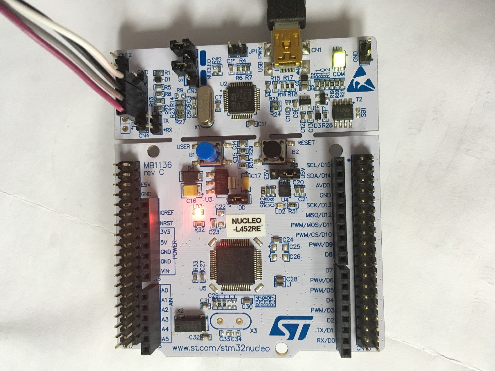

# NUCLEO-L452RE BSP 说明

## 简介

本文档为刘恒为 NUCLEO-L452RE 开发板提供的 BSP (板级支持包) 说明。

主要内容如下：

- 开发板资源介绍
- BSP 快速上手
- 进阶使用方法

通过阅读快速上手章节开发者可以快速地上手该 BSP，将 RT-Thread 运行在开发板上。在进阶使用指南章节，将会介绍更多高级功能，帮助开发者利用 RT-Thread 驱动更多板载资源。

## 开发板介绍

对于 NUCLEO-L452RE，内核是 Cortex-M4，这款芯片是低功耗系列，板载 ST-LINK/V2-1 调试器/编程器，迷你尺寸，MINI USB 接口，兼容 Arduino、还带有ST Zio和 ST Morpho 扩展接口，可连接微控制器的所有周边外设。

开发板外观如下图所示：



该开发板常用 **板载资源** 如下：

- MCU：STM32L452RE，主频 80MHz，512KB FLASH ，160KB RAM
- 常用外设
  - LED：3个，USB communication(LD1 双色),power LED(LD3 红色),user LED(LD2 绿色)
  - 按键：2个，复位按键 B2，用户按键 B1。
- 常用接口：USB 支持 3 种不同接口：虚拟 COM 端口、大容量存储和调试端口。
- 调试接口：板载 ST-LINK/V2-1 调试器。

开发板更多详细信息请参考【STMicroelectronics】 [NUCLEO-L452RE](https://www.st.com/en/evaluation-tools/nucleo-l452re.html#)。

## 外设支持

本 BSP 目前对外设的支持情况如下：

| **板载外设**      | **支持情况** | **备注**                              |
| :---------------: | :----------: | :-----------------------------------: |
| ST-LINK           |     支持     |                                       |
| USB 转串口        |     支持     | UART2                                 |
| **片上外设**      | **支持情况** | **备注**                              |
| GPIO              |     支持     | PA0, PA1... PC15 ---> PIN: 0, 1...47  |
| UART              |     支持     | UART1(TX:PA9 RX:PA10)、UART2(TX:PA2  RX:PA2)                                 |
| SPI               |   支持   |  SPI1                                       |
| I2C               |   暂不支持   |                                       |
| RTC               |   暂不支持   |                                       |
| PWM               |   暂不支持   |                                       |
| USB Device        |   暂不支持   |                                       |
| IWG               |   暂不支持   |                                       |

## 使用说明

使用说明分为如下两个章节：

- 快速上手

    本章节是为刚接触 RT-Thread 的新手准备的使用说明，遵循简单的步骤即可将 RT-Thread 操作系统运行在该开发板上，看到实验效果 。

- 进阶使用

    本章节是为需要在 RT-Thread 操作系统上使用更多开发板资源的开发者准备的。通过使用 ENV 工具对 BSP 进行配置，可以开启更多板载资源，实现更多高级功能。


### 快速上手

本 BSP 为开发者提供 MDK5 和 IAR 工程，并且支持 GCC 开发环境。下面以 MDK5 开发环境为例，介绍如何将系统运行起来。

#### 硬件连接

使用数据线连接开发板到 PC，打开电源开关。

#### 编译下载

双击 project.uvprojx 文件，打开 MDK5 工程，编译并下载程序到开发板。

> 工程默认配置使用 ST-LINK 仿真器下载程序，在通过 miniUSB 连接开发板的基础上，点击下载按钮即可下载程序到开发板

#### 运行结果

下载程序成功之后，系统会自动运行，观察开发板上 LED 的运行效果，红色 LD3 常亮、绿色 LD2 会周期性闪烁。

连接开发板对应串口到 PC , 在终端工具里打开相应的串口（115200-8-1-N），复位设备后，可以看到 RT-Thread 的输出信息:

```
 \ | /
- RT -     Thread Operating System
 / | \     4.0.2 build May 31 2019
 2006 - 2019 Copyright by rt-thread team
msh >
```

### 进阶使用

此 BSP 默认只开启了 GPIO 和 串口2 的功能，如果需使用更多高级功能，需要利用 ENV 工具对 BSP 进行配置，步骤如下：

1. 在 bsp 下打开 env 工具。

2. 输入`menuconfig`命令配置工程，配置好之后保存退出。

3. 输入`pkgs --update`命令更新软件包。

4. 输入`scons --target=mdk5/iar` 命令重新生成工程。

本章节更多详细的介绍请参考 [STM32 系列 BSP 外设驱动使用教程](../docs/STM32系列BSP外设驱动使用教程.md)。

## 注意事项

1. MCU 片内 SRAM 有 SRAM1、SRAM2，分别是 128KB、32KB，共计 160KB，本 bsp 只使用 SRAM1 128KB.

## 联系人信息

维护人:

-  [刘恒](https://github.com/lhxzui), 邮箱：<iuzxhl@qq.com>