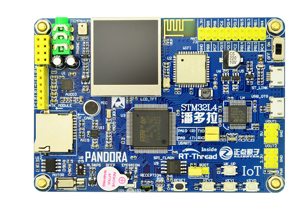

# STM32L475 潘多拉开发板 BSP 说明

## 简介

本文档为 RT-Thread 开发团队为 STM32L475 潘多拉开发板提供的 BSP (板级支持包) 说明。

主要内容如下：

- 开发板资源介绍
- BSP 快速上手
- 进阶使用方法

通过阅读快速上手章节开发者可以快速地上手该 BSP，将 RT-Thread 运行在开发板上。在进阶使用指南章节，将会介绍更多高级功能，帮助开发者利用 RT-Thread 驱动更多板载资源。

## 开发板介绍

潘多拉 STM32L475 是正点原子推出的一款基于 ARM Cortex-M4 内核的开发板，最高主频为 80Mhz，该开发板具有丰富的板载资源，可以充分发挥 STM32L475 的芯片性能。

开发板外观如下图所示：



该开发板常用 **板载资源** 如下：

- MCU：STM32L475VET6，主频 80MHz，512KB FLASH ，128KB RAM
- 外部 FLASH：W25Q128 或 NM25Q128EVB（SPI，16MB）
- 常用外设
  - RGB 状态指示灯：1个，（红、绿、蓝三色）
  - 按键：4个，KEY_UP（兼具唤醒功能，PC13），K0（PD10），K1（PD9），K2（PD8）
  - 红外发射头，红外接收头
  - 有源蜂鸣器：1个
  - 光环境传感器：1个
  - 贴片电机：1个
  - 六轴传感器：1个
  - 高性能音频解码芯片：1个
  - 温湿度传感器（AHT10）：1个
  - TFTLCD 显示屏：1个
  - WIFI 模块（AP6181）：1个
  - 板载 ST LINK V2.1 功能
- 常用接口：SD 卡接口、USB OTG、Micro USB 接口
- 调试接口，ST-LINK Micro USB 接口

开发板更多详细信息请参考正点原子 [STM32 潘多拉开发板介绍](https://eboard.taobao.com/index.htm)。

## 外设支持

本 BSP 目前对外设的支持情况如下：

| **板载外设**      | **支持情况** | **备注**                              |
| :----------------- | :----------: | :------------------------------ |
| 板载 ST-LINK 转串口 |     支持     |                                    |
| QSPI_FLASH         |     支持     |                                   |
| SD 卡               |   支持       | 使用 SPI1 驱动 |
| 温湿度传感器        |    支持     |                             |
| 六轴传感器         |    支持     |                              |
| 音频解码           |    支持     |                                     |
| TFTLCD           |    支持     | 使用 SPI3 驱动 |
| 贴片电机           |    暂不支持     |即将支持                      |
| 光环境传感器       |    暂不支持     |即将支持                           |
| AP6181 WIFI 模块 | 支持 |使用 SDIO 驱动 |
| **片上外设**      | **支持情况** | **备注**                              |
| GPIO              |     支持     |                                      |
| UART              |     支持     |                                      |
| SPI               |     支持     |                                      |
| QSPI              |     支持     |                                      |
| I2C               |     支持     |                                      |
| TIM               |     支持     |                                      |
| ADC               |     支持     |                                      |
| RTC               |     支持     | 支持外部晶振和内部低速时钟 |
| WDT               |     支持     |                                      |
| PWM               |     支持     |                                      |
| USB Device        |   支持   |                          |
| USB Host          |   暂不支持   | 即将支持                              |
| **扩展模块**      | **支持情况** | **备注**                              |
| NRF24L01 模块  |     支持    | 根据实际板子接线情况修改 NRF24L01 软件包中的 `NRF24L01_CE_PIN` 和 `NRF24_IRQ_PIN` 的宏定义，以及 SPI 设备名 |
| ATK-ESP8266 模块  |    暂不支持  | 即将支持                              |
| ENC28J60 模块  |     暂不支持    | 即将支持                              |
使用该开发板的更多高级功能请参考 RT-Thread 代码仓库： [RT-Thread IoT-Board SDK](https://github.com/RT-Thread/IoT_Board)。

## 使用说明

使用说明分为如下两个章节：

- 快速上手

    本章节是为刚接触 RT-Thread 的新手准备的使用说明，遵循简单的步骤即可将 RT-Thread 操作系统运行在该开发板上，看到实验效果 。

- 进阶使用

    本章节是为需要在 RT-Thread 操作系统上使用更多开发板资源的开发者准备的。通过使用 ENV 工具对 BSP 进行配置，可以开启更多板载资源，实现更多高级功能。


### 快速上手

本 BSP 为开发者提供 MDK4、MDK5 和 IAR 工程，并且支持 GCC 开发环境。下面以 MDK5 开发环境为例，介绍如何将系统运行起来。

#### 硬件连接

使用数据线连接开发板到 PC，打开电源开关。

#### 编译下载

双击 project.uvprojx 文件，打开 MDK5 工程，编译并下载程序到开发板。

> 工程默认配置使用板载 ST-LINK 下载程序，只需一根 USB 线连接开发板，点击下载按钮即可下载程序到开发板

#### 运行结果

下载程序成功之后，系统会自动运行，观察开发板上 LED 灯的运行效果，红色 LED 灯会周期性闪烁。

连接开发板对应串口到 PC , 在终端工具里打开相应的串口（115200-8-1-N），复位设备后，可以看到 RT-Thread 的输出信息:


```bash
 \ | /
- RT -     Thread Operating System
 / | \     3.1.1 build Nov 19 2018
 2006 - 2018 Copyright by rt-thread team
msh >
```
### 进阶使用

此 BSP 默认只开启了 GPIO 和 串口1 的功能，如果需使用 SD 卡、Flash 等更多高级功能，需要利用 ENV 工具对 BSP 进行配置，步骤如下：

1. 在 bsp 下打开 ENV 工具。

2. 输入 `menuconfig` 命令配置工程，配置好之后保存退出。

3. 输入 `pkgs --update` 命令更新软件包。

4. 输入 `scons --target=mdk4/mdk5/iar` 命令重新生成工程。

本章节更多详细的介绍请参考 [STM32 系列 BSP 外设驱动使用教程](../docs/STM32系列BSP外设驱动使用教程.md)。

## 注意事项

关于ST-Link无法升级的问题请参考：https://github.com/armink/HackSTLinkUpgrade

## 联系人信息

维护人:

- [SummerGift](https://github.com/SummerGGift)