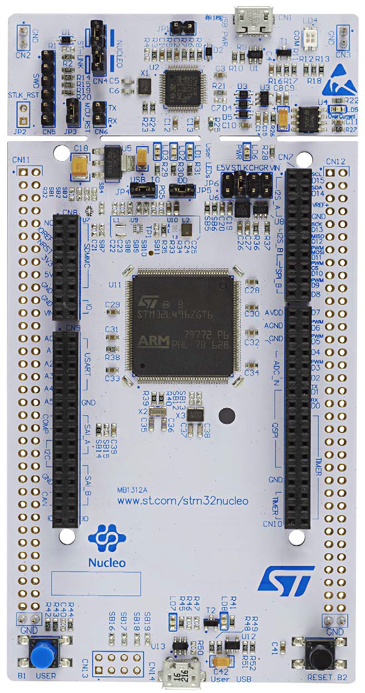

# STM32L4R5ZI-NUCLEO 开发板bsp说明

## 简介

由 QYZ 为 STM32L4R5ZI-NUCLEO 开发板提供的 BSP (板级支持包) 说明。

主要内容如下：

- 开发板资源介绍
- BSP 快速上手
- 进阶使用方法

通过阅读快速上手章节开发者可以快速地上手该 BSP，将 RT-Thread 运行在开发板上。在进阶使用指南章节，将会介绍更多高级功能，帮助开发者利用 RT-Thread 驱动更多板载资源。

## 开发板介绍

开发板外观如下图所示：



该开发板常用 **板载资源** 如下：

- MCU：STM32L4R5ZI，主频 120MHz，2048KB FLASH ，640KB RAM
- 常用外设
  - 状态指示灯：3个，LD1 - 3
  - 按键：2个
  - 板载 ST LINK
- 常用接口：USB OTG Micro USB 接口
- 调试接口，ST-LINK Micro USB 接口
开发板更多详细信息请参考 ST 的 [STM32L4R5ZI-NUCLEO](https://www.st.com/en/evaluation-tools/nucleo-l4r5zi.html)介绍。
## 外设支持

本 BSP 目前对外设的支持情况如下：

| **板载外设**      		| **支持情况** 	| **备注**                              		|
| :-----------------	| :----------: 	| :-----------------------------------------|
| 板载 ST-LINK 转串口 	|     支持     	| PG7 PG8 LPUART1                           |
| SRAM              	|     支持     	|                              				|
| **片上外设**     		| **支持情况** 	| **备注**                              		|
| GPIO              	|     支持     	| 											|
| UART              	|     支持     	| USART3                             		|


## 使用说明

使用说明分为如下两个章节：

- 快速上手

    本章节是为刚接触 RT-Thread 的新手准备的使用说明，遵循简单的步骤即可将 RT-Thread 操作系统运行在该开发板上，看到实验效果 。

- 进阶使用

    本章节是为需要在 RT-Thread 操作系统上使用更多开发板资源的开发者准备的。通过使用 ENV 工具对 BSP 进行配置，可以开启更多板载资源，实现更多高级功能。


### 快速上手

本 BSP 为开发者提供 MDK5 和 IAR 工程，并且支持 GCC 开发环境。下面以 MDK5 开发环境为例，介绍如何将系统运行起来。

#### 硬件连接

使用数据线连接开发板到 PC，打开电源开关。

#### 编译下载

双击 project.eww 文件，打开 IAR 工程，编译并下载程序到开发板。

> 工程默认配置使用 板载STLINK 仿真器下载程序，在通过 STLINK 连接开发板的基础上，点击下载按钮即可下载程序到开发板

#### 运行结果

下载程序成功之后，系统会自动运行，观察开发板上 LED 的运行效果， LED 会周期性闪烁。

连接开发板对应串口到 PC , 在终端工具里打开相应的串口（115200-8-1-N），复位设备后，可以看到 RT-Thread 的输出信息:

```bash
 \ | /
- RT -     Thread Operating System
 / | \     4.0.1 build Apr 4 2019
 2006 - 2019 Copyright by rt-thread team
msh >
```
### 进阶使用

此 BSP 默认只开启了 GPIO 和 LPUART1的功能，如果需使用 USB、Flash 等更多高级功能，需要利用 ENV 工具对BSP 进行配置，步骤如下：

1. 在 bsp 下打开 env 工具。

2. 输入`menuconfig`命令配置工程，配置好之后保存退出。

3. 输入`pkgs --update`命令更新软件包。

4. 输入`scons --target=mdk5/iar` 命令重新生成工程。

本章节更多详细的介绍请参考 [STM32 系列 BSP 外设驱动使用教程](../docs/STM32系列BSP外设驱动使用教程.md)。

## 注意事项

- 调试串口为LPUART1 映射到PG7 PG8

- stm32L4R5ZI 共有三块内部RAM区域 具体使用情况入如下

 ```
      RAM1 (rw) : ORIGIN = 0x20000000, LENGTH =  192k /* 192K sram 用于程序定义全局变量 静态变量存放*/
      RAM2 (rw) : ORIGIN = 0x10000000, LENGTH =   64k /* 64K sram  暂未使用 */ 
      RAM3 (rw) : ORIGIN = 0x20040000, LENGTH =  384k /* 384K sram 用于heap空间*/ 
 ```


## 联系人信息

维护人:
