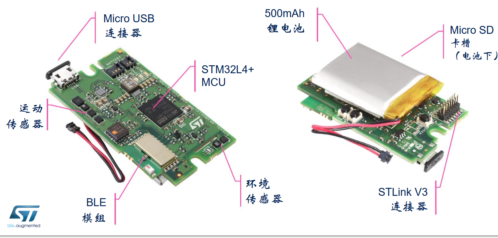

# STM32L4R9ZI-MKSBOX1V1 开发板bsp说明

## 简介

由 supperthomas 为 STM32L4R9ZI-MKSBOX1V1 开发板提供的 BSP (板级支持包) 说明。

主要内容如下：

- 开发板资源介绍
- BSP 快速上手
- 进阶使用方法

通过阅读快速上手章节开发者可以快速地上手该 BSP，将 RT-Thread 运行在开发板上。在进阶使用指南章节，将会介绍更多高级功能，帮助开发者利用 RT-Thread 驱动更多板载资源。

## 开发板介绍

开发板外观如下图所示：



该开发板常用 **板载资源** 如下：

- MCU：STM32L4R9，主频 120MHz，2048KB FLASH ，640KB RAM
- 常用外设
  - 状态指示灯：2个，LED1（PB5）LED 2(PF2) 
  - UART1: RX(PA9) TX(PA10)
  - 按键：1个，USER_PB1（PG1）
  - 板载 BLE 模组SPBTLE-1S（SPI/UART)
  - 温度传感器STTS751(I2C3_SDA PG8  I2C3_SCL PG7 )
  - 温湿度HTS221 压力传感器LPS22HH   I2C3_SDA(PB7) I2C3_SCL(PB6)
  - 加速度LIS2DW12  CS_ACC(PE11)
  - 
- 常用接口：SD 卡接口、USB OTG Micro USB 接口
- 调试接口，ST-LINK Micro USB 接口
开发板更多详细信息请参考 ST 的 [STM32L4R9ZI-MKSBOX1V1](https://www.st.com/zh/evaluation-tools/steval-mksbox1v1.html)介绍。

## 外设支持

本 BSP 目前对外设的支持情况如下：

|   **板载外设**    |  **支持情况**     |   **备注**   |
| ---- | ---- | ---- |
| 板载 ST-LINK 转串口 | 支持 | RX(PA9) TX(PA10) 需要外接ST-LINK 有ST-LINK插槽 |
| BLE 模组SPBTLE-1S | 待支持 |  |
| 传感器 | 待支持 |  |
|  |  |  |
|   **片上外设**      |    **支持情况**   |   **备注**    |
| GPIO | 支持 | LED1（PB5）LED 2(PF2) USER_PB1（PG1） |
| UART | 支持 | UART1: RX(PA9) TX(PA10)   CONSOLE |
| USBD | 支持 | USBD CDC 虚拟串口已验证 |
| SPI1 | 待支持 | SPI1_MOSI(PE15) SPI1_MISO(PE14) SPI1_CLK(PE13) |
| SPI2 | 待支持 | SPI2_MOSI(PC3) SPI2_MISO(PD3) SPI2_SCK(PD1) SPI2_CS(PD0) |
| IIC1 | 待支持 | I2C1_SCL(PB6)   I2C_SDA(PB7) |


## 使用说明

使用说明分为如下两个章节：

- 快速上手

    本章节是为刚接触 RT-Thread 的新手准备的使用说明，遵循简单的步骤即可将 RT-Thread 操作系统运行在该开发板上，看到实验效果 。

- 进阶使用

    本章节是为需要在 RT-Thread 操作系统上使用更多开发板资源的开发者准备的。通过使用 ENV 工具对 BSP 进行配置，可以开启更多板载资源，实现更多高级功能。


### 快速上手

本 BSP 为开发者提供 MDK5 和 IAR 工程，并且支持 GCC 开发环境。下面以 MDK5 开发环境为例，介绍如何将系统运行起来。

#### 硬件连接

使用数据线连接开发板到 PC，打开电源开关。

#### 编译下载

双击 project.uvprojx 文件，打开 MDK5 工程，编译并下载程序到开发板。

> 工程默认配置使用 STLINK 仿真器下载程序，你可以在你的其他NUCLEO板上接一个STLINK到开发板的SWD接口上

下载程序成功之后，系统会自动运行，观察开发板上 LED 的运行效果， LED 会周期性闪烁。

连接开发板对应串口到 PC , 在终端工具里打开相应的串口（由STLINK连接的串口）（115200-8-1-N），复位设备后，可以看到 RT-Thread 的输出信息:

```bash
 \ | /
- RT -     Thread Operating System
 / | \     4.0.3 build Mar 22 2020
 2006 - 2020 Copyright by rt-thread team
msh >
```
### 进阶使用

此 BSP 默认只开启了 GPIO 和 串口1的功能，如果需使用 SD 卡、Flash 等更多高级功能，需要利用 ENV 工具对BSP 进行配置，步骤如下：

1. 在 bsp 下打开 env 工具。

2. 输入`menuconfig`命令配置工程，配置好之后保存退出。

3. 输入`pkgs --update`命令更新软件包。

4. 输入`scons --target=mdk5/iar` 命令重新生成工程。

本章节更多详细的介绍请参考 [STM32 系列 BSP 外设驱动使用教程](../docs/STM32系列BSP外设驱动使用教程.md)。

## 注意事项

- 调试串口为串口1 映射到PA9   PA10，由ST-LINK连接
- 板子上的外接接口有限，建议使用官方提供的转接板ST-LINK进行调试，也可以用DFU的方式进行烧入


## 联系人信息

- 维护人:

  - [super_mcu] 邮箱：[super_mcu@qq.com](mailto:super_mcu@qq.com)

-  更详细的资料会整理在

   [STM32L4R9ZI-MKSBOX1V1](https://github.com/supperthomas/BSP_BOARD_STM32L4R9ZI_MKSBOX1V1.git)

