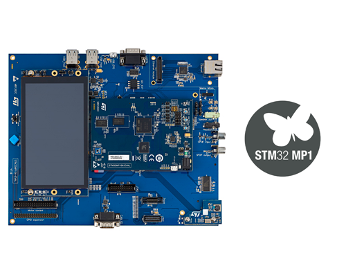

# STM32MP157A-EV1 开发板 BSP 说明

## 简介

本文档为 RT-Thread 开发团队为 STM32MP157A-EV1 开发板提供的 BSP (板级支持包) 说明。

主要内容如下：

- 开发板资源介绍
- BSP 快速上手
- 进阶使用方法

通过阅读快速上手章节开发者可以快速地上手该 BSP，将 RT-Thread 运行在开发板上。在进阶使用指南章节，将会介绍更多高级功能，帮助开发者利用 RT-Thread 驱动更多板载资源。

## 开发板介绍

STM32MP157A-EV1 是 ST 推出的一款基于双 Cortex-A7  + Cortex-M4 内核的开发板。Cortex-A7 核工作频率为 650MHZ，Cortex-M4 工作频率为 209MHZ。

开发板外观如下图所示：

​											

该开发板常用 **板载资源** 如下：

- MCU：STM32MP157AAAx
- 常用外设
  - LED：4个 ，LD4(PD8), LD5(PD9), LD2(PA13), LD3(PA14)
  - 按键，4个，WAKE_UP, RESET (NRST), USER1(PA13), USER2 (PA14)
- 常用接口：USB 转串口、SD 卡接口、以太网接口、MIPI接口、USB HOST、Audio、HDMI、Arduino
- 调试接口，标准 JTAG/SWD

开发板更多详细信息请参考 ST 官方文档 [STM32MP157A-DK1 开发板介绍](https://www.st.com/content/st_com/zh/products/evaluation-tools/product-evaluation-tools/mcu-mpu-eval-tools/stm32-mcu-mpu-eval-tools/stm32-discovery-kits/stm32mp157a-dk1.html)。

## 外设支持

本 BSP 目前对外设的支持情况如下：

| **板载外设**   | **支持情况** |    **备注**     |
| :------------- | :----------: | :-------------: |
| USB 转串口     |     支持     |                 |
| PMIC           |   暂不支持   | ST 电源管理 IC  |
| 摄像头         |   暂不支持   |     OV5640      |
| MFX            |   暂不支持   | ST 多功能拓展器 |
| FMC            |   暂不支持   |   NAND FLASH    |
| QSPI FLASH     |   暂不支持   |   MX25L51245G   |
| OpenAMP        |   暂不支持   |    双核通讯     |
| 低功耗电源管理 |   暂不支持   |                 |
| SD卡           |   暂不支持   |     SDMMC1      |
| eMMC           |   暂不支持   |     SDMMC2      |
| 以太网         |   暂不支持   |  千兆以太网卡   |
| 音频接口       |   暂不支持   |                 |
| **片上外设**   | **支持情况** |    **备注**     |
| GPIO           |     支持     |                 |
| UART           |     支持     | UART4 (ST-Link) |
| EXTI           |     支持     |                 |
| SPI            |     支持     |                 |
| TIM            |     支持     |                 |
| LPTIM          |     支持     |                 |
| I2C            |     支持     |      软件       |
| ADC            |     支持     |                 |
| DAC            |     支持     |                 |
| WWDG           |     支持     |                 |
| MDMA           |   暂不支持   |                 |
| SPDIFRX        |   暂不支持   |                 |
| DFSDM          |   暂不支持   |                 |
| PWM            |   暂不支持   |                 |
| FDCAN          |   暂不支持   |                 |
| CRC            |   暂不支持   |                 |
| RNG            |   暂不支持   |                 |
| HASH           |   暂不支持   |                 |


## 使用说明

使用说明分为如下两个章节：

- 快速上手

    本章节是为刚接触 RT-Thread 的新手准备的使用说明，遵循简单的步骤即可将 RT-Thread 操作系统运行在该开发板上，看到实验效果 。

- 进阶使用

    本章节是为需要在 RT-Thread 操作系统上使用更多开发板资源的开发者准备的。通过使用 ENV 工具对 BSP 进行配置，可以开启更多板载资源，实现更多高级功能。


### 快速上手

本 BSP 为开发者提供 MDK4、MDK5 和 IAR 工程，并且支持 GCC 开发环境。下面以 MDK5 开发环境为例，介绍如何将系统运行起来。

#### 硬件连接

使用数据线连接开发板到 PC，打开电源开关。

#### 编译下载

双击 project.uvprojx 文件，打开 MDK5 工程，编译并下载程序到开发板。

> 工程默认配置使用 ST-LINK 下载程序，在通过 ST-LINK 连接开发板的基础上，点击下载按钮即可下载程序到开发板

#### 运行结果

下载程序成功之后，系统会自动运行，观察开发板上 LED 的运行效果，橙色 LD4 会周期性闪烁。

连接开发板对应串口到 PC , 在终端工具里打开相应的串口（115200-8-1-N），可以看到 RT-Thread 的输出信息:

> 注：正点原子开发板 在使用终端工具如：PuTTy、XShell 时，会出现系统不能启动的问题，推荐使用串口调试助手如：sscom

```bash
 \ | /
- RT -     Thread Operating System
 / | \     3.1.1 build Nov 19 2018
 2006 - 2018 Copyright by rt-thread team
msh >
```
#### 驱动使用
##### 1. DAC

1. 在 bsp 下打开 env 工具；
2. 输入`menuconfig`命令， 进入 Hardware Drivers config 打开 dac，保存并退出；
3. 输入  `scons --target=iar` 命令重新生成工程；

###### Finsh

在使用设备前，需要先查找设备是否存在，可以使用命令 `dac probe` 后面跟注册的 DAC 设备的名称。如下所示：

```c
msh />dac probe dac1
probe dac1 success
```

使能设备的某个通道可以使用命令 `dac enable` 后面跟通道号。

```c
msh />dac enable 1
dac1 channel 1 enables success
```

设置 DAC 设备某个通道的数据可以使用命令 `dac write` 后面跟通道号。

```c
msh />dac write 1 1000
dac1 channel 1 write value is 1000
```

关闭设备的某个通道可以使用命令 `dac disable` 后面跟通道号。

```c
msh />dac disable 1
dac1 channel 1 disable success
```

### 进阶使用

此 BSP 默认只开启了 GPIO 和 串口4 的功能，如果需使用 SD 卡、Flash 等更多高级功能，需要利用 ENV 工具对BSP 进行配置，步骤如下：

1. 在 bsp 下打开 env 工具。

2. 输入`menuconfig`命令配置工程，配置好之后保存退出。

3. 输入`pkgs --update`命令更新软件包。

4. 输入`scons --target=iar` 命令重新生成工程。

本章节更多详细的介绍请参考 [STM32 系列 BSP 外设驱动使用教程](../docs/STM32系列BSP外设驱动使用教程.md)。

## 注意事项

1. 下载程序前，将开发板设置为 "Engineering Mode" 模式。 在 DK1 开发板上，将底下的BOOT开关设成 BOOT0=0，BOOT2=1状态，就进入"Engineering Mode"，如下图所示：

   ​																

2. 再次烧写程序时，需要复位开发板。

## 联系人信息

维护人:

- [liukang](https://github.com/thread-liu) 

