# STM32N657-st-nucleo 开发板 BSP 说明

## 简介

本文档为 tyustli 为 STM32N657-st-nucleo 开发板提供的 BSP (板级支持包) 说明。

主要内容如下：

- 开发板资源介绍
- BSP 快速上手
- 进阶使用方法

通过阅读快速上手章节开发者可以快速地上手该 BSP，将 RT-Thread 运行在开发板上。在进阶使用指南章节，将会介绍更多高级功能，帮助开发者利用 RT-Thread 驱动更多板载资源。

## 开发板介绍

STM32N657 是 ST 推出的一款基于 ARM Cortex-M55 内核的开发板，最高主频为 800Mhz，该开发板具有丰富的板载资源，可以充分发挥 STM32N657 的芯片性能。

开发板外观如下图所示：

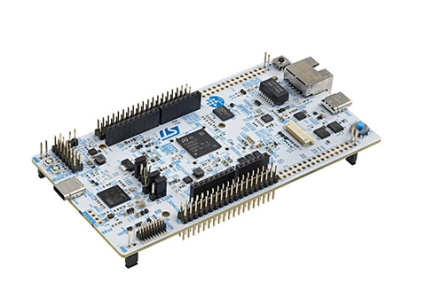

该开发板常用 **板载资源** 如下：

- MCU：STM32N657，主频 800MHz，内置32 KB ICACHE、32 KB DCACHE
  - RAM：4.2 MB连续SRAM（分为多个存储组）、8 KB备用SRAM（在VBAT模式下工作）
  - 加速器：1 GHz的ST Neural-ART加速器，可提供600 Gops
  - GPU：Neo-Chrom GPU
- 常用接口：USB 转串口、以太网接口、arduino 接口等
- 板载ST-LINK（ST-LINK/V2-1、STLINK-V3E或STLINK-V3EC）调试器/编程器，支持USB重新枚举功能：大容量存储器、虚拟COM端口和调试端口


开发板更多详细信息请参考 ST [STM32N657](https://www.st.com/en/evaluation-tools/nucleo-n657x0-q.html)。

## 外设支持

本 BSP 目前对外设的支持情况如下：

| **板载外设**      | **支持情况** | **备注**                             |
| :----------------- | :----------: | :----------------------------------|
| USB 转串口        |     支持     |  
| **片上外设**      | **支持情况** | **备注**                             |
| GPIO              |     支持     |                                      |
| UART              |     支持     |   UART1                              |
| SPI               |     支持     |                                      |
| PWM               |     支持     |                                      |
| TIM               |     支持     |                                      |


## 使用说明

使用说明分为如下三个章节：

- STM32N657 启动流程

​		本章节介绍 STM32N657 的启动流程。

- 配置签名/烧录工具的环境变量

    本章节是为后续给固件签名和烧录固件的步骤配置好环境变量。

- 快速上手

    本章节是为刚接触 RT-Thread 的新手准备的使用说明，遵循简单的步骤即可将 RT-Thread 操作系统运行在该开发板上，看到实验效果 。

- 进阶使用

    本章节是为需要在 RT-Thread 操作系统上使用更多开发板资源的开发者准备的。通过使用 ENV 工具对 BSP 进行配置，可以开启更多板载资源，实现更多高级功能。

### STM32N657 启动流程

STM32N6 是 ST 第一颗带 NPU 的 MCU 芯片，内部只有一小块 ROM 用于第一阶段的 Boot，必须使用外部 Flash 存储用户代码或通过 USB/U(S)ART 串口启动。

STM32N6 启动方式有以下三种（本 BSP 使用的是第三种）：

#### FSBL

FSBL 的全称为 First Stage Boot Loader, 在上电后，先执行片内 ROM 区域的 BootROM，然后根据 Boot 选项和地址，执行相应地址的 FSBL，参考下图实例为外部 Flash 的启动流程。

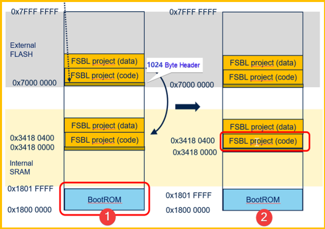

如上图，系统启动流程如下：

1. BootROM 启动后，会验证 FSBL 的头，如上图深黄色部分 1024Bytes 的 Header 信息，可以使用 ST 提供的脚本对 FSBL 进行签名，FSBL 程序必须完成签名，不然无法正常启动。验证成功后，BootROM 将 FSBL 程序搬运至内部 SRAM2：0x34180000 的位置，然后PC 指针跳转过去开始执行 FSBL。

2. FSBL 开始执行。

#### FSBL+Load&Run

APP 的开发可以在内部 SRAM 中调试完成，开发完成后通过 External loader 下载到外部 Flash。

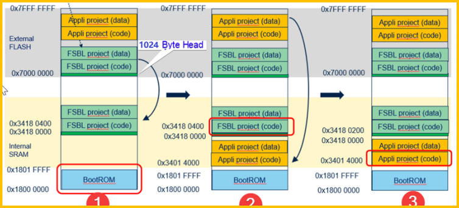

如上图，系统启动流程如下：

1. 和 FSBL 的执行一样，BootROM 先启动，然后校验，搬运 FSBL，并跳转到 FSBL。

2. FSBL 开始执行，然后拷贝 Appli 的完整内容到内部 SRAM，包括 data 和 code。然后跳转到 APP 代码进行执行。

3. APP 代码开始执行。

#### FSBL+XiP（Execute in Place）

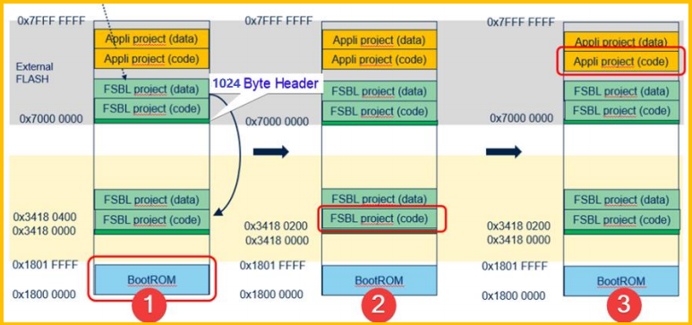

如上图，系统启动流程如下：

1. BootROM 开始执行，和第一种方式一样，校验完 FSBL 后将其搬运到 SRAM 中。

2. FSBL 开始执行，将外部 Flash 配置为 XiP 模式，FSBL 完成后，将 PC 跳转至外部Flash 中 App 的第一条指令。

3. APP 开始执行。

### 配置签名/烧录工具的环境变量

这⾥以 Windows 为例，需要配置环境变量的有三点：

- 签名工具

- 烧录工具

- 烧录算法

上述三个⼯具均可以从 `STM32CubeIDE_2.1.1` 获取，⾸先是签名与烧录⼯具：

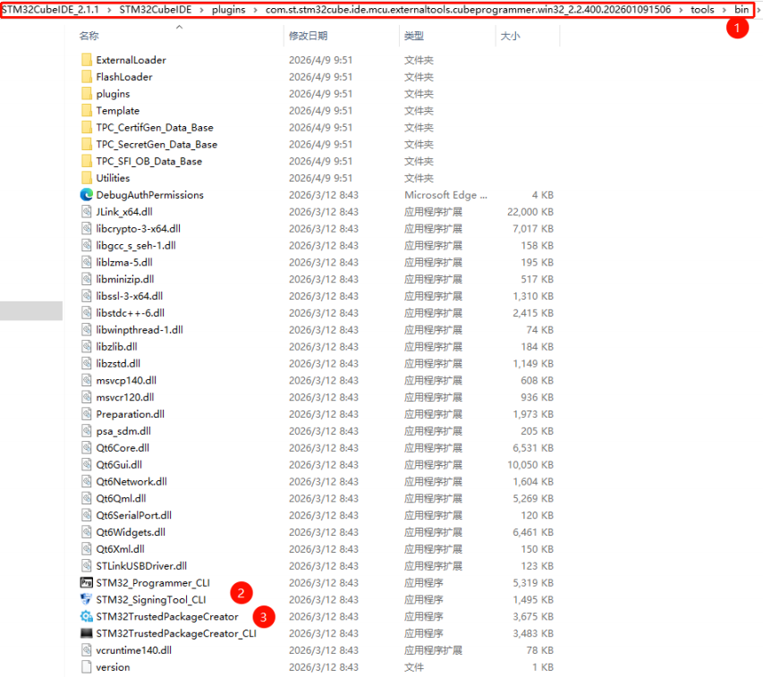

上图中的 2,3 号⼯具是我们需要的⼯具，所以将上述路径加⼊系统的环境变量：

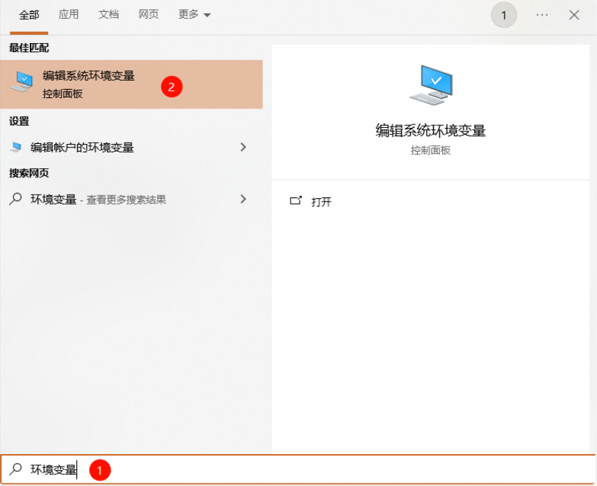

按下述⽅法将签名与烧录共⼯具的路径添加⾄环境变量：

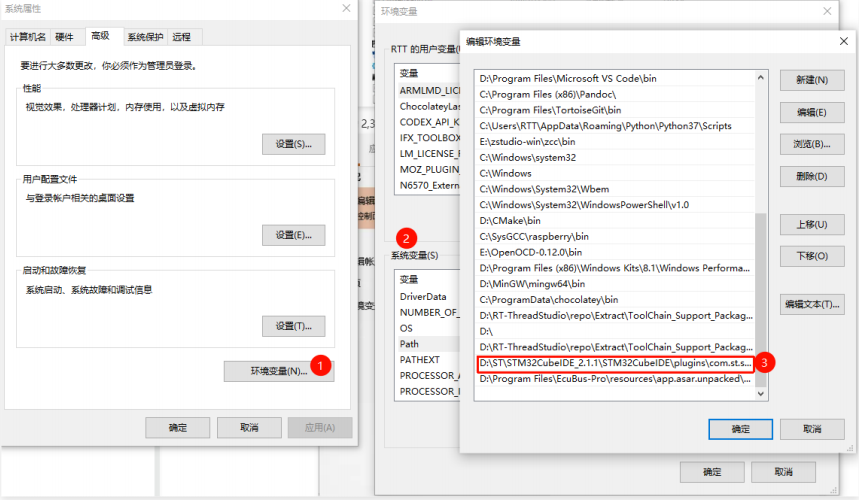

还有烧录算法，位于下述路径：

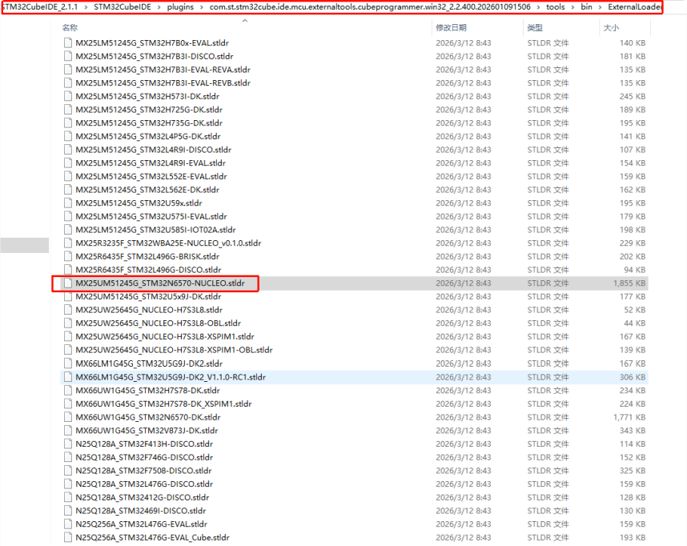

环境变量添加⽅式如下：

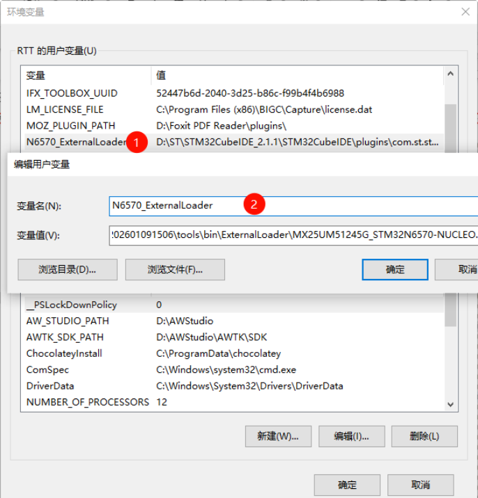

### 快速上手

本 BSP 为开发者提供 MDK5 和 IAR 工程，并且支持 GCC 开发环境。下面介绍如何将系统运行起来。

**请注意！！！**

在执行编译工作前请先打开ENV执行以下指令（该指令用于拉取必要的HAL库及CMSIS库，否则无法通过编译）：

```bash
pkgs --upgrade
pkgs --update
```

#### 硬件连接

使用 C to C 数据线连接开发板到 PC，确保设备管理器中识别到 ST-Link。

#### 编译下载

##### MDK 环境

双击 Project.uvmpw 文件，打开包含两个 MDK5 工程（FSBL 和 APP）的工作空间。

在工作空间中切换工程：

1. 在工作空间名称上右键；
2. 点击 `Manage Multi-Project Workspace...`；

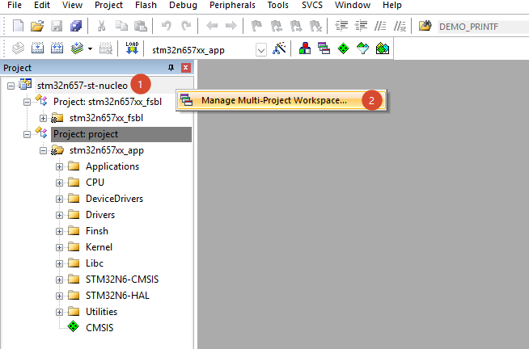

3. 选择要切换的工程；
4. 点击 `Set as Active Project`；
5. 点击 `OK` 按钮完成切换；

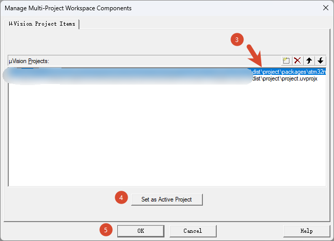

6. 此时已经切换到 `stm32n657xx_fsbl` 工程。

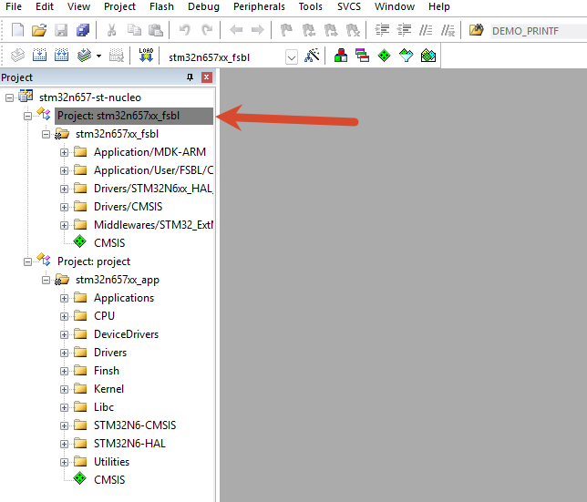

分别编译和烧录两个工程。

> 工程默认配置使用 ST_LINK 仿真器下载程序，在通过 ST_LINK 连接开发板的基础上，点击下载按钮即可下载程序到开发板

##### Scons 环境

1. 编译 FSBL 固件：

```
scons fsbl -j16
```

2. 编译 APP 固件

```
scons -j16
```

下载程序可以使用 `tools\STM32N6固件烧录工具.exe` 。

打开烧录工具之后，FSBL 烧录脚本选择 `fsbl\Signing_Programmer.bat`，APP 烧录脚本选择 `.\Signing_Programmer.bat`。点击 “一键烧录完整固件” 按钮即可下载程序。

#### 运行结果

下载程序成功之后，系统会自动运行，LED闪烁。

连接开发板对应串口到 PC , 在终端工具里打开相应的串口（115200-8-1-N），复位设备后，可以看到 RT-Thread 的输出信息:

```bash
 \ | /
- RT -     Thread Operating System
 / | \     5.3.1 build Sep 11 2026 09:31:55
 2006 - 2026 Copyright by RT-Thread team
msh >
```
### 进阶使用

此 BSP 默认只开启了 GPIO 和 串口1 的功能，如果需使用更多高级功能，需要利用 ENV 工具对BSP 进行配置，步骤如下：

1. 在 bsp 下打开 env 工具。

2. 输入`menuconfig`命令配置工程，配置好之后保存退出。

3. 输入`pkgs --update`命令更新软件包。

4. 输入`scons --target=mdk4/mdk5/iar` 命令重新生成工程。

本章节更多详细的介绍请参考 [STM32 系列 BSP 外设驱动使用教程](../docs/STM32系列BSP外设驱动使用教程.md)。

## 注意事项

- 调试串口为串口1 映射说明

    PE5     ------> VCP_TX

    PE6     ------> VCP_RX 

* 在编译时如果找不到 FSBL 工程，请检查 packages 目录下是否有 `stm32n657xx_fsbl-latest` 软件包。