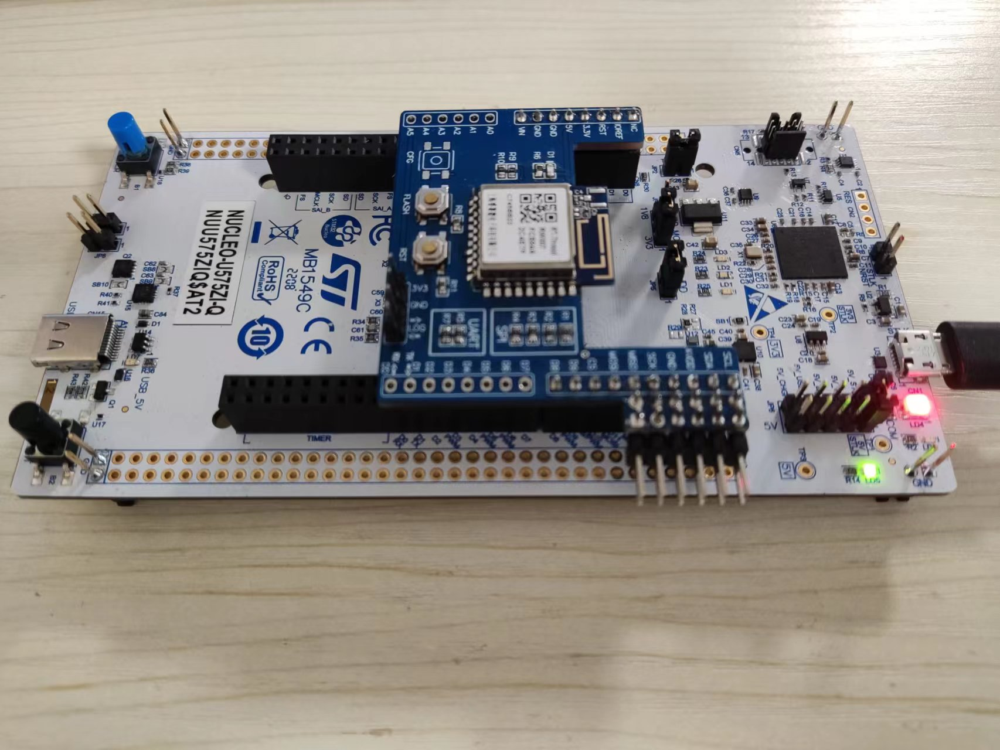
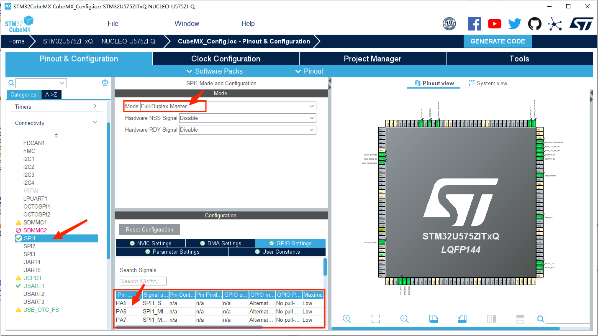
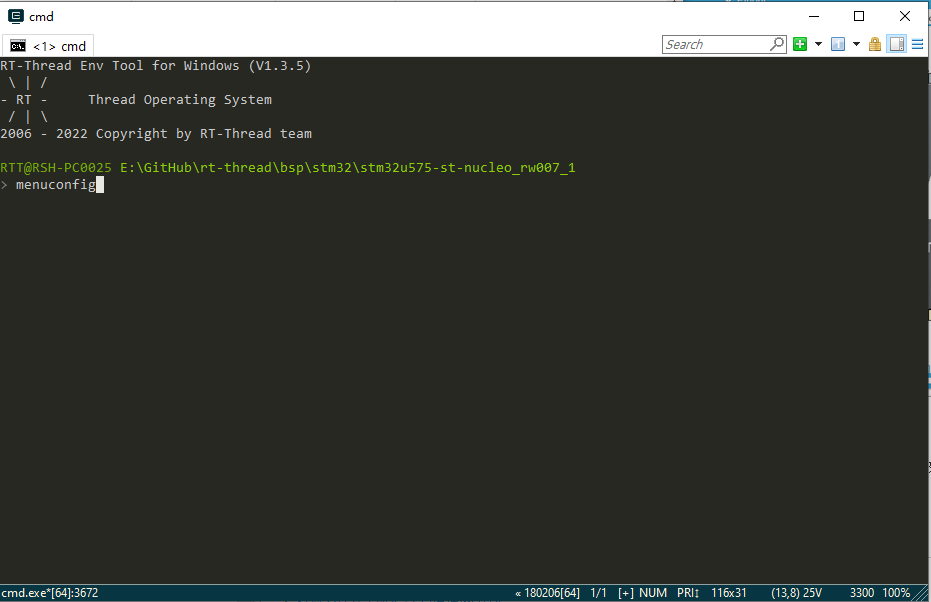
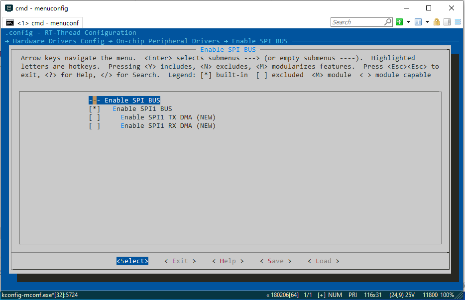
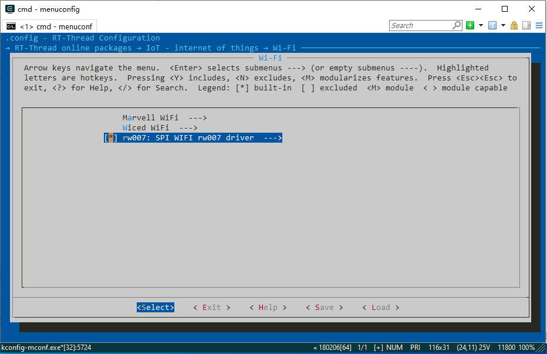
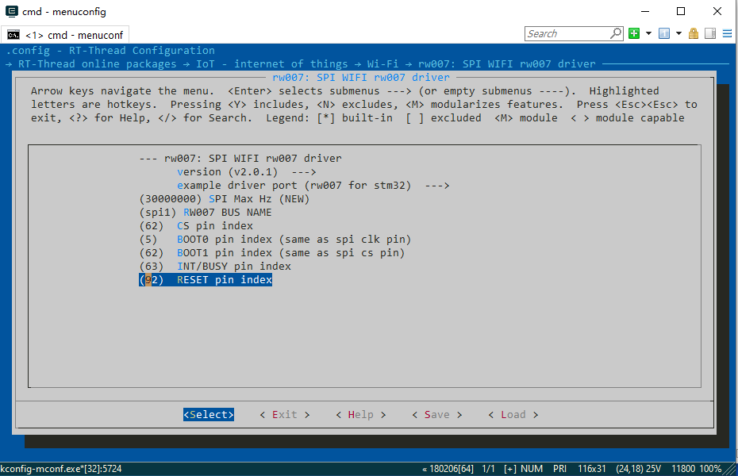
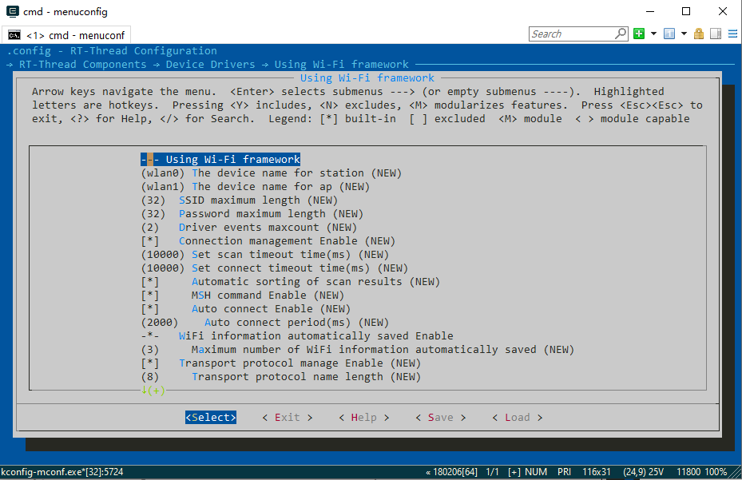
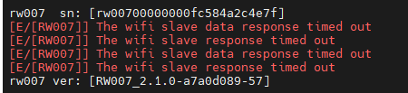
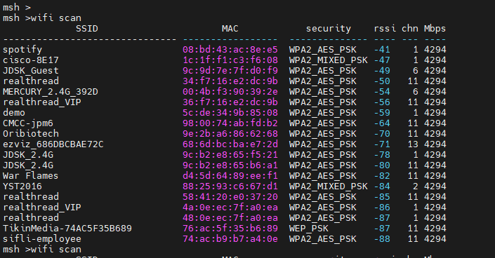
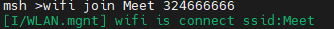

#STM32U575-NUCLEO 上手指南

STM32U575-NUCLEO 上手指南是通过使用 SPI1 驱动 RW007 模块实例进行介绍，实现 STM32U575-NUCLEO 入门

##准备工作
在 STM32U575-NUCLEO 驱动`RW007`畅快跑起来之前，以下准备工作必不可少，你将需要：

> 1.STM32U575-NUCLEO 开发板  
2.RW007 WiFi 模块  
3.Mini-USB 连接线（连接开发板与电脑）  
4.ENV 编译构建环境（[安装使用说明](https://www.rt-thread.org/document/site/#/development-tools/env/env)）  
5.开发常用软件（git、Keil5、STM32CubeMX、串口调试等）  

##开始上路
RT-Thread 包含了 RW007 的软件包，用户无需自己编写驱动程序，下面以 SPI 模式为例，介绍如何在 STM32U575-NUCLEO 上驱动 RW007 模块，并完成 AP 扫描、连接等基本 WiFi 功能。

##硬件连接
得益于 Nucleo 上的 Arduino 接口，只需把 RW007 往开发板上一插，即可完成了两者的硬件连接。  

  

根据下面原理图可查找各 IO 接口与功能之间的对应关系表如下：  
 
    

	|STM32引脚名 | 封装管脚序号  |Arduino接口序号|	功能       |   
	|PA5        |	5	       |D13	          |BOOT0/CLK  |  
	|PA6        |	6	       |D12           |MISO       |  
	|PA7        |	7	       |D11	          |MOSI       |    
	|PD14       |	62         |D10	          |BOOT1/CS   |  
	|PD15       |	63	       |D9	          |INT/BUSY   |  
	|PF12       |	92	       |D8	          |RESET      |  

##STM32 bsp 配置（Menuconfig）
###1.下载 RT-Thread源码
GitHub链接：[https://github.com/RT-Thread/rt-thread](https://github.com/RT-Thread/rt-thread)  
打开 `rt-thread\bsp\stm32` 目录，能看到 RT-Thread 所支持的开发板型号，把 RT-Thread 在 STM32 上跑起来并不是一件难事，但在编译内核组件之前，要对 bsp 进行简单配置。本次实验所使用的 bsp 为 stm32u575-st-nucleo。

###2.通过 CubeMX 配置 SPI 初始化程序
一般 STM32 系列的引脚分配可以通过对应 BSP 中board\CubeMX_Config目录下的CubeMX_Config.ioc打开 CubeMX 工程，进行配置 SPI1，并生成代码，保存退出即可 。  
  
 
###3.通过menuconfig配置 RW007 软件包
进入 rt-thread\bsp\stm32\stm32u575-st-nucleo 文件夹，右键打开 ENV 窗口（前提是已在 Windows 下搭好 ENV 环境），输入 menuconfig 进行系统配置：  

3.1开发板与模块的通讯依赖 SPI 设备，在 bsp 中已经实现了 SPI 驱动，只需在设置中打开即可使用。 进入 `Hardware Drivers Config --->` 下的 `On-chip Peripheral Drivers`，勾选 `Enable SPI BUS --->` 选项，并按回车键进入，进一步选中 `Enable SPI1 BUS`，完成配置：
 

如果在 bsp 中的 menuconfig 中没有对应 spi的配置，可以通过修改 Kconfig文件增加对应spi的配置。 Kconfig 的路径在board/Kconfig ，`menu "On-chip Peripheral Drivers"`下面添加 SPI1的配置。  

	menuconfig BSP_USING_SPI
		bool "Enable SPI BUS"
		default n
		select RT_USING_SPI
		if BSP_USING_SPI
		    config BSP_USING_SPI1
		        bool "Enable SPI1 BUS"
		        default n
		
		    config BSP_SPI1_TX_USING_DMA
		        bool "Enable SPI1 TX DMA"
		        depends on BSP_USING_SPI1
		        default n
		        
		    config BSP_SPI1_RX_USING_DMA
		        bool "Enable SPI1 RX DMA"
		        depends on BSP_USING_SPI1
		        select BSP_SPI1_TX_USING_DMA
		        default n
				
		endif

3.2配置 RW007 软件包
RT-Thread 通过软件包的形式，对 RW007 模块提供配套驱动支持，系统默认选项不包含软件包，用户需手动开启：通过 Esc 键回到 Menuconfig 主界面，依次进入 `RT-Thread online packages  --->` 、`IoT - internet of things  --->`、`Wi-Fi  --->`，勾选 `rw007: SPI WIFI rw007 driver  --->` 选项：
  
RW007 软件包 Github 仓库链接：[RT-Thread-packages/rw007: RW007 (SPI Wi-Fi module) driver for RT-Thread](https://github.com/RT-Thread-packages/rw007)  

紧接着按下 Enter 键进一步设置软件包参数，完成 SPI 总线和 IO 的配置，更改总线设备名称 RW007 BUS NAME 为 spi1,然后配置 SPI 控制 IO，各管脚号依次按下图序号填入：   
  

3.3开启 WiFi 框架  
RW007 驱动使用了 WLAN 相关的接口，按以下选项路径打开 WiFi 框架：`RT-Thread Components  --->`、`Device Drivers  --->`、`Using WiFi  --->`，勾选 `Using Wi-Fi framework`：

3.4保存 Menuconfig 配置
完成了上面的 3 步，bsp 配置算大功告成了，但最最重要的一步不能漏，保存 Menuconfig 配置：直接一路狂按 Esc 键退出，在保存提示窗口中选择 Yes 确认即可。

###4.修改部分工程代码
打开工程，将 `rw007_stm32_port.c` 文件中 `wifi_spi_device_init(void)` 函数内容替换成下面的代码：

	int wifi_spi_device_init(void)
	{
	    char sn_version[32];
	
	    rw007_gpio_init();
	    rt_hw_spi_device_attach(RW007_SPI_BUS_NAME, "wspi", RW007_CS_PIN);
	    rt_hw_wifi_init("wspi");
	
	    rt_wlan_set_mode(RT_WLAN_DEVICE_STA_NAME, RT_WLAN_STATION);
	    rt_wlan_set_mode(RT_WLAN_DEVICE_AP_NAME, RT_WLAN_AP);
	
	    rw007_sn_get(sn_version);
	    rt_kprintf("\nrw007  sn: [%s]\n", sn_version);
	    rw007_version_get(sn_version);
	    rt_kprintf("rw007 ver: [%s]\n\n", sn_version);
	
	    return 0;
	}

###5.编译、下载工程

使用工具栏的 Build 按钮编译工程，出现 0 Error(s) 表示编译成功，将开发板连接电脑，再点击 Download 按钮下载固件到开发板

##运行、测试模块功能
下载完程序便能自动复位运行，打开串口工具（推荐使用 XShell 等交互型终端），设置参数为 115200 8-1-N。若系统启动正常，且开发板与模块间的通讯也没有问题，会看到如下初始化打印信息：  
  
rw007 sn 与 rw007 ver 可以正常输出无乱码时，RW007驱动成功！！！  

wifi联网测试
在shell中输入 wifi scan 命令搜索wifi:
  

连接目标wifi测试：  

上图可见wifi成功连接热点Meet。  
至此`STM32U575-NUCLEO`的基础环境便搭建测试完毕！！！

##参考资料：   
1. [STM32F401 Nucleo-64使用SPI驱动RW007](https://www.rt-thread.org/document/site/#/rt-thread-version/rt-thread-standard/application-note/packages/rw007_module_using/an0034-rw007-module-using?id=rw007)  
2. [STM32U575-NUCLEO原理图下载](https://www.st.com/resource/en/schematic_pack/mb1549-u575ziq-c03_schematic.pdf)

##注意事项：  
1. MDK版本最好使用比较新的版本的，本次实验是在MDK5.36版本下进行的。
2. RW007软件包请选用最新版本的，否则会出现版本不兼容的问题，导致工程报错。若未选择最新版本的RW007软件包，就把下面链接里面的RW007软件包下载，替换掉`bsp\stm32\stm32u575-st-nucleo\packages\rw007-xxx`里面的文件即可！（但上述修改部分工程代码这一步也是要做的，如果工程`rw007_stm32_port.c`文件中`wifi_spi_device_init(void)`函数内容与所给内容相同可忽略！）   
RW007 软件包 Github 仓库链接：[RT-Thread-packages/rw007: RW007 (SPI Wi-Fi module) driver for RT-Thread](https://github.com/RT-Thread-packages/rw007) 
3. 目前，在本实验测试中发现RW007会出现超时现象，还未找到合适的解决方案，但并不影响RW007模块的正常使用。 