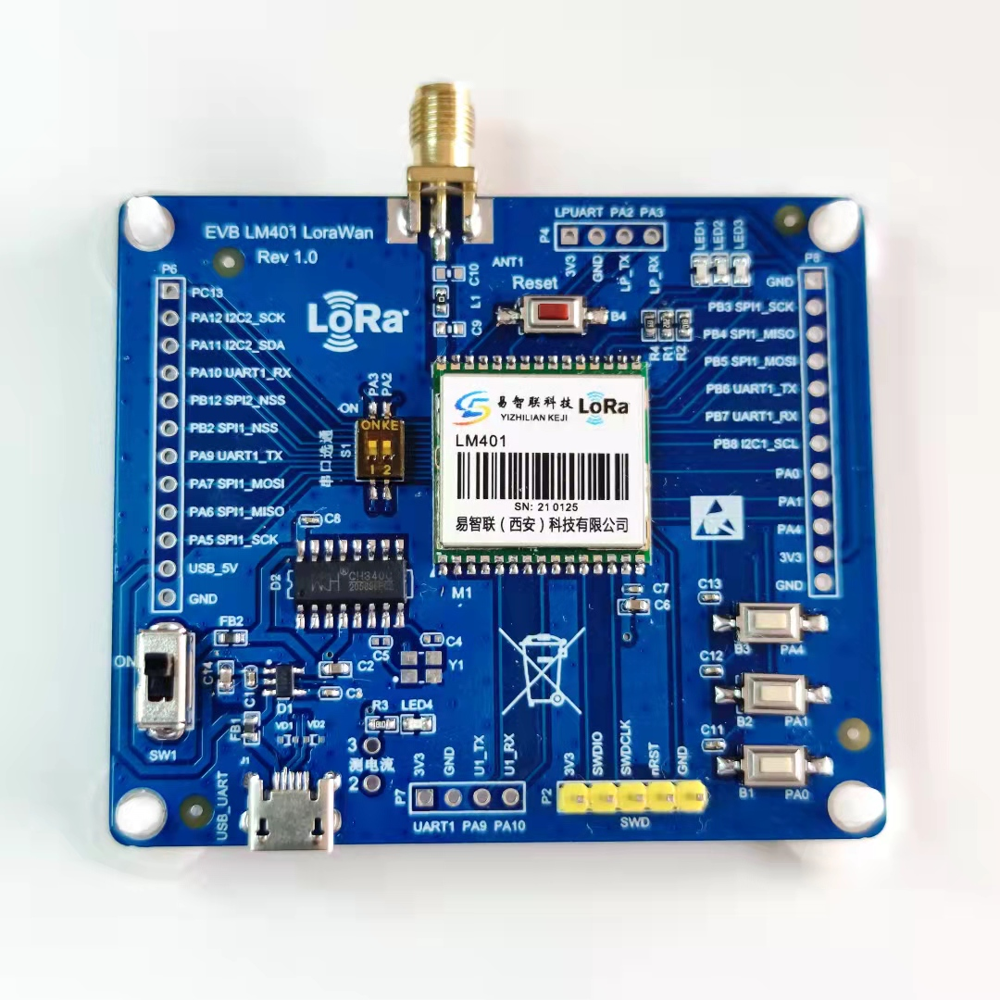

# LM401-LoraWan 开发板的 BSP 说明

## 简介

本文档为易智联（西安）科技有限公司基于STM32WLE5CB SOC 的Lora模块评估板的 BSP (板级支持包) 说明。

主要内容如下：

- 开发板资源介绍
- BSP 快速上手
- 进阶使用方法

通过阅读快速上手章节开发者可以快速地上手该 BSP，将 RT-Thread 运行在开发板上。在进阶使用指南章节，将会介绍更多高级功能，帮助开发者利用 RT-Thread 驱动更多板载资源。

## 开发板介绍

LM401-LoraWAN评估板是易智联（西安）科技有限公司推出的基于STM32WLE5CB的Lora模块评估板。提供了基本的硬件电路，并板载USB转COM以及LDO。

开发板外观如下图所示：



该开发板常用 **板载资源** 如下：

- MCU：STM32WLE5CB，主频 48MHz，128KB FLASH ，48KB RAM（16KB+32KB）。
- 常用外设:
  - LED：power LED(LED4 红色),3个User LED(LED1 蓝色、LED2 黄绿色、LED3 红色)
  - 按键：复位按键(B4)，3个 User Button(B1、B2、B3)。
- 常用接口：USB转串口，可拨码开(S1)关断开。

开发板更多详细信息请参考(https://item.taobao.com/item.htm?spm=a1z0d.6639537.1997196601.33.7e207484TKjwGe&id=655801203935)。

## 外设支持

本 BSP 目前对外设的支持情况如下：

| **板载外设**      | **支持情况** | **备注**                              |
| :----------------- | :----------: | :------------------------------------- |
| 板载 USB 转串口 |     支持     | LPUART1                              |
| **片上外设**      | **支持情况** | **备注**                              |
| GPIO              |     支持     | LED1(PB5)\LED2(PB4)\LED3(PB3) |
| UART              |     支持     | LPUART1    |
| **扩展模块**      | **支持情况** | **备注** |

## 使用说明

使用说明分为如下两个章节：

- 快速上手

    本章节是为刚接触 RT-Thread 的新手准备的使用说明，遵循简单的步骤即可将 RT-Thread 操作系统运行在该开发板上，看到实验效果 。

- 进阶使用

    本章节是为需要在 RT-Thread 操作系统上使用更多开发板资源的开发者准备的。通过使用 ENV 工具对 BSP 进行配置，可以开启更多板载资源，实现更多高级功能。


### 快速上手

本 BSP 为开发者提供 MDK5 和 IAR 工程，并且支持 GCC 开发环境。下面以 MDK5 开发环境为例，介绍如何将系统运行起来。

#### 硬件连接

使用数据线连接开发板到 PC，打开电源开关。

#### 编译下载

双击 project.uvprojx 文件，打开 MDK5 工程，编译并下载程序到开发板。

> 工程默认配置使用 ST_LINK 仿真器下载程序，在通过 ST_LINK 连接开发板的基础上，点击下载按钮即可下载程序到开发板

#### 运行结果

下载程序成功之后，系统会自动运行，观察开发板上 LED 的运行效果，LED5 常亮、LED1\LED2\LED3 会周期性闪烁。

USB 转 COM 端口默认连接LPUART1，在终端工具里打开相应的串口（115200-8-1-N），复位设备后，可以看到 RT-Thread 的输出信息:

```bash
 \ | /
- RT -     Thread Operating System
 / | \     4.0.4 build Oct 10 2020
 2006 - 2021 Copyright by rt-thread team
msh >
```
### 进阶使用

此 BSP 默认只开启了 GPIO 和 LPUART1的功能，如果需使用更多高级功能，需要利用 ENV 工具对 BSP 进行配置，步骤如下：

1. 在 bsp 下打开 env 工具。

2. 输入`menuconfig`命令配置工程，配置好之后保存退出。

3. 输入`pkgs --update`命令更新软件包。

4. 输入`scons --target=mdk5` 命令重新生成工程。

本章节更多详细的介绍请参考 [STM32 系列 BSP 外设驱动使用教程](../docs/STM32系列BSP外设驱动使用教程.md)。

## 注意事项

- 开机时如果不能打印 RT-Thread 版本信息，请重新选择 PC 端串口调试软件的串口号.

## 联系人信息

维护人:

-  [CaocoWang] 邮箱：<18092050692@163.com>