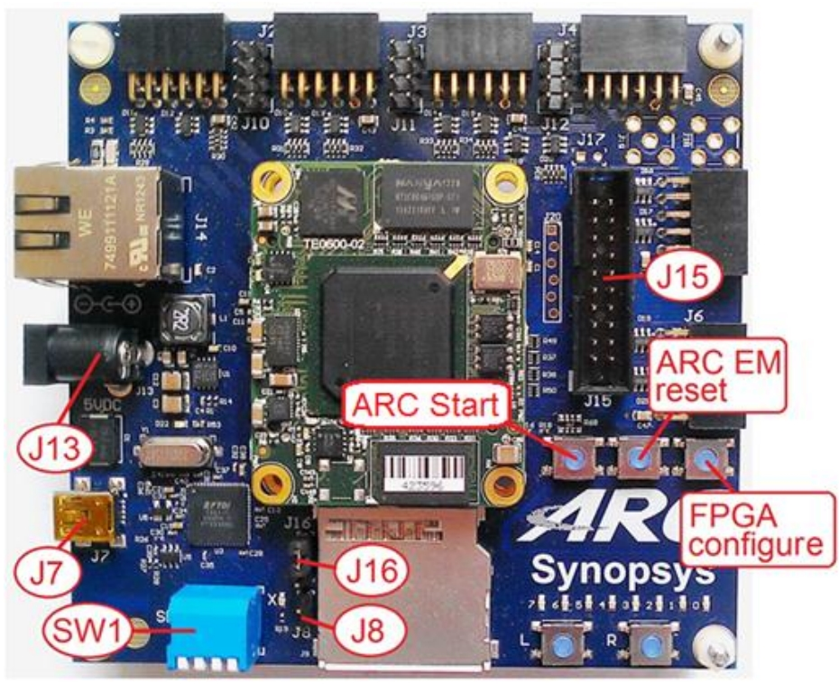

# Synopsys DesignWare ARC EM Starter Kit

## Overview

The DesignWare™ ARC™ EM Starter Kit(EMSK, emsk) is a low-cost, versatile
solution enabling rapid software development and software debugging, and
profiling for the ARC EM Family of processors. The EM Family includes the EM4,
EM6, EM5D, EM7D, EM9D, and EM11D cores.

The EMSK consists of a hardware platform and a software package, including
pre-installed FPGA images of different configurations of the ARC EM Processor
with peripherals.

The development board is based on a Xilinx Spartan-6 LX45 FPGA. It supports
hardware extensions using six 2x6 connectors supporting a total of 48 user I/O
pins (plus power and ground pins) that can be used to connect components such
as sensors, actuators, memories, displays, buttons, switches, and
communication devices. A Digilent Pmod™ compatible extension board containing
a four-channel 12-bit A/D converter with an IIC interface and an AC power
adapter are included in the package.

## Board Resources

| Hardware | Description |
| -- | -- |
| SOC | EMSK |
| Core | EM9D                                   |
| Arch       |  32-bit ARC EM                                         |
| Frequency  |  20/25 Mhz                                            |
| RAM | 128 MB DDR RAM + 256 KB Instruction CCM + 256 KB Data CCM |
|Flash | 16 MB SPI Flash for FPGA configuration with 128 KB reserved for application |

## Usage

### FPGA Configuration

Current, only em9d configuration is supported and tested for RT-Thread. However,
it's can be easily applied to other configurations because all emsk configurations almost share the same memory map and periphreals.

Please refer [EMSK configuration](https://embarc.org/embarc_osp/doc/build/html/board/emsk.html) for details.

### Toolchain

The ARC GNU Toolchain offers all of the benefits of open source tools, including complete source code and a large install base. The ARC GNU IDE Installer consists of Eclipse IDE with [ARC GNU plugin for Eclipse](https://github.com/foss-for-synopsys-dwc-arc-processors/arc_gnu_eclipse/releases), [ARC GNU prebuilt toolchain](https://github.com/foss-for-synopsys-dwc-arc-processors/toolchain/releases) and [OpenOCD for ARC](https://github.com/foss-for-synopsys-dwc-arc-processors/openocd>)

Here, the ARC GNU toolchain is installed to `c:\arc\gnu`. If not, please change the path configuration in rtconfig.py.

### Compile

please run the following cmds to compile

    cd <rt-thread-root>/bsp/synopsys/emsk_em9d
    scons

## Debug

You need to  install [Zadig](http://zadig.akeo.ie) to replace the default FTDI driver with WinUSB driver. See [How to Use OpenOCD on Windows](https://github.com/foss-for-synopsys-dwc-arc-processors/arc_gnu_eclipse/wiki/How-to-Use-OpenOCD-on-Windows>) for more information.

After compile, please use the following cmds to debug

    scons  --gdb

## Supported Drivers

| Driver | Supported | Comment  |
| ------ | ----  | :------:  |
| UART1 |  yes |  USB-UART for shell & log |
| UART0 | yes | PMOD A UART for UART modules, e.g. esp8266 |

## Maintainer
- [vonhust](https://github.com/vonhust)

## Notes

