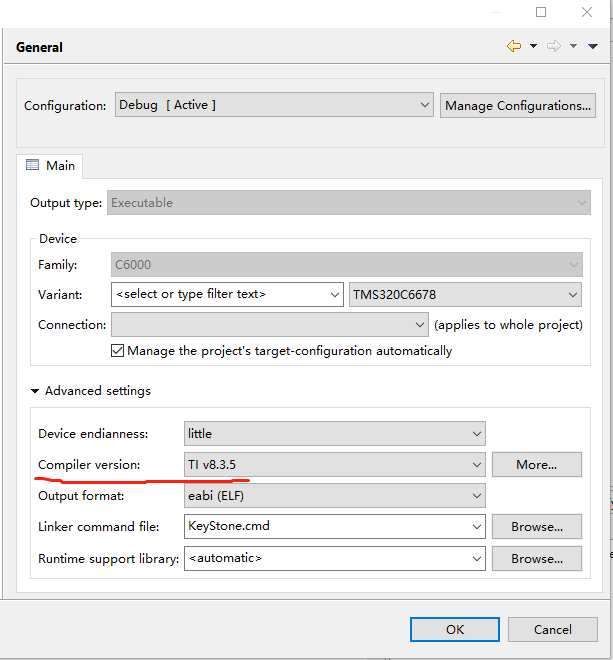

### 1. 简介

TMS320C6678是TI基于KeyStone的多核固定浮点数字信号处理器，DSP集成C66x CorePac，每个核心在1GHz至1.25 GHz的运行。该设备支持高性能的信号处理应用，如任务关键，医疗成像，测试和自动化。

### 2. 编译说明

TMS320C6678 工程的编译和下载要使用的是 TI 官方提供的 Code Composer Studio。在本工程使用的是 CCS5.5 版本编译调试，CCS5.5 Compiler version:TIv8.3.5进行编译，需要安装TI提供的CSL库pdk_C6678_1_1_2_6。

### 2.1 导入工程

首先打开 Code Composer Studio，点击 Project -> Import CCS Projects...

.png)

在打开的对话框中，点击 Select search -> directory 右边的 Browse... 选择 TMS320C6678 BSP 所在文件夹，如图所示。选择完成后点击 Finish 完成导入。

.png)

### 2.2 检查工程路径和编译器

- 检查工程路径是否正确，是否成功安装pdk_C6678_1_1_2_6，本工程安装路径为C盘。

- 检查编译器版本，本工程使用的是TIv8.3.5

### 3. 编译工程

导入工程后，选中导入的 ti-tms320c6678 工程，右键点击，在弹出的菜单中选择 Build Project 即可开始编译。

### 4. 加载和调试

编译完成后，可以开始加载和调试。将板子和 XDS560 仿真器连接，仿真器可以将编译生成的可执行文件加载到L2或MSMC执行。

- 如下图ti-tms320c6678.out是编译之后生成的可执行文件。

.png)

- 本工程目前只支持单核运行，按如下图加载可执行文件。

- 加载可执行文件完成后，CCS将进入调试模式，可以选择继续运行、单步调试、复位等操作。

.png)

到此，可以开启tms320c6678 + rt-thread的愉快旅程了 :smile: 。