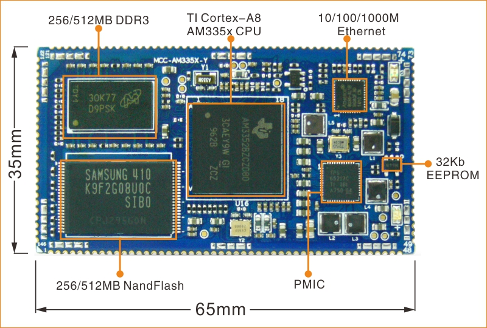
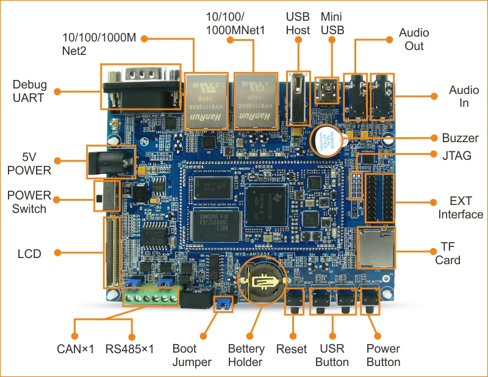
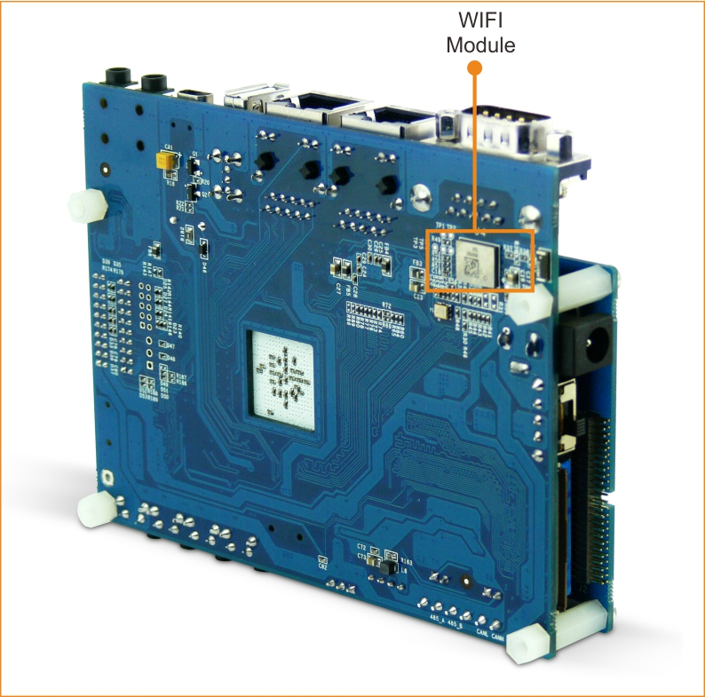

# MYB-AM335X-Y 板级支持包说明

## 1. 简介

MYB-AM335X-Y 基于 TI AM3352 处理器，详细信息请参考官网介绍 [MYD-Y335X-V2开发板](http://www.myir-tech.com/product/MYD-Y335X.htm)。







## 2. 编译说明

进入到`bsp/ti/boards/myb-am335x-y`目录进行输入：
```
scons
```
可以看到正常生成`rtthread.elf`与`rtthread.bin`文件。

或者通过 `scons --exec-path="GCC工具链路径"` 命令，在指定工具链位置的同时直接编译。

## 3. 执行

请参考`bsp/beaglebone/uboot_cmd.txt`里面的命令，注意：如果 u-boot 里面开了看门狗，请用 wdt 命令将看门狗关闭。

示例，新建一条 u-boot 命令如下：

```shell
=> setenv rt-thread "wdt dev gpio-wdt; wdt stop; tftpboot 0x80200000 rtthread.bin; go 0x80200000"
=> saveenv
```
以后就使用 `run rt-thread` 命令运行，开机信息如下：

```
=> run rt-thread
link up on port 0, speed 1000, full duplex
Using ethernet@4a100000 device
TFTP from server 192.168.19.121; our IP address is 192.168.19.111
Filename 'rtthread.bin'.
Load address: 0x80200000
Loading: ###########################
	 2.8 MiB/s
done
Bytes transferred = 388304 (5ecd0 hex)
## Starting application at 0x80200000 ...

 \ | /
- RT -     Thread Operating System
 / | \     5.0.0 build Oct  7 2022 17:12:30
 2006 - 2022 Copyright by RT-Thread team
lwIP-2.1.2 initialized!

PHY found at address 4 for  Port 1 of Instance 0.

Performing Auto-Negotiation...

Auto-Negotiation Successful.

Transfer Mode : 1000 Mbps.

PHY link verified for Port 1 of Instance 0.
hello rt-thread
msh />
```

## 4.支持情况

| 驱动 | 支持情况  |  备注  |
| ------ | ----  | :------:  |
| UART | 支持 | 复用 beaglebone 的 uart.c 驱动 |
| GPIO | 支持 | 复用 beaglebone 的 gpio.c 驱动 |
| ETH | 支持 | 目前只支持 CPSW0 |

