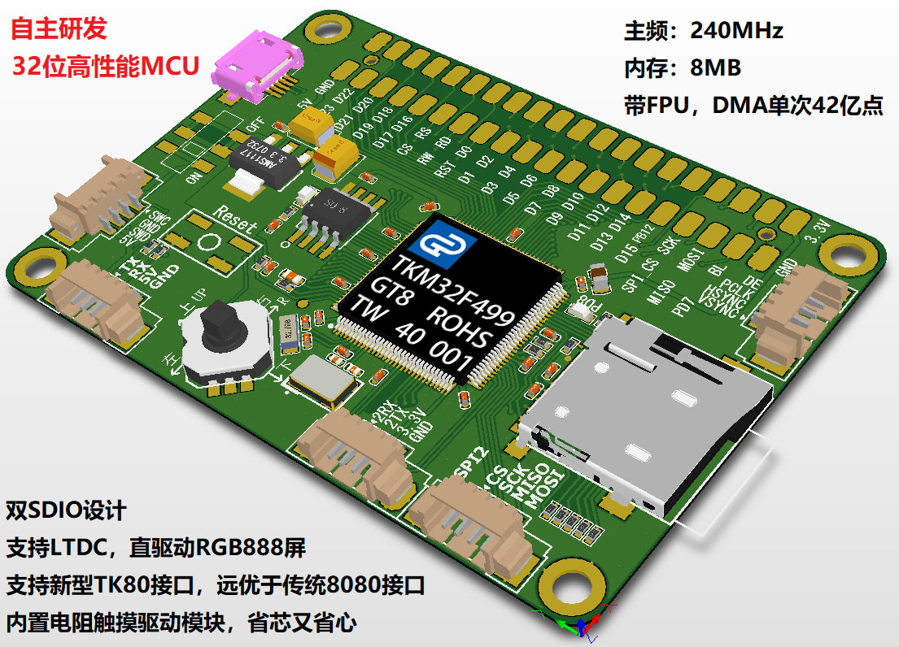

# TKM32F499

## 简介

本文档为 TKM32F499 液晶屏评估板的 BSP (板级支持包) 说明。

主要内容如下：

- 开发板资源介绍
- BSP 快速上手
- 进阶使用方法

通过阅读快速上手章节开发者可以快速地上手该 BSP，将 RT-Thread 运行在开发板上。在进阶使用指南章节，将会介绍更多高级功能，帮助开发者利用 RT-Thread 驱动更多板载资源。

## 开发板介绍

TKM32F499 液晶屏评估板是深圳市好钜润科技有限公司官方推出的开发板，搭载 TKM32F499 芯片，基于 ARM Cortex-M4 内核，最高主频 240 MHz，具有丰富的板载资源，可以充分发挥 TKM32F499 的芯片性能。

开发板外观如下图所示：



该开发板常用 **板载资源** 如下：

- MCU：TKM32F499，主频 240MHz ，8MB RAM，带FPU，DMA 单次 42 亿点
- 常用外设
  - LED：3个，LD1（PD8），LD2（PB14），LD3（PB15）
  - 按键：5 向按键 1 个，RESET
- 常用接口：TK80接口（向下兼容老式8080接口）

官方资料：[TKM32F499评估板参考资料](http://hjrkj.com/companyfile/1.html)

*更多相关信息资料见官网详情页：[TKM32F499芯片及评测](http://hjrkj.com/product/13.html)*

## 外设支持

本 BSP 目前对外设的支持情况如下：

| **片上外设** | **支持情况** | **备注**     |
| :----------- | :----------: | :----------- |
| GPIO         |     支持     |              |
| UART         |     支持     | UART1、UART2 |
| SPI          |   暂不支持   |              |
| I2C          |   暂不支持   |              |
| RTC          |   暂不支持   |              |
| PWM          |   暂不支持   |              |

## 使用说明

使用说明分为如下两个章节：

- 快速上手

  本章节是为刚接触 RT-Thread 的新手准备的使用说明，遵循简单的步骤即可将 RT-Thread 操作系统运行在该开发板上，看到实验效果 。

- 进阶使用

  本章节是为需要在 RT-Thread 操作系统上使用更多开发板资源的开发者准备的。通过使用 ENV 工具对 BSP 进行配置，可以开启更多板载资源，实现更多高级功能。


### 快速上手

本 BSP 为开发者提供 MDK5 工程。下面以 MDK5 开发环境为例，介绍如何将系统运行起来。

#### 硬件连接

使用数据线连接开发板到 PC，连接串口1到 PC，打开电源开关。

#### 编译下载

双击 project.uvprojx 文件，打开 MDK5 工程，编译并下载程序到开发板。

> 可以通过 bootloader 自带 usb下载，通过 u 盘方式下载：
>
> * 方法一：五向按键向上推（按下 PA1 按键，又名 APP 键） ，同时按一下复位（注意，松手时，先松复位，再松五向按键），然后点一下 KEIL 的下载按钮即可
> * 方法二：向上推， 同时按一下复位，然后先松开复位再松开向上按键， 就会进入程序下载模式， 电脑会弹出一个 TK499_V2 盘符的 U 盘，把 KEIL 工程目录下生成的 bin 程序拖进 U盘就行  
>
> 本工程下自带官方的 bootloader ，通过把五向按键向左推（按下 PA13 按键，又名 BOOT 键） ， 同时再按一下复位，然后先松开复位再松开向上按键就进入了 Bootloader 下载模式。这时会弹出一个盘符为 TK499 的 U 盘，把本工程下的 Bootloader.bin 拖进去即可重新烧录 bootloader
>
> 注意：
>
> * bootloader 默认的波特率为460800，所以会在启动 rtthread 时存在乱码
> * 该芯片有个致命问题：复位引脚不能正常复位，断电重启了才可以。如有莫名其妙的问题请断电重启。出处https://www.amobbs.com/thread-5748003-1-1.html

#### 运行结果

下载程序成功之后，系统会自动运行，橘黄色 LD2 会周期性闪烁。

USB 虚拟 COM 端口默认连接串口 1，在终端工具里打开相应的串口（115200-8-1-N），复位设备后，可以看到 RT-Thread 的输出信息:

```bash
 \ | /
- RT -     Thread Operating System
 / | \     4.0.4 build Oct 14 2021
 2006 - 2021 Copyright by rt-thread team
msh >
```

* 注意：官方 bootloader 使用的是串口1，且波特率为460800，所以会在一开始有一段乱码

### 进阶使用

此 BSP 默认只开启了 GPIO 和 串口1 的功能，更多高级功能需要利用 ENV 工具对 BSP 进行配置，步骤如下：

1. 在 bsp 下打开 env 工具。

2. 输入`menuconfig`命令配置工程，配置好之后保存退出。

3. 输入`pkgs --update`命令更新软件包。

4. 输入`scons --target=mdk5` 命令重新生成工程。


## 联系人信息

维护人：[NU-LL](https://github.com/NU-LL)
