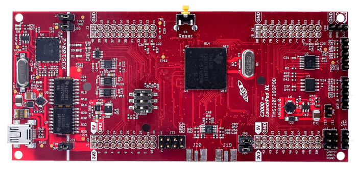
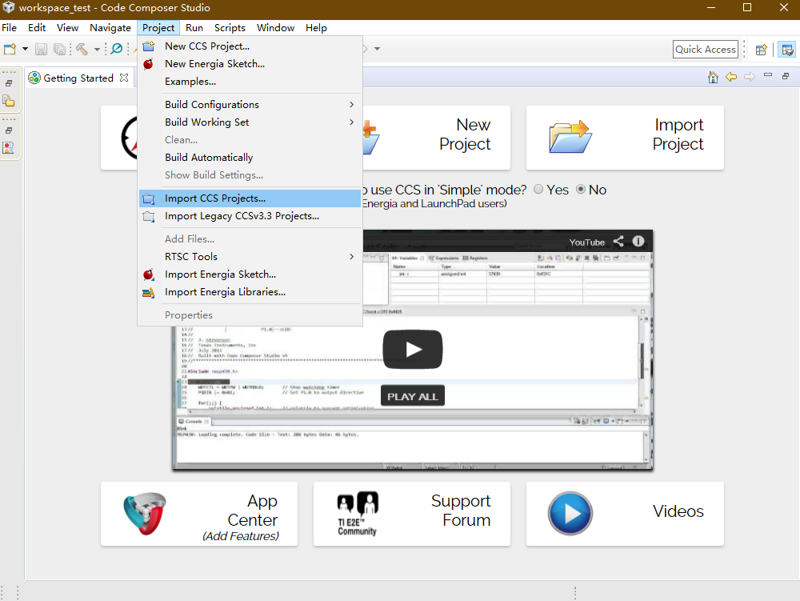
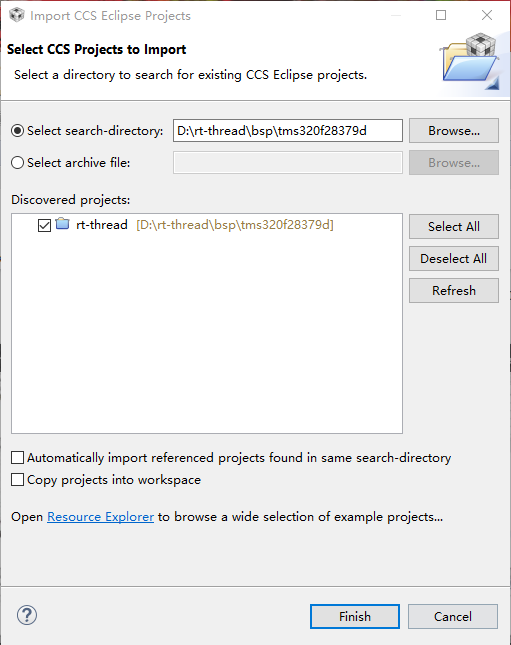
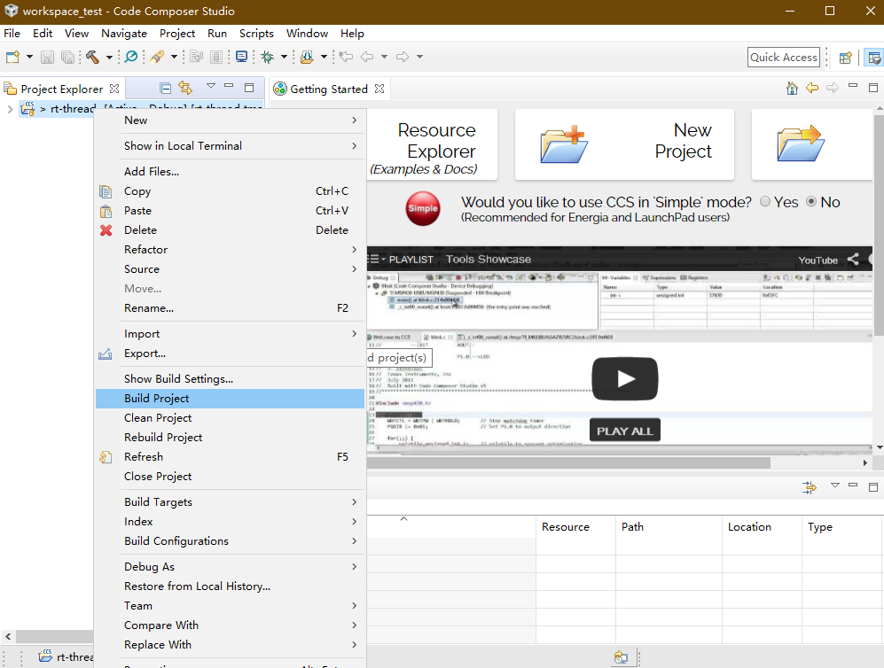
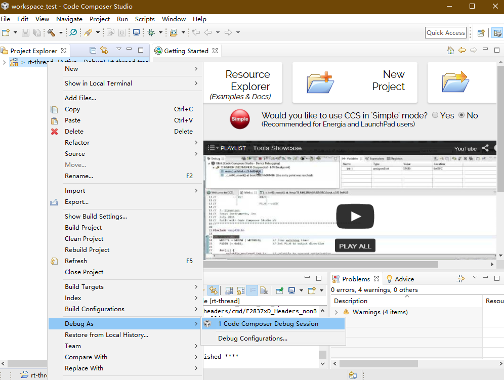
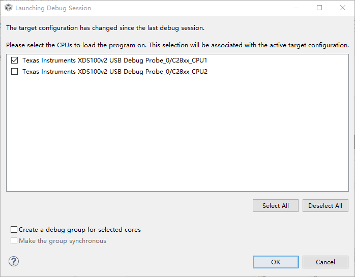

# TMS320F28379D


## 1. 简介

TMS320F28379D BSP 基于 C2000 Delfino MCU F28379D LaunchPad 开发套件开发。   
TMS320F28379D 是一款功能强大的 32 位浮点微控制器单元 (MCU)，针对高级闭环控制应用而设计，例如工业驱动器和伺服电机控制、太阳能逆变器和转换器、数字电源、电力输送以及电力线通信。


包括如下硬件特性：

| 硬件 | 描述 |
| -- | -- |
|芯片型号| TMS320F28379D |
|多核 CPU| 两个 TMS320C28x 32 位 CPU
|| 两个可编程控制律加速器 (CLA) |
|主频| 200MHz |
|CLA 频率| 200MHz |
|总处理能力| 800MIPS |
|片内SRAM| 204kB |
|片内Flash| 1MB |

## 2. 编译说明
### 2.1 导入工程
首先打开 Code Composer Studio，点击 Project -> Import CCS Projects...

在打开的对话框中，点击 Select search -> directory 右边的 Browse... 选择 TMS320F28379D BSP 所在文件夹，如图所示。选择完成后点击 Finish 完成导入。


### 2.2 编译工程
使用 CCS 内置的 C 编译器可以进行工程的编译，本文使用的是 Code Composer Studio 8.1.0 和 TI v18.1.3.LTS 编译器的组合。

导入工程后，在右边的 Project Explorer 列表里可以看到刚刚导入的 rt-thread 工程，右键点击，在弹出的菜单中选择 Build Project 即可开始编译。


## 3. 烧写及执行

把开发板和电脑通过 Mini-USB 线连接，使用 CCS 中的烧写功能可直接通过板载 XDS100v2 仿真器烧写并执行。


在右边的 Project Explorer 的列表中右键点击 rt-thread 工程，在弹出的菜单中选择 Debug As -> 1 Code Composer Debug Session。


在弹出的 Launching Debug Session 对话框中可以选择要调试的 CPU 核和 CLA 核，这里我们只选择 C28xx_CPU1，点击 OK 开始下载和调试。

下载完成后，CCS 将进入调试模式，可以选择继续运行、单步调试、复位等操作。

在终端工具里打开相应的串口（115200-8-1-N），继续运行或者退出调试复位设备后，可以看到 RT-Thread 的输出信息:
```bash
 \ | /
- RT -     Thread Operating System
 / | \     4.0.1 build Feb 21 2019
 2006 - 2019 Copyright by rt-thread team
 ```

## 4. 驱动支持情况及计划

| 驱动 | 支持情况  |  备注  |
| ------ | ----  | :------:  |
| CPU Timer | 支持 |  |
| GPIO | 支持 | |
| SCI | 支持 | SCIA |
| ePWM | | 预计2019年3月支持 |
| ADC | | 预计2019/Q2支持 |
| DAC | | |
| I2C | | |
| SPI | | |
| CAN | | |
| eCAP | | |

## 5. 联系人信息

维护人：xuzhuoyi < xzy476386434@vip.qq.com >

## 6. 参考

* [C2000 Delfino MCU F28379D LaunchPad 开发套件][1]
* TMS320F28379D [相关技术文档][2]

  [1]: http://www.ti.com.cn/tool/cn/launchxl-f28379d
  [2]: http://www.ti.com.cn/product/cn/tms320f28379d/technicaldocuments
