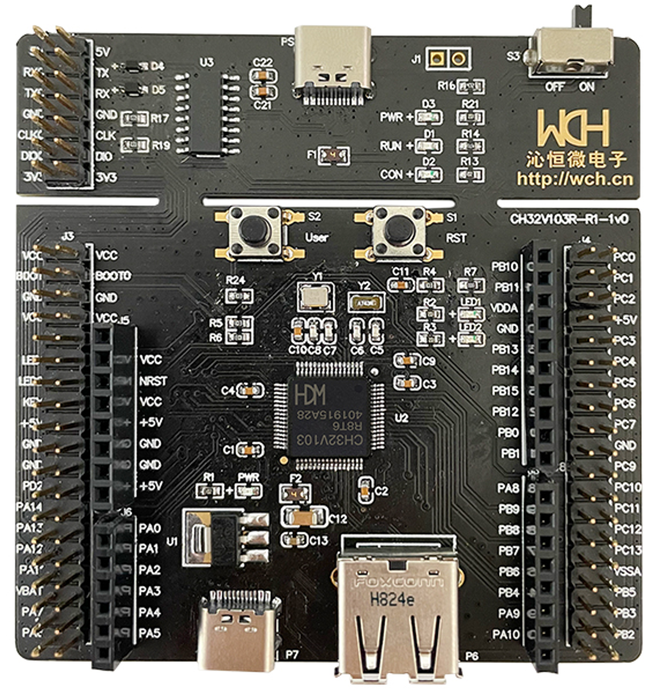
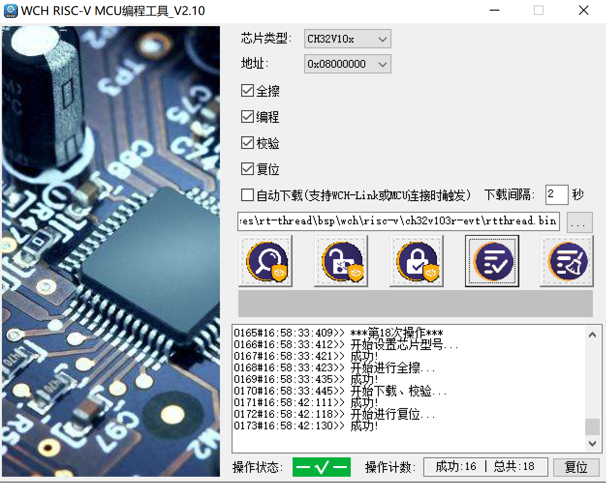

# ch32v103r-evt BSP 说明
## 开发板简介

ch32v103r-evt 是基于 CH32V103 MCU 推出了一款开发板，包含 WCH-Link 调试器，具有丰富的外设，比较适合入门学习 RISC-V 架构。

开发板图片



基本硬件资源：

- 青稞 V3A 处理器，最高 80MHz 系统主频；
- 支持单周期乘法和硬件除法；
- 20KB SRAM，64KB CodeFlash；
- 供电范围：2.7V ~ 5.5V，GPIO同步供电电压；
- 多种低功耗模式：睡眠/停止/待机；
- 上电/断电复位（POR/PDR）；
- 可编程电压监测器（PVD）；
- 7通道 DMA 控制器；
- 16路 TouchKey 通道监测；
- 16路12位 ADC 转换通道；
- 7个定时器；
- 1个 USB2.0 主机/设备接口（全速和低速）；
- 2个 IIC 接口（支持 SMBus/PMBus）；
- 3个 USART 接口；
- 2个 SPI 接口（支持 Master 和 Slave 模式）；
- 51个 I/O 口，所有的 I/O 口都可以映射到16个外部中断；
- CRC 计算单元，96位芯片唯一 ID；
- 串行单线调试（SWD）接口；
- 封装形式：LQFP64M、LQFP48、QFN48。

更多信息和资源请访问 [WCH CHV103](http://www.wch.cn/products/CH32V103.html?)

## 编译说明

板级包支持 RISC-V GCC 开发环境，以下是具体版本信息：

| IDE/编译器 | 已测试版本           |
| ---------- | -------------------- |
| GCC        | WCH RISC-V GCC 8.2.0 |


## 外设支持

本 BSP 目前对外设驱动的支持情况如下：

| 驱动      | 支持情况 |            备注            |
| --------- | -------- | :------------------------:|
| UART      | 支持     | USART 1       |
| GPIO      | 支持     | PA0...PE15                  |


### IO在板级支持包中的映射情况

| IO号 | 板级包中的定义 |
| ---- | -------------- |
| PA9(默认与板载wch-link串口相连)  | USART1_TX      |
| PA10(默认与板载wch-link串口相连) | USART1_RX      |


## 使用说明

    本章节是为刚接触 RT-Thread 的新手准备的使用说明，遵循简单的步骤即可将 RT-Thread 操作系统运行在该开发板上，看到实验效果 。

### 快速上手

本 BSP 为开发者提供 SCons编译配置。下面介绍如何将系统运行起来。

#### SCons 编译

需要先正确配置 RISC-V GCC 位置，推荐使用 RT_Studio 软件包里的

```
import os
ARCH     = 'risc-v'
CPU      = 'ch32v1'
# toolchains options
CROSS_TOOL  = 'gcc'

#------- toolchains path -------------------------------------------------------
if os.getenv('RTT_CC'):
    CROSS_TOOL = os.getenv('RTT_CC')

if  CROSS_TOOL == 'gcc':
    PLATFORM    = 'gcc'
    EXEC_PATH   = r'D:/Softwares/RT_ThreadStudio/repo/Extract/ToolChain_Support_Packages/WCH/RISC-V-GCC-WCH/8.2.0/bin'
else:
    print('Please make sure your toolchains is GNU GCC!')
    exit(0)

# if os.getenv('RTT_EXEC_PATH'):
    # EXEC_PATH = os.getenv('RTT_EXEC_PATH')

```

开始 scons 编译

```
LT@DESKTOP-WIN10 E:\WorkSpaces\rt-thread\bsp\wch\risc-v\ch32v103r-evt                             
>scons                                                                                           
scons: Reading SConscript files ...                                                               
Newlib version:3.0.0                                                                              
scons: done reading SConscript files.                                                             
scons: Building targets ...                                                                       
scons: building associated VariantDir targets: build                                              
CC build\applications\main.o                                                                      
CC build\board\board.o                                                                            
CC build\board\ch32v10x_it.o                                                                      
....                            
CC build\libraries\ch32_library\StdPeriph_Driver\src\ch32v10x_misc.o                              
CC build\libraries\ch32_library\StdPeriph_Driver\src\ch32v10x_pwr.o                               
CC build\libraries\ch32_library\StdPeriph_Driver\src\ch32v10x_rcc.o                               
CC build\libraries\ch32_library\StdPeriph_Driver\src\ch32v10x_rtc.o                               
CC build\libraries\ch32_library\StdPeriph_Driver\src\ch32v10x_spi.o                               
CC build\libraries\ch32_library\StdPeriph_Driver\src\ch32v10x_tim.o                               
CC build\libraries\ch32_library\StdPeriph_Driver\src\ch32v10x_usart.o                             
CC build\libraries\ch32_library\StdPeriph_Driver\src\ch32v10x_wwdg.o                              
LINK rtthread.elf                                                                                 
riscv-none-embed-objcopy -O binary rtthread.elf rtthread.bin                                      
riscv-none-embed-size rtthread.elf                                                                
text    data     bss     dec     hex filename                                                  
63540     392    8080   72012   1194c rtthread.elf                                              
scons: done building targets.                                                                     
```

#### 硬件连接

使用数据线连接板载 wch-link 到 PC，打开电源开关。

#### 下载

打开WCH_RISC-V_Programmer下载软件，选择bsp目录下生成的`rtthread.bin` 文件,单击执行进行下载。



>  WCH_RISC-V_Programmer下载软件 可以从 MRS IDE中直接导出

#### 运行结果


在终端工具里打开板载 wch-link 串口（WCHDapLink SERIAL，默认115200-8-1-N），复位设备后，在串口上可以看到 RT-Thread 的输出信息:

```bash

 \ | /
- RT -     Thread Operating System
 / | \     4.1.0 build Apr  4 2022 16:57:50
 2006 - 2022 Copyright by RT-Thread team

 MCU: CH32V103C8T6
 SysClk: 72000000Hz
 www.wch.cn
msh >ps
thread   pri  status      sp     stack size max used left tick  error
-------- ---  ------- ---------- ----------  ------  ---------- ---
tshell    20  running 0x00000140 0x00000400    83%   0x00000003 000
tidle0    31  ready   0x000000b0 0x00000100    70%   0x00000002 000
timer      4  suspend 0x000000e0 0x00000200    43%   0x00000009 000
main      10  suspend 0x00000140 0x00000800    20%   0x0000000f 000
```

## 联系人信息

维护人:

- [blta](https://github.com/blta)
