# CH32V208W-R0 User Guide

**English** | [中文](./CH32V208W-R0上手指南.md)

The CH32V208W-R0 supports RT-Studio projects, and this tutorial gives an example of development instructions for the RT-Studio environment.

## 1 Preparation Stage

- Pull the github repository for rt-thread locally, [link address](https://github.com/RT-Thread/rt-thread).
- Download and install RT-Thread Studio, [link to address](https://www.rt-thread.org/studio.html).
- Prepare the ESP8266 module.

## 2 BSP Start Stage

### 2.1 Click on the file and select the import option.

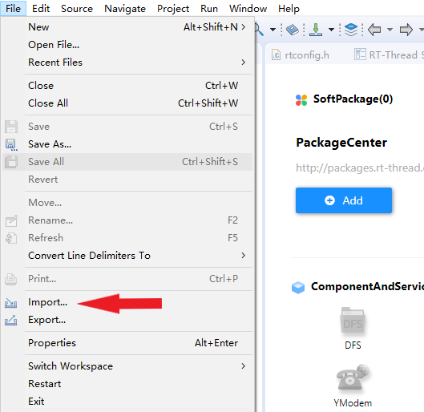

### 2.2 Select to import RT-Thread BSP into the workspace


<div STYLE="page-break-after: always;"></div>

### 2.3 Fill in the project information according to the example

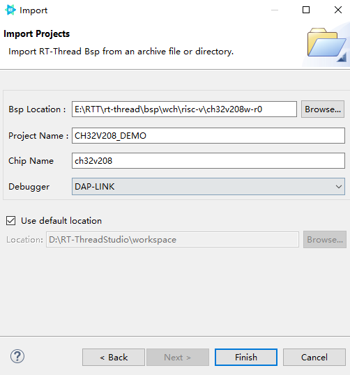

### 2.4 Configuration Engineering

After importing the project, there is a reference document readme in the root directory of the project, first of all, follow the readme.md for basic configuration

In order to reduce the memory increase caused by the standard library added during linking, we can choose to use the relatively small memory consumption of newlib, as follows：

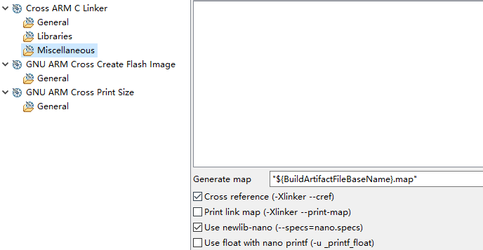

### 2.5 Compiling the project

Click on the compile option:


Compile result:

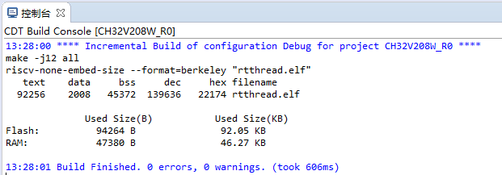

The project compiles and passes, and thus the preparation phase is completed.

## 3 Configuring the BSP driver with RT-Studio

Each BSP of RT-Thread has been configured with several on-chip peripheral drivers and onboard peripheral drivers by default, use RT-Studio to turn on the corresponding switches directly and configure the corresponding parameters according to the usage environment to use. Due to the multiplexing function of each pin, not all on-chip peripheral drivers and onboard peripheral drivers can be used at the same time, so you need to combine them with the schematic to enable the corresponding peripheral drivers.

RT-Thread has a number of software packages, which can be added to the project by turning on the corresponding package switch using RT-Studio.

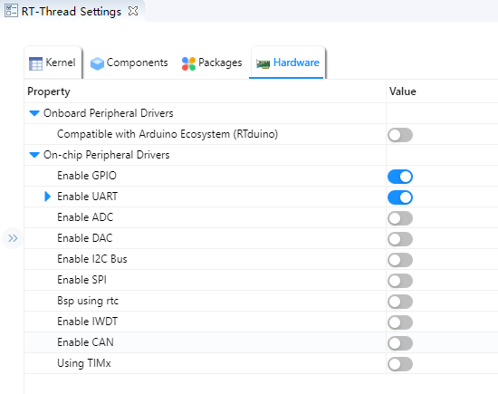

## 4 Networking with ESP8266 modules

The ESP8266 is a cost-effective, highly integrated Wi-Fi MCU for IoT applications, and can also be used as a standalone WIFI module with the following physical diagram. ESP8266 modules usually support [AT](https://www.rt-thread.org/document/site/#/rt- thread-version/rt-thread-standard/programming-manual/at/at), RT-Thread provides an abstraction layer for these modules that support AT instructions, and this summary will use the AT group to communicate with ESP8266 and connect WIFI.

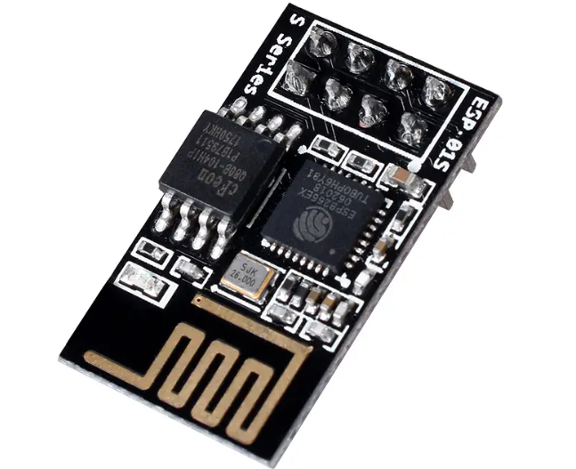

### 4.1 Configuring Onboard UART Peripherals

Using the AT component to communicate with the ESP8266 module using serial communication, so we need to enable one more serial port, here we use UART2, the serial driver is already supported by default, we just need to open it in RT-Studio when we use it, as follows:

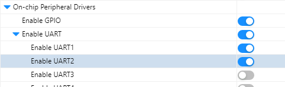

After turning on the option, `ctrl + s` saves the settings and serial port 2 is initialized.

### 4.2 Configuring AT components with RT-Studio

Click on the RT-Thread Settings option on the left, the configuration menu on the right pops up, type AT in the search field, select `AT device` and enable the AT device: 

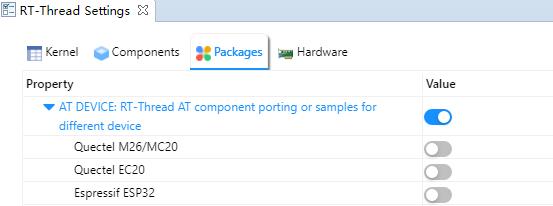

Select the ESP8266 and configure the appropriate parameters, as shown in the example below.

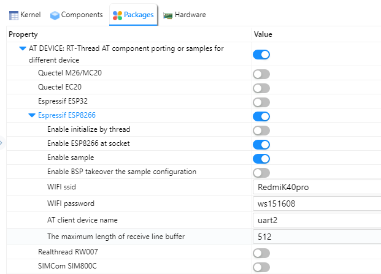

### 4.3 ESP8266 module connection

Connect the `PA2` pin on the board to the `RX` pin of the module, connect the `PA3` pin to the `TX` pin of the module, and power the module using the power supply pinout from the development board.

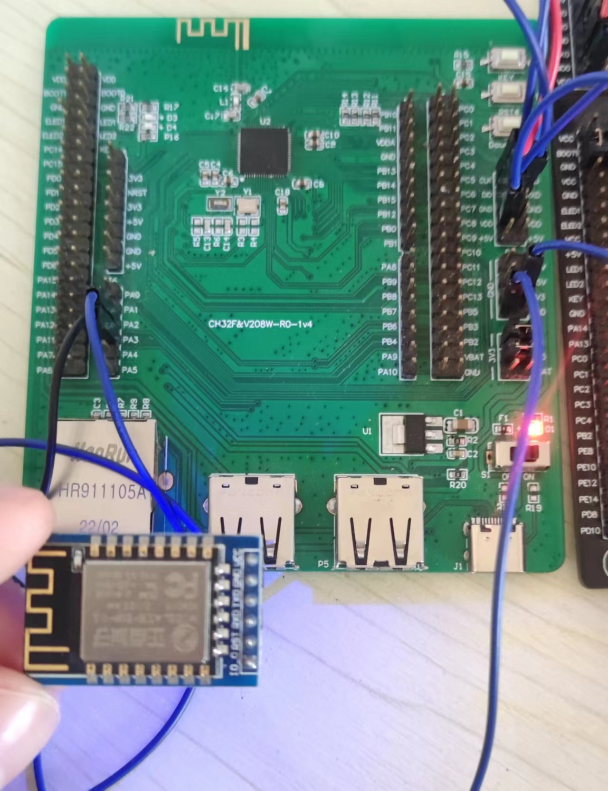

### 4.4 Enabling kernel debugging.

For a more intuitive understanding of the component initialization process, we can enable the kernel debugging feature to observe it (you can turn it off when not needed) by doing the following:

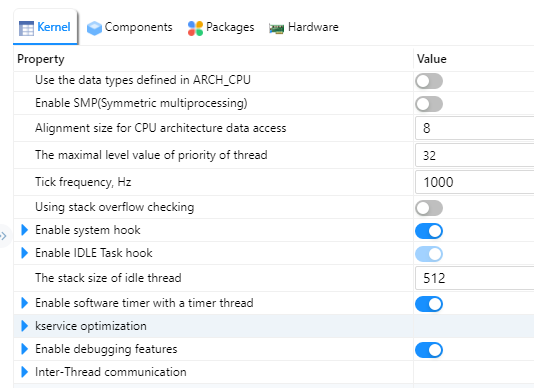

Recompile and burn the firmware, the shell output is as follows:

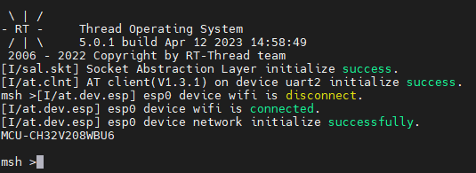

### 4.5 wifi networking test

My door has configured the WIFI ID and password when using AT, enter the `ping www.baidu.com` command in the shell to test the WIFI connection.

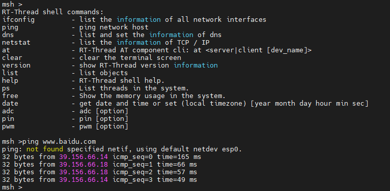

Output similar content, the ESP8266 module is connected successfully!

### 5 RTduino components

[RTduino](https://github.com/Yaochenger/RTduino) is the Arduino eco-compatible layer of the RT-Thread real-time operating system, and is a sub-community of the [RT-Thread community](https://github.com/RT-Thread/rt- thread), the downstream project of the Arduino open source project, aims to be compatible with the Arduino community ecology to enrich the RT-Thread community package ecology (such as thousands of different Arduino libraries, as well as the excellent open source projects of the Arduino community), and to reduce the learning threshold of the RT-Thread operating system and the chips compatible with RT-Thread. and RT-Thread-adapted chips.

#### 5.1 Configuring RTduino

Turn on the RTduino option in the onboard device driver.

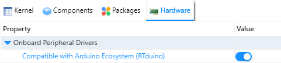

After turning on the option, `ctrl + s` saves the settings and the RTduino package can be added to the project.

#### 5.2 Using RTduino

In `arduino_main.cpp` you will see the familiar `void setup(void)` and `void loop(void)`, so we can use the BSP here like the official arduino board, the sample code is as follows:

```c++
#include <Arduino.h>

void setup(void)
 {
     /* put your setup code here, to run once: */
    pinMode(LED_BUILTIN, OUTPUT).
 }

void loop(void)
{
    /* put your main code here, to run repeatedly: */
    digitalWrite(LED_BUILTIN, !digitalRead(LED_BUILTIN)).
    delay(100).
}

```

 By default, the project performs a blinking LED function. ch32v208w-r0, the default on-board LED is not directly connected to the pin, the user needs to manually connect the LED to the control pin using a duplex cable, the phenomenon is shown below:

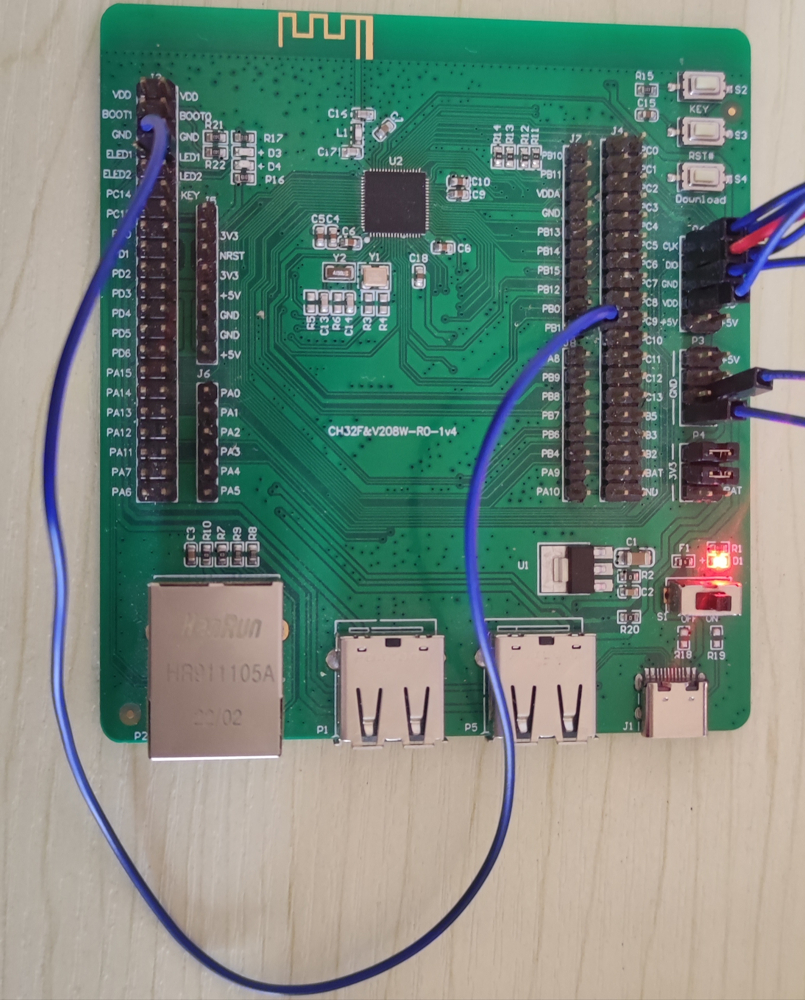

So the basic environment of ch32v208w-r0 is built and tested!