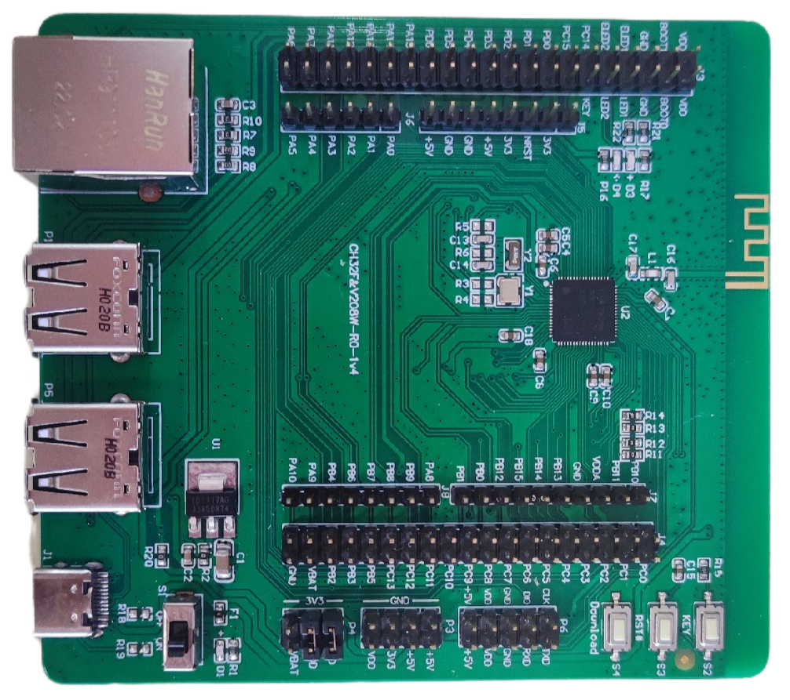
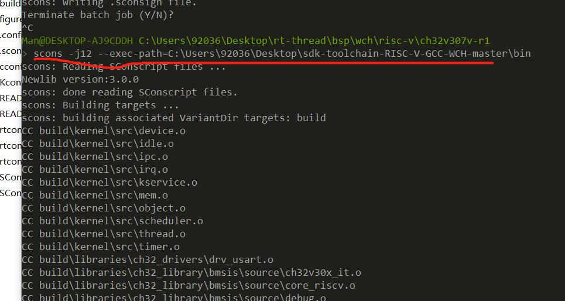
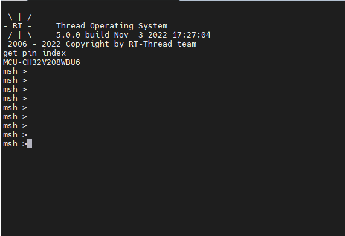
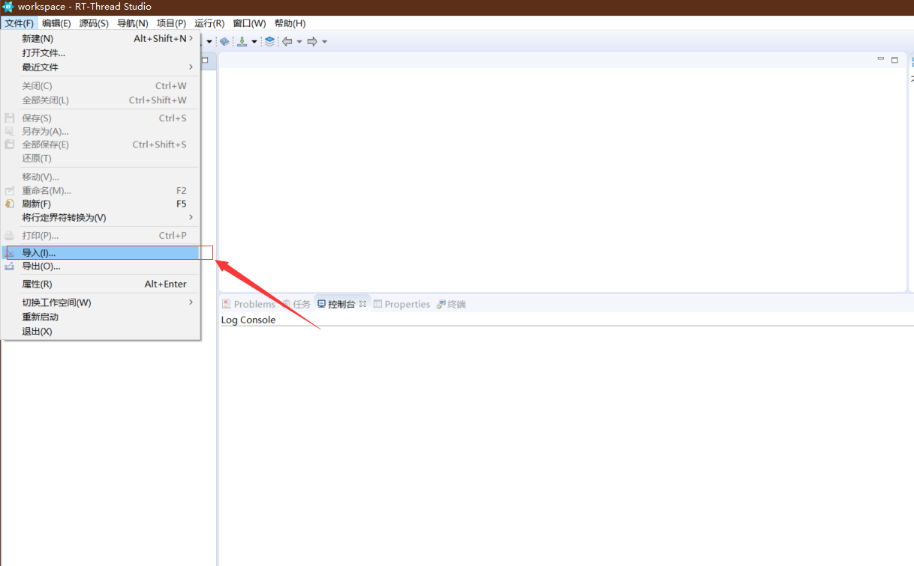

# CH32V208W-R0 BSP 说明

**中文** | [英文](README.md) 

## 1 开发板简介

CH32V208W-R0 是 WCH 推出的一款基于 RISC-V 内核的开发板，最高主频为 144Mhz。比较适合入门学习 RISC-V 架构。



**基本特性：**

- MCU：CH32V208WBU6，主频 144MHz，FLASH和RAM可配置
- LED：2个。
- 按键：3个 Download  ,Reset， User 。
- USB：2个，Tpye-C。
- 网口：1个，内置 10M PHY。
- 板上无 WCH-Link 下载调试工具，需外接。

### 1.2 编译说明

板级包支持 RISC-V GCC 开发环境，以下是具体版本信息：

| IDE/编译器 | 已测试版本           |
| ---------- | -------------------- |
| GCC        | WCH RISC-V GCC 8.2.0 |

### 1.3 使用说明

>本章节是为刚接触 RT-Thread 的新手准备的使用说明，遵循简单的步骤即可将 RT-Thread 操作系统运行在该开发板上，看到实验效果 。

### 1.4 使用Env编译BSP

本节讲解如何使用Env工具来编译BSP工程。

#### 1.4.1 编译BSP

1. [下载WCH编译工具链](https://github.com/NanjingQinheng/sdk-toolchain-RISC-V-GCC-WCH/archive/refs/tags/V1.0.0.zip)
2. 下载Env工具[最新版本](https://github.com/RT-Thread/env-windows/releases)
3. 下载RT-Thread[最新源码](https://github.com/RT-Thread/rt-thread/archive/refs/heads/master.zip)
4. 并在当前BSP根目录下打开Env工具并执行 `scons --exec-path=D:\sdk-toolchain-RISC-V-GCC-WCH-1.0.0\bin` 命令，在指定工具链位置的同时直接编译。
5. 编译完成之后会生成 **rtthread.bin** 文件。



#### 1.4.2 硬件连接

使用数据线连接板载 wch-link 到 PC，打开电源开关。

#### 1.4.3 下载

打开 WCH RISC-V MCU ProgrammerTool 下载软件，选择刚刚生成的 **rtthread.bin**  文件，进行下载。


#### 1.4.4 运行结果

在终端工具里打开板载 wch-link 串口（WCHDapLink SERIAL，默认115200-8-1-N），复位设备后，在串口上可以看到 RT-Thread 的输出信息：



### 1.5 使用VSCode编译工程

在Env终端中敲入命令 `scons --target=vsc` 来生成VSCode工程. 接着敲入命令 `code .` 来打开VSCode.

使用 **VSCode 终端** 敲入命令 `scons -j12 --exec-path=D:\sdk-toolchain-RISC-V-GCC-WCH-1.0.0bin` 来编译工程。


### 1.6 导入 RT-Thread Studio 工程

#### 1.6.1 导入

打开 RT-Thread Studio 后点击：文件->导入：



选择“RT-Thread Bsp 到工作空间中”：


填写项目信息，Bsp 根目录为 `\rt-thread\bsp\wch\risc-v\ch32v307v-r1` 目录：


#### 1.6.2 配置环境

工程导入后进行编译环境的设置，首先点击“打开构建设置”进入设置界面：


将编译链路径复制到 Toolchain path 中：


如图更改 Prefix ：


进行工具设置：


#### 1.6.3 编译

编译结果如下：

#### 

## 2 CH32V208W-R0上手指南

**中文** | [English](./CH32V208W-R0 Getting Started Guide.md)

CH32V208W-R0支持RT-Studio工程，本上手指南以RT-Studio环境的开发说明举例。

### 2.1 准备阶段

- 拉取rt-thread的github仓库到本地，[链接地址](https://github.com/RT-Thread/rt-thread)。

- 下载安装RT-Thread Studio,[链接地址](https://www.rt-thread.org/studio.html)。
- 准备ESP8266模块。

### 2.2 BSP上手阶段

#### 2.2.1 点击文件，选择导入选项。


#### 2.2.2 选择导入RT-Thread Bsp 到工作空间中


<div STYLE="page-break-after: always;"></div>

#### 2.2.3 按照示例填写工程信息


### 2.4 配置工程

导入工程后，在工程的根目录下存在参考文档readme,首先按照readme.md进行基础的配置

为了减小链接时添加的标准库带来的内存增大，我们可以选择使用相对占用内存较小的newlib,具体操作如下：


### 2.5 编译工程

点击编译选项：


编译结果：


工程编译通过，至此，准备阶段完成。

## 3 使用RT-Studio配置BSP驱动

RT-Thread每个BSP已经默认适配了若干片上外设驱动与板载外设驱动，使用RT-Studio将相应的开关直接打开并依据使用环境配置相应参数即可使用。由于各个管脚存在复用功能，所以并不是所有的片上外设驱动与板载外设驱动都可以同时使用，使用时需要结合原理图来合理开启相应的外设驱动。

RT-Thread有许多软件软件包，使用RT-Studio将相应软件包的开关打开便可将软件包添加至工程使用。


## 4 联网实操：使用ESP8266模块联网

ESP8266是面向物联网应用的高性价比、高度集成的 Wi-Fi MCU,也可以将其作为一个单独的WIFI模块使用,其实物图如下。ESP8266模组通常支持[AT指令](https://www.rt-thread.org/document/site/#/rt-thread-version/rt-thread-standard/programming-manual/at/at)的操作方式，RT-Thread针对这些支持AT指令的模组提供了一个抽象层,本小结将使用AT组将与ESP8266通讯并连接WIFI。


### 4.1 配置板载UART外设

使用AT组件与ESP8266模组通讯采用串口通讯的方式，所以需要再使能一路串口，这里我们使用UART2，串口驱动默认已经支持，我们仅需要在使用时在RT-Studio中打开即可，具体操作方式如下:


开启选项后，`ctrl + s`保存设置，串口2即被初始化。

### 4.2 使用RT-Studio配置AT组件

点击左侧的RT-Thread Settings选项，弹出右侧的配置菜单，在搜索栏中输入AT,选择`AT设备 `，使能AT设备：


选择ESP8266，并配置相应参数，示例如下:


### 4.3 ESP8266模组连接

将板子上的`PA2`管脚与模组的`RX`管脚连接，将`PA3`管脚与模组的`TX`管脚连接，并使用开发板引出的电源为模组供电。


### 4.4 使能内核调试功能。

为了更加直观的了解组件的初始化过程，我们可以使能内核调试功能来观察(不需要时可以关掉)，操作方法如下：


重新编译并烧录固件，shell输出如下：


### 4.5 wifi联网测试

我门在使用AT时已经配置了WIFI的ID与密码，在shell中输入`ping www.baidu.com`命令测试WIFI连接情况。


输出类似内容，ESP8266模组便联网成功！

## 5 RTduino组件

[RTduino](https://github.com/Yaochenger/RTduino)是RT-Thread实时操作系统的Arduino生态兼容层，为[RT-Thread社区](https://github.com/RT-Thread/rt-thread)的子社区、Arduino开源项目的下游项目，旨在兼容Arduino社区生态来丰富RT-Thread社区软件包生态（如上千种分门别类的Arduino库，以及Arduino社区优秀的开源项目），并降低RT-Thread操作系统以及与RT-Thread适配的芯片的学习门槛。

### 5.1 配置RTduino

将板载设备驱动中的RTduino选项打开。


开启选项后，`ctrl + s`保存设置，RTduino软件包即可添加至工程。

### 5.2 使用RTduino

在`arduino_main.cpp`中会看到熟悉的`void setup(void)`与`void loop(void)`,至此我们便可以在此像使用arduino官方板一样使用该BSP，示例代码如下：

```c++
#include <Arduino.h>

void setup(void)
 {
     /* put your setup code here, to run once: */
    pinMode(LED_BUILTIN, OUTPUT);
 }

void loop(void)
{
    /* put your main code here, to run repeatedly: */
    digitalWrite(LED_BUILTIN, !digitalRead(LED_BUILTIN));
    delay(100);
}

```

 工程默认执行一个LED闪烁的功能，ch32v208w-r0这款板子默认板载LED不与管脚直接连接，用户在使用LED时需要使用杜邦线手动将LED与控制管脚连接起来,现象如下图所示：


至此ch32v208w-r0的基础环境便搭建测试完毕！

