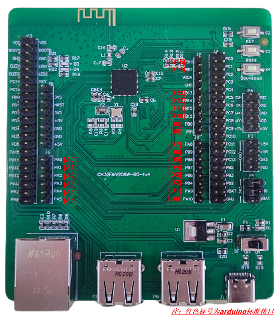

# CH32V208W-R0 开发板的Arduino生态兼容说明

## 1 RTduino - RT-Thread的Arduino生态兼容层

CH32V208W-R0开发板已经完整适配了[RTduino软件包](https://github.com/RTduino/RTduino)，即RT-Thread的Arduino生态兼容层。用户可以按照Arduino的编程习惯来操作该BSP，并且可以使用大量Arduino社区丰富的库，是对RT-Thread生态的极大增强。更多信息，请参见[RTduino软件包说明文档](https://github.com/RTduino/RTduino)。

### 1.1 如何开启针对本BSP的Arduino生态兼容层

Env 工具下敲入 menuconfig 命令，或者 RT-Thread Studio IDE 下选择 RT-Thread Settings：

```Kconfig
Hardware Drivers Config --->
    Onboard Peripheral Drivers --->
        [*] Compatible with Arduino Ecosystem (RTduino)
```

## 2 Arduino引脚排布

更多引脚布局相关信息参见 [pins_arduino.c](pins_arduino.c) 和 [pins_arduino.h](pins_arduino.h)。


| Arduino引脚编号  | STM32引脚编号 | 5V容忍 | 备注  |
| ------------------- | --------- | ---- | ------------------------------------------------------------------------- |
| 0 (D0) | PA9 | 是 | Serial2-TX，默认被RT-Thread的UART设备框架uart1接管 |
| 1 (D1) | PB0 | 是 | Serial2-RX，默认被RT-Thread的UART设备框架uart1接管 |
| 2 (D2) | PB4 | 是 |  |
| 3 (D3) | PB6 | 是 | PWM4-CH1，默认被RT-Thread的PWM设备框架pwm4接管 |
| 4 (D4) | PB7 | 是 | PWM4-CH2，默认被RT-Thread的PWM设备框架pwm4接管 |
| 5 (D5) | PB8 | 是 | PWM4-CH3，默认被RT-Thread的PWM设备框架pwm4接管 |
| 6 (D6) | PB9 | 是 | PWM4-CH4，默认被RT-Thread的PWM设备框架pwm4接管 |
| 7 (D7) | PA8 | 否 | PWM1-CH1，默认被RT-Thread的PWM设备框架pwm1接管 |
| 8 (D8) | PB1 | 否 | PWM3-CH4，默认被RT-Thread的PWM设备框架pwm3接管 |
| 9 (D9) | PB0 | 否 | PWM3-CH3，默认被RT-Thread的PWM设备框架pwm3接管 |
| 10 (D10) | PB12 | 是 |  |
| 11 (D11) | PB15 | 是 |  |
| 12 (D12) | PB14 | 是 |  |
| 13 (D13) | PB13 | 是 |  |
| 14 (D14) | PB11 | 是 | I2C1-SDA，默认被RT-Thread的I2C设备框架i2c1接管 |
| 15 (D15) | PB10 | 是 | I2C1-SCL，默认被RT-Thread的I2C设备框架i2c1接管 |
| 16 (A0) | PA0 | 否 | ADC1-CH0，默认被RT-Thread的ADC设备框架adc1接管 |
| 17 (A1) | PA1 | 否 | ADC1-CH1，默认被RT-Thread的ADC设备框架adc1接管 |
| 18 (A2) | PA2 | 否 | ADC1-CH2，默认被RT-Thread的ADC设备框架adc1接管 |
| 19 (A3) | PA3 | 否 | ADC1-CH3，默认被RT-Thread的ADC设备框架adc1接管 |
| 20 (A4) | PA4 | 否 | ADC1-CH4，默认被RT-Thread的ADC设备框架adc1接管 |
| 21 (A5) | PA5 | 否 | ADC1-CH5，默认被RT-Thread的ADC设备框架adc1接管 |

> 注意：
>
> 1. 驱动舵机和analogWrite函数要选择不同定时器发生的PWM信号引脚，由于硬件定时器4个通道需要保持相同的频率，如果采用相同的定时器发生的PWM分别驱动舵机和analogWrite，可能会导致舵机失效

## 3 通信

### 3.1 I2C总线

CH32V208W-R0  开发板的I2C总线是板上丝印的 `SCL/D15` 和 `SDA/D14` 引脚，这两个引脚默认是被RT-Thread I2C设备框架接管的，直接引用`#include <Wire.h>`（Arduino官方I2C头文件）即可使用。

### 3.2 SPI总线

目前本BSP不支持使用Arduino的SPI功能。

### 3.3 串口

本BSP通过 `Serial.` 方法调用 `uart1` 串口设备。详见[例程](https://github.com/RTduino/RTduino/blob/master/examples/Basic/helloworld.cpp)。