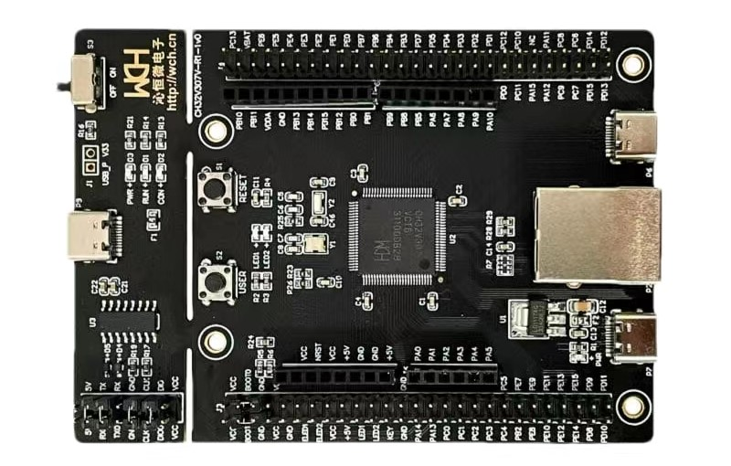
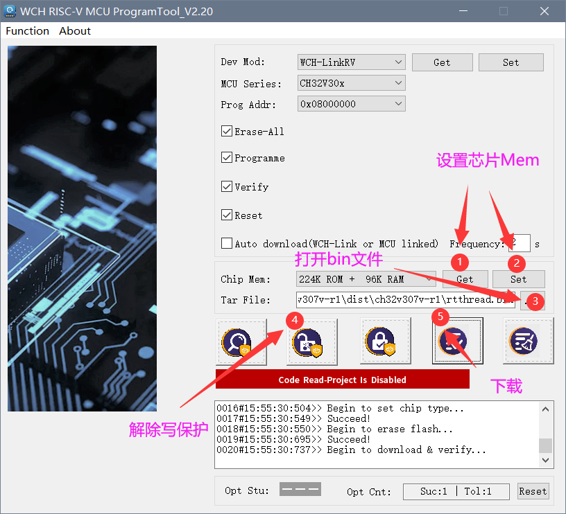
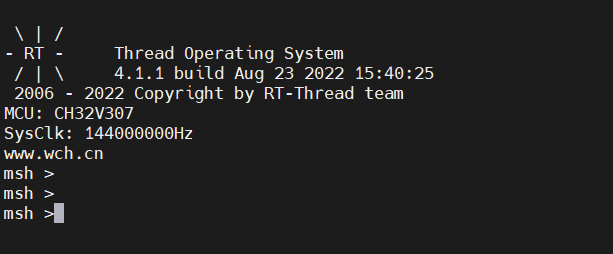
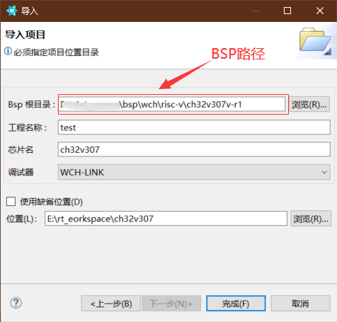
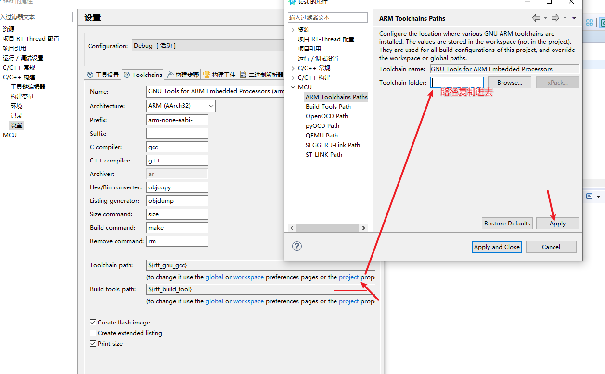
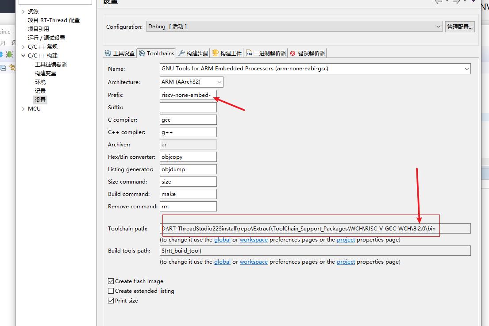

# CH32V307V-R1 BSP Introduction

**English** | [中文](README_zh.md)

## 1 Introduction

CH32V307V-R1 is a RISC-V core-based development board with a maximum main frequency of 144Mhz. It delivers the best value for developers to try and get started with RISC-V architecture.

This document records the execution instruction of the BSP (board support package) provided by the RT-Thread community for the CH32V307V-R1 development board.

The document is covered in three parts:

- Board Resources Introduction
- Compiling
- Quickly Get Started

By reading the Quickly Get Started section developers can quickly get their hands on this BSP and run RT-Thread on the board.

**Features**

- MCU: CH32V307VCT6, main frequency 144MHz，FLASH and RAM are available for configuration.
- LED: 2, user LEDs, LED1(blue), LED2(blue).
- Button: 2, Reset, User.
- USB: 2, Tpye-C.
- Network Port: 1, 10M PHY inside.
- WCH-Link download debugging tools onboard.

For more details about this board, please refer to: [CH32V307](https://www.wch.cn/products/CH32V307.html) and [CH32V307 official document](https://github.com/openwch/ch32v307)

## 2 Compiling

The BSP supports the RISC-V GCC development environment, here's the specific version information:

| IDE/Compiler | Version Tested       |
| ------------ | -------------------- |
| GCC          | WCH RISC-V GCC 8.2.0 |

## 3 Quickly Get Started

### 3.1 Using [Env](https://www.rt-thread.io/download.html?download=Env) to compile BSP

This section is about to introduce how to use Env to compile the BSP.

#### 3.1.1 Compile BSP

1. [Download WCH Compile Toolchain](https://github.com/NanjingQinheng/sdk-toolchain-RISC-V-GCC-WCH/releases)
2. [Download the Env tool latest version](https://github.com/RT-Thread/env-windows/releases)
3. [Download the RT-Thread latest code](https://github.com/RT-Thread/rt-thread/archive/refs/heads/master.zip)
4. Open the Env tool in the current BSP root directory and execute the `scons -j12 --exec-path=D:\sdk-toolchain-RISC-V-GCC-WCH-1.0.0\bin` command, compile it directly while specifying the toolchain location.
5. After compilation, the **rtthread.bin** file will be generated

#### 3.1.2 Hardware Connection

Use a data cable to connect the onboard wch-link to the PC, and turn on the power switch.

#### 3.1.3 Download

Open the WCH RISC-V MCU ProgrammerTool, select the **rtthread.bin** file that we just generated, and download it.

> Note that Chip Mem here is set to 224K ROM + 96K RAM.

#### 3.1.4 Running Result

In the terminal tool, open the onboard wch-link serial port (WCHDapLink SERIAL, default 115200-8-1-N), and after resetting the device, you can see the output information of RT-Thread on the serial port:

#### 3.1.5 If no running result

Replace download tool with WCH-LinkUtility.
[Details](https://club.rt-thread.org/ask/article/44e5b4bc129ff373.html)

### 3.2 Use VSCode to edit and compile the project

In the Env terminal, type command `scons --target=vsc` to generate the VSCode project. Then, type command `code .` in the Env terminal to open the VSCode.

Use **VSCode terminal** to type command `scons -j12 --exec-path=D:\sdk-toolchain-RISC-V-GCC-WCH-1.0.0\bin` to compile the project in VSCode.

<!-- ### 3.3 Import RT-Thread Studio Project

**CH32V307V-R1 is pending upgrade in Studio. It's not encouraged now to use Studio to compile this BSP.**

#### 3.3.1 Import

Open RT-Thread Studio and click: File-> Import:

Select "RT-Thread BSP Project into Workspace":

填写项目信息，Bsp 根目录为 \rt-thread\bsp\wch\risc-v\ch32v307v-r1 目录：

Fill in the project info, the BSP root directory is \rt-thread\bsp\wch\risc-v\ch32v307v-r1：

#### 3.3.2 Compilation Environment

工程导入后进行编译环境的设置，首先点击“打开构建设置”进入设置界面：

After the project is imported, set the compilation environment, click "Open Build Settings" to enter the setting interface:

将编译链路径复制到 Toolchain path 中：
Copy the compilation chain path into the Toolchain path:

Change Prefix:

Set the tool:

#### 3.3.3 Compiling

The result is shown as below:

![success](./figures/success.png -->
