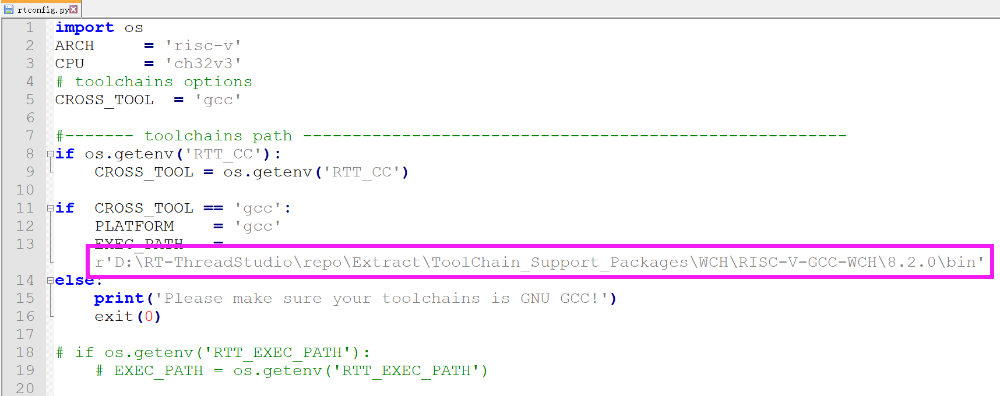
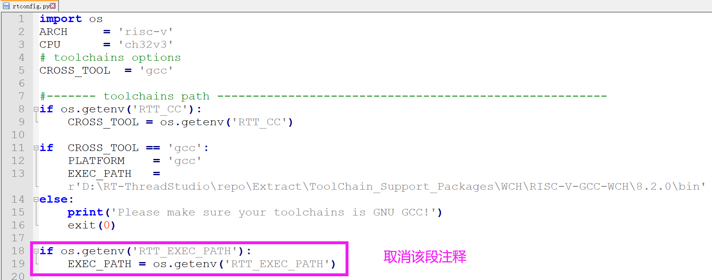

# ch32v307v-r1 BSP 说明
## 开发板简介

CH32V307V-R1 是 WCH 推出的一款基于 RISC-V 内核的开发板，最高主频为 144Mhz。比较适合入门学习 RISC-V 架构。

## 开发板图片


## 基本特性：

- MCU：CH32V307VCT6，主频 144MHz，FLASH和RAM可配置
- LED：2个，用户 LEDs， LED1（blue），LED2(red)。
- 按键：3个，Reset， User 和 Download。
- USB：2个，Tpye-C。
- 网口：1个，内置 10M PHY。
- 板载 WCH-Link 下载调试工具。

更多信息和资源请访问[互联型RISC-V单片机 CH32V307](https://www.wch.cn/products/CH32V307.html)

## 编译说明

板级包支持 RISC-V GCC 开发环境，以下是具体版本信息：

| IDE/编译器 | 已测试版本           |
| ---------- | -------------------- |
| GCC        | WCH RISC-V GCC 8.2.0 |

## 使用说明

>本章节是为刚接触 RT-Thread 的新手准备的使用说明，遵循简单的步骤即可将 RT-Thread 操作系统运行在该开发板上，看到实验效果 。

### 快速上手

本 BSP 为开发者提供 Scons编译配置。下面介绍如何将系统运行起来。

#### 1、指定RISC-V GCC编译器

推荐使用RT-Thread Studio软件里面的编译器。

##### 方法一：直接指定编译器路径。



##### 方法二：通过env设置编译器路径



```shell
set RTT_EXEC_PATH=D:\RT-ThreadStudio\repo\Extract\ToolChain_Support_Packages\WCH\RISC-V-GCC-WCH\8.2.0\bin
```

> 注意：如果使用第二种方法，第一种方法设置的路劲将会失效。

#### 2、生成dist文件夹

```shell
scons --dist
```


#### 3、进入dist文件夹scons编译

```shell
scons
```


最终会生成 **rtthread.bin** 文件。

#### 4、硬件连接

使用数据线连接板载 wch-link 到 PC，打开电源开关。

#### 5、下载

打开WCH RISC-V MCU ProgrammerTool下载软件，选择刚刚生成的 **rtthread.bin**  文件，进行下载。


> 注意：这里Chip Mem 设置为224K ROM + 96K RAM。不要以参考手册为准。

#### 运行结果

在终端工具里打开板载 wch-link 串口（WCHDapLink SERIAL，默认115200-8-1-N），复位设备后，在串口上可以看到 RT-Thread 的输出信息：


