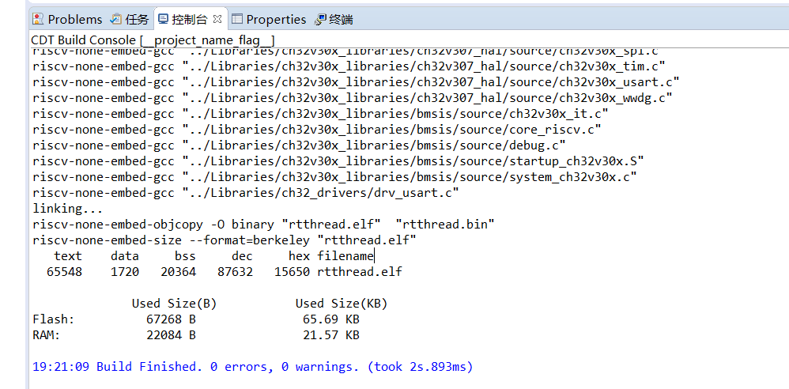

# ch32v307v-r1 BSP 说明

[English](README.md) | **中文**

## 1 开发板简介

CH32V307V-R1 是 WCH 推出的一款基于 RISC-V 内核的开发板，最高主频为 144Mhz。比较适合入门学习 RISC-V 架构。

**基本特性：**

- MCU：CH32V307VCT6，主频 144MHz，FLASH 和 RAM 可配置
- LED：2 个，用户 LEDs，LED1（blue），LED2（blue）。
- 按键：2 个，Reset，User 。
- USB：2 个，Tpye-C。
- 网口：1 个，内置 10M PHY。
- 板载 WCH-Link 下载调试工具。

更多信息和资源请访问[互联型 RISC-V 单片机 CH32V307](https://www.wch.cn/products/CH32V307.html) 以及 [官网文档资料](https://github.com/openwch/ch32v307)

## 2 编译说明

板级包支持 RISC-V GCC 开发环境，以下是具体版本信息：

| IDE/编译器 | 已测试版本           |
| ---------- | -------------------- |
| GCC        | WCH RISC-V GCC 8.2.0 |

## 3 使用说明

> 本章节是为刚接触 RT-Thread 的新手准备的使用说明，遵循简单的步骤即可将 RT-Thread 操作系统运行在该开发板上，看到实验效果 。

### 3.1 使用 Env 编译 BSP

本节讲解如何使用 Env 工具来编译 BSP 工程。

#### 3.1.1 编译 BSP

1. [下载 WCH 编译工具链](https://github.com/NanjingQinheng/sdk-toolchain-RISC-V-GCC-WCH/archive/refs/tags/V1.0.0.zip)
2. 下载 Env 工具[最新版本](https://github.com/RT-Thread/env-windows/releases)
3. 下载 RT-Thread[最新源码](https://github.com/RT-Thread/rt-thread/archive/refs/heads/master.zip)
4. 并在当前 BSP 根目录下打开 Env 工具并执行 `scons --exec-path=D:\sdk-toolchain-RISC-V-GCC-WCH-1.0.0\bin` 命令，在指定工具链位置的同时直接编译。
5. 编译完成之后会生成 **rtthread.bin** 文件。

#### 3.1.2 硬件连接

使用数据线连接板载 wch-link 到 PC，打开电源开关。

#### 3.1.3 下载

打开 WCH RISC-V MCU ProgrammerTool 下载软件，选择刚刚生成的 **rtthread.bin** 文件，进行下载。

> 注意：这里 Chip Mem 设置为 224K ROM + 96K RAM。不要以参考手册为准。

#### 3.1.4 运行结果

在终端工具里打开板载 wch-link 串口（WCHDapLink SERIAL，默认 115200-8-1-N），复位设备后，在串口上可以看到 RT-Thread 的输出信息：

#### 3.1.5 无运行结果解决方案

将 WCH RISC-V MCU ProgrammerTool 下载软件替换为 WCH-LinkUtility.[详情](https://club.rt-thread.org/ask/article/44e5b4bc129ff373.html)

### 3.2 使用 VSCode 编译工程

在 Env 终端中敲入命令 `scons --target=vsc` 来生成 VSCode 工程. 接着敲入命令 `code .` 来打开 VSCode.

使用 **VSCode 终端** 敲入命令 `scons -j12 --exec-path=D:\sdk-toolchain-RISC-V-GCC-WCH-1.0.0\bin` 来编译工程。

### 3.3 导入 RT-Thread Studio 工程

#### 3.3.1 导入

打开 RT-Thread Studio 后点击：文件->导入：

选择“RT-Thread Bsp 到工作空间中”：

填写项目信息，Bsp 根目录为 `\rt-thread\bsp\wch\risc-v\ch32v307v-r1` 目录：

#### 3.3.2 配置环境

工程导入后进行编译环境的设置，首先点击“打开构建设置”进入设置界面：

将编译链路径复制到 Toolchain path 中：

如图更改 Prefix ：

进行工具设置：

#### 3.3.3 编译

编译结果如下：

