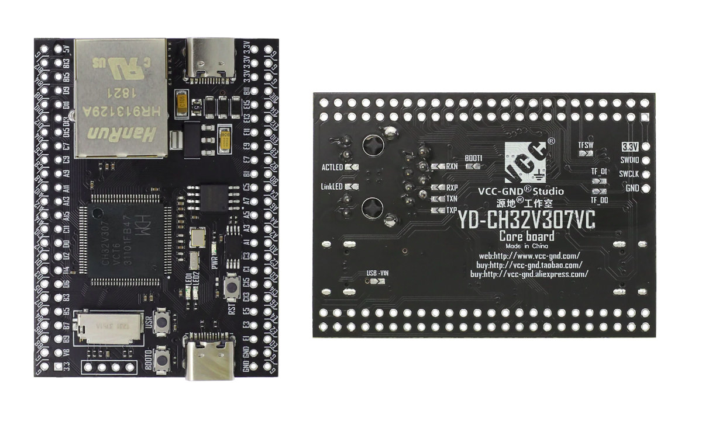

# YD-CH32V307VCT6 BSP Introduction

## 1 Introduction

YD-CH32V307VCT6 is a RISC-V core-based development board with a maximum main frequency of 144Mhz. It delivers the best value for developers to try and get started with RISC-V architecture.

This document records the execution instruction of the BSP (board support package) provided by the RT-Thread community for the CH32V307V-R1 development board.

The document is covered in three parts:

- Board Resources Introduction
- Compiling
- Quickly Get Started

By reading the Quickly Get Started section developers can quickly get their hands on this BSP and run RT-Thread on the board.



**Features**

- MCU: CH32V307VCT6, main frequency 144MHz，FLASH and RAM are available for configuration.
- LED: 2, user LEDs (blue and red).
- Button: 3, Reset, Boot, User.
- SPI Flash: 32M-bit serial flash memory (W25Q32).
- I2C EEPROM: 64k-bit serial EEPROM (24C64).
- USB: 2, Type-C.
- Network Port: 1, 10M PHY inside.
- SDIO: microSD connector.
- Debug interface: SWD.
- 8 MHz external quartz oscillator (HSE).
- 32,768 Hz external RTC quartz oscillator (LSE).

For more details about this board, please refer to: 
- [Board YD-CH32V307VCT6 VCC-GND Studio](http://152.32.187.208:8080/yd-data/YD-CH32V307VCT6/YD-CH32V307VCT6/)
- [CH32V307](https://www.wch.cn/products/CH32V307.html)
- [CH32V307 official document](https://github.com/openwch/ch32v307)

## 2 Compiling

The BSP supports the RISC-V GCC development environment, here's the specific version information:

| IDE/Compiler | Version Tested       |
| ------------ | -------------------- |
| GCC          | WCH RISC-V GCC 8.2.0 |

## 3 Quickly Get Started

### 3.1 Using Linux to compile BSP

This section is about to introduce how to compile the BSP in Linux.

#### 3.1.1 Compile BSP

1. [Download WCH Compile Toolchain](https://github.com/NanjingQinheng/sdk-toolchain-RISC-V-GCC-WCH/releases)
2. [Download the RT-Thread latest code](https://github.com/RT-Thread/rt-thread/archive/refs/heads/master.zip)
3. Install SCons construction tool (similar GNU Make): sudo apt install scons
4. Edit the variable **EXEC_PATH** in file **rtconfig.py** to point to the directory with executable WCH Compile Toolchain (file riscv-none-embed-gcc).
5. Configure RT-Thread and hardware board: scons --menuconfig
6. Start compilation: scons
7. After compilation, the **rtthread.bin** file will be generated

#### 3.1.2 Download

1. Clone source file: git clone https://github.com/jmaselbas/wch-isp.git
2. Compile and install :
- cd wch-isp
- make && sudo make install && sudo make load
3. Use a USB cable Type-C to connect board to the PC. Hold button **BOOT0**, press briefly button **RST** and release button **BOOT0**.
4. Check board connection:
```sh
wch-isp list
0: BTVER v2.9 UID 10-46-89-26-3b-38-d4-a4 [0x1770] CH32V307VCT6
MCU current flash size: 256 Kbyte
```

> Note that Chip Mem here is set to 256K ROM + 64K RAM (see Table 2-1 of datasheet CH32V307, and chapter 32.6 "User Option Bytes" of Reference Manual CH32V2x_V3x).

5. Download firmware to board:
```
wch-isp -p flash ./rtthread.bin && wch-isp reset 
```

#### 3.1.3 Running Result

1. Connect USB-UART converter to board:
- board pin A9 (UART1_TX) -> converter RX
- board pin A10 (UART1_RX) -> converter TX (optional, for enter commands)
2. In the terminal tool, open the converter serial port (default 115200-8-1-N), and after resetting the device, you can see the output information of RT-Thread on the serial port:
```
 \ | /
- RT -     Thread Operating System
 / | \     5.1.0 build Jan  6 2024 17:12:03
 2006 - 2022 Copyright by RT-Thread team
SystemClk: 144000000 Hz
msh >
```
On board LEDs (red and blue) blinking.
