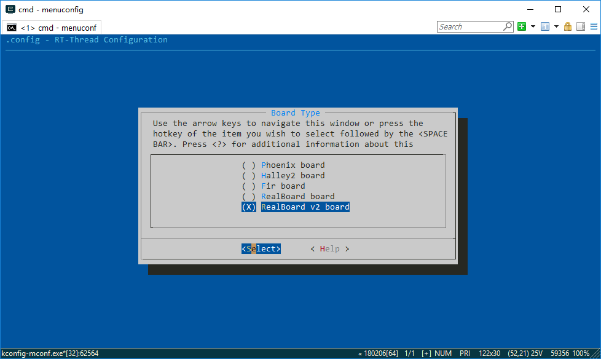
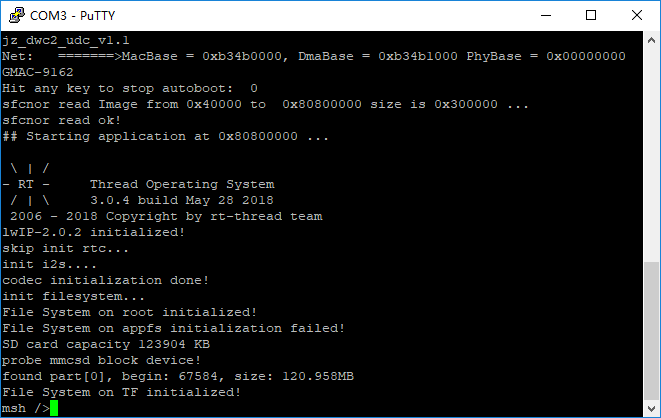

# 君正X1000处理器板级支持包

---

## 1. 简介

X1000 是 君正 Ingenic 公司的一款面向 智能音频、图像识别、智能家电、智能家居 等领域的高性能物联网芯片。包括如下硬件特性：

| 硬件 | 描述 |
| -- | -- |
|芯片型号| X1000/X1000E |
|CPU| MIPS32, XBurst |
|主频| 1GHz |
|片内LPDDR| 32MB |

***注：*** X1000E携带64MB片内LPDDR；

![此处输入图片的描述][1]

这个板级支持包是一份君正X1000处理器的完整移植。

## 2. 编译说明

X1000处理器是一款MIPS32兼容处理器，由于[RT-Thread/ENV][2]工具中并未默认携带MIPS的工具链，可以按照自己使用PC情况到以下地方下载工具链：

* [Windows环境版本GCC][3]
* [Linux环境版本GCC][4]

安装好工具链后，假设使用的是Windows版本，工具链安装在`D:\Tools\mips-2016.05`目录下。使用env工具，打开console，进入到命令行环境中，需要手动设置工具链的环境变量`RTT_EXEC_PATH`：

    set RTT_EXEC_PATH=d:\Tools\mips-2016.05\bin

然后在console中进入到`rt-thread\bsp\x1000`目录中，执行以下命令编译RT-Thread:

    scons

来编译这个板级支持包。如果编译正确无误，会产生rtthread.elf、rtthread.bin文件。其中rtthread.bin需要烧写到设备中进行运行。

也可以在ENV中使用

    menuconfig

来配置RT-Thread。当前这份BSP支持多种板卡类型，包括哈雷2，凤凰板以及睿赛德提供的RealBoard X1000开发板等。



## 3. 烧写及执行

在烧写前，请使用两条micro-b的USB线连接到电脑上，一个是USB转UART，一个是USB接口（用于烧写固件）。烧写需要使用君正提供的[cloner工具软件，注意是cloner-2.3.0版本][5]。请按照下面的方式设置cloner工具软件。

其中，

* uboot.bin烧写地址是0x0
* rtthread.bin烧写地址是0x40000
* rootfs烧写地址是0x400000

> uboot.bin请使用bsp/x1000中附带的uboot-for-realboard.bin文件。关于rootfs文件生成，请见第5节

在连接好USB后，如果是RT-Thread RealBoard/X1000开发板，可以同时按住 `Reset + Boot` 按键，然后先释放`Reset`按键，然后再释放`Boot`按键。这个时候cloner软件会进入烧写模式，烧写固件到板子上。 

连接好串口，可以使用putty以115200-N-8-1的配置方式连接到设备上。开发板复位后首先运行的是u-boot引导程序，然后再由u-boot跳转到flash中的rtthread.bin固件中。

> 如果是自行编译的uboot程序，可以把bootcmd设置为

    bootcmd=sfcnor read 0x40000 0x340000 0x80800000\;go 0x80800000

### 3.1 运行结果

如果编译 & 烧写无误，当复位设备后，会在串口上看到RT-Thread的启动logo信息：



## 4. 驱动支持情况及计划

| 驱动 | 支持情况  |  备注  |
| ------ | ----  | :------  |
| UART | 支持 | UART0/1 |
| Clock | 支持 |  |
| pinmux | 支持 |  |
| SPI | 支持 |  |
| IIC | 支持 | 以IO模拟方式 |
| SFC Flash | 支持 | 支持四线模式挂载文件系统 |
| WDT | 支持 |  |
| SLCD | 支持 |  |
| MMC | 支持 | MMC0/1 |
| EMAC | 支持 | 测试未充分 |
| USB | 有限度支持device | USB device还未完全稳定 |
| Camera | 不支持 | N/A |

### 4.1 IO在板级支持包中的映射情况

| IO号 | 板级包中的定义 |
| -- | -- |
| 调试串口 | PD2/3 |

## 5. 生成flash中的文件系统镜像

在这份BSP中，默认把flash偏移0x400000后的空间划分为文件系统使用（即Flash中4MB以后的空间做为文件系统使用），并且以FAT文件系统方式来使用（RT-Thread本身并无一些文件系统上文件的依赖，不过第6节中提及的Wi-Fi功能固件是放于文件系统根目录下）。

这部分文件系统空间，可以在系统启动后使用mkfs命令来格式化，然后装载；也可以在PC上预先生成，然后通过cloner工具烧写到flash上。如果是预先生成的方式，可以使用env/tools/fatdisk工具进行生成。fatdisk工具类似于把一个目录下的所有文件及子目录都转换成一个FAT文件系统的映像，至于如何转换，相对应的参数是什么样的，主要由fatdisk.xml配置文件来控制，例如：

```xml
<?xml version="1.0" encoding="UTF-8"?>
<fatdisk>
   <disk_size>4096</disk_size>
   <sector_size>4096</sector_size>
   <root_dir>root</root_dir>
   <output>sd.bin</output>
   <strip>1</strip>
</fatdisk>
```

disk_size代表了这个文件系统映像的最大容量是多少，单位是kBytes；sector_size代表着扇区大小，对于X1000分支，这个大小必须是4096。root_dir则表示转换的目录，是针对fatdisk.exe可执行文件的相对目录；output代表生成的文件系统映像文件的文件名称。strip代表文件系统后面的全0数据是否移除，0代表不移除，1代表移除；

***注：***
在BSP中也可以更改这个flash偏移点，它是由如下分区代码所决定：

`文件：bsp/x1000/drivers/sfc/drv_sfc_gd25qxx_mtd_partition.c`

```C
static struct rt_mtd_nor_partition _sf_gd25_parts[] =
{
    {
        /* sf01 u-boot 512K */
        .name       = "uboot",
        .offset     = 0x0,
        .size       = (0x80000),
        .mask_flags = PART_FLAG_RDONLY | PART_TYPE_BLK,     /* force read-only */
    },
    ...
    {
        /* rootfs */
        .name       = "rootfs",
        .offset     = 0x400000,
        .size       = 0x800000,
        .mask_flags = PART_FLAG_RDONLY | PART_TYPE_BLK,     /* force read-only & Block device */
    },
    ...
};
```

当前BSP中，这个分区配置被配置成如下表所示：

| 名称 | 起始地址 | 大小 | 属性 |
| -- | -- | -- | -- |
| uboot | 0x0 | 512KBytes | 只读 |
| kernel | 0x80000 | 3.5MBytes | 只读 |
| rootfs | 0x400000 | 8MBytes | 只读 |
| appfs | 0xE00000 | 2MBytes | 读写 |

## 6. 使用哈雷2核心板Wi-Fi功能

在RT-Thread package上已经包含了哈雷2核心板带的BCM43438的Wi-Fi驱动，可以在menuconfig中打开以下选项：

    RT-Thread online packages --->
        IoT - internet of things --->
            Wi-Fi --->
                Wiced WiFi --->
                    [*] Wiced WiFi driver for rt-thread
                        wiced wifi version (latest version)

然后在console命令下执行`pkgs --update`，它会下载Wi-Fi驱动package，并部署到这个板级支持包中。

当编译成功，并烧写到板子上，以及把BCM43438的固件（43438A1.bin）放置一份在文件系统根目录下。系统运行起来后，然后使用以下命令行关联到Wlan网络中：

    wifi w0 join YOUR_SSID YOUR_PASSWD

其中，

* YOUR_SSID 请使用你的wlan AP名称代替；
* YOUR_PASSWD 请使用你的wlan设备密码代替；

## 6. 参考

* 芯片[数据手册][7]

  [1]: http://www.ingenic.cn/~editor/eweditor/uploadfile/20160615102142861.png
  [2]: https://www.rt-thread.org/page/download.html
  [3]: https://sourcery.mentor.com/GNUToolchain/package14477/public/mips-sde-elf/mips-2016.05-7-mips-sde-elf-i686-mingw32.tar.bz2
  [4]: https://sourcery.mentor.com/GNUToolchain/package14476/public/mips-sde-elf/mips-2016.05-7-mips-sde-elf-i686-pc-linux-gnu.tar.bz2
  [5]: https://pan.baidu.com/s/1slVU4tJ
  [6]: images/startup.jpg
  [7]: ftp://ftp.ingenic.com/SOC/X1000/X1000_DS.pdf
