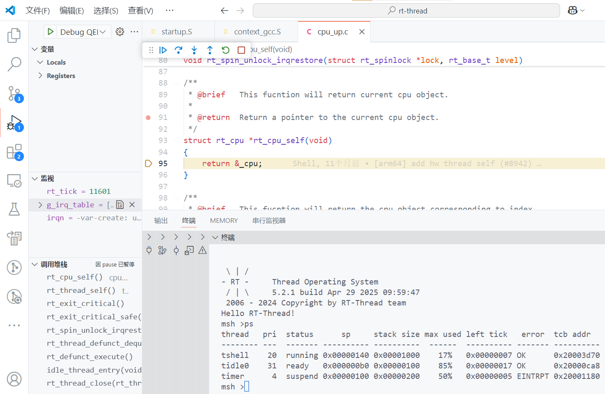

# XuanTie - E902  Series

## 一 简介

### 1. 内核

玄铁 E902 是杭州中天微系统有限公司自主研发的极低功耗、极低成本嵌入式 CPU 核，以 8 位 CPU的成本获得 32 位嵌入式 CPU 的运行效率与性能。E902 兼容 RISC-V 指令架构，采用 16/32 位混合编码系统，指令系统与流水线硬件结构精简高效，具备极低成本、极低功耗和高代码密度等优点。E902 主要针对智能卡、智能电网、低成本微控制器、无线传感网络等嵌入式应用。

### 2.特点

E902 处理器体系结构的主要特点如下：

• 支持 RISC-V RV32E[M]C 指令集；

• 16 个 32 位通用寄存器；

• 两级顺序执行流水线；

• 支持 RISC-V 机器模式和用户模式；

• 支持 RISCV debug 架构，支持标准五线 jtag 调试接口，支持 cjtag 两线调试接口;

• 可配置的单周期硬件乘法器，多周期硬件除法器；

• 兼容 RISC-V CLIC 中断标准，支持中断嵌套，外部中断源数量最高可配置 240 个；

• 兼容 RISC-V PMP 内存保护标准，0/4/8/12/16 区域可配置；

• 支持 AHB-Lite 总线协议，支持指令总线，系统总线；

• 支持可配置的指令高速缓存，缓存行 16 字节，容量 2KiB/4KiB/8KiB 可配；

• 支持玄铁扩展编程模型；

• 支持复位启动地址硬件集成时可配置；

• 支持软复位操作。

### 3.BSP支持情况

- 当前BSP支持下述内核：

  ```asciiarmor
   e902 e902m e902mt e902t
  ```

- 当前BSP默认设置的内核是e902。

- 当使用其他内核架构时需要修改，rtconfig.py文件中的`MCPU`字段。

### 4.运行QEMU

- BSP根目录下存在`qemu.bat`脚本，生成可执行文件后可点击该脚本直接启动QEMU.

## 二 工具

- 编译器： https://www.xrvm.cn/community/download?id=4433353576298909696
- 模拟器： https://www.xrvm.cn/community/download?id=4397435198627713024

注：若上述链接中的编译器与模拟器不能使用，可以使用下述CDK中的编译器与模拟器

- SDK：https://www.xrvm.cn/community/download?id=4397799570420076544

## 三 调试方法

**下述调试方法以E902举例，本BSP操作方式一致**，搭建完成RT-Thread开发环境，在BSP根目录使用env工具在当前目录打开env。


使用前执行一次**menuconfig**命令，更新rtconfig.h配置，然后在当前目录执行**scons -j12**命令编译生成可可执行文件。


生成可执行文件，可以直接在命令行启动qemu或者配置vscode脚本借助vscode强大的插件进行图形化调试，qemu的相关命令可以查看玄铁qemu的[用户手册](https://www.xrvm.cn/community/download?id=4397435198627713024)，下述是启动qemu的命令，在powershell或命令行可直接执行下述命令，注意qemu需要导出至环境变量或者使用绝对路径。

```shell
qemu-system-riscv64 -machine smartl -nographic -kernel rtthread.elf -cpu e906
```

下述是使用vscode调试的展示。



一起为RISC-V加油！