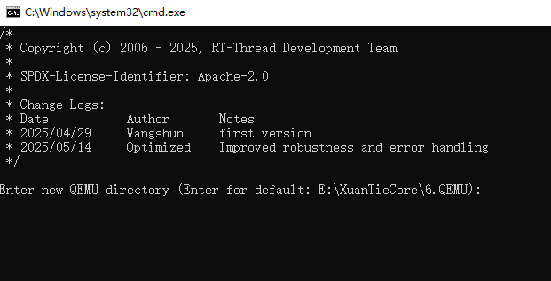

# XuanTie - E906  Series

## 一 简介

### 1. 内核

[E906](https://www.xrvm.cn/community/download?id=4222755171580579840) 是一款基于 RISC-V 指令集的高能效嵌入式处理器，是玄铁 RISC-V MCU 产品线中的最高性能
处理器。 E906 的设计目标是，使用最低的面积和功耗成本，取得相对较高的性能指标。 E906 主要面向语
音、高端 MCU、轻量级 AI、导航、 WiFi 等应用领域。  

### 2.特点

E906 处理器体系结构的主要特点如下：
• 32 位 RISC 处理器；
• 支持 RISC-V RV32IMA[F][D]C[P] 指令集；
• 支持 RISC-V 32/16 位混编指令集；
• 32 个 32 位通用寄存器；
• 整型 5 级/浮点 7 级，单发射，顺序执行流水线；
• 可选配 BHT 和 BTB；
• 支持 RISC-V 机器模式和用户模式；
• 双周期硬件乘法器，基 4 硬件除法器；
• 可选配指令 cache，两路组相连结构， 2KiB-32KiB 可配置；
• 可选配数据 cache，两路组相连结构， 2KiB-32KiB 可配置；
• 兼容 RISC-V CLIC 中断标准，支持中断嵌套，外部中断源数量最高可配置 240 个；
• 兼容 RISC-V PMP 内存保护标准， 0/4/8/12/16 区域可配置；
• 支持 AHB-Lite 总线协议，支持三条总线：指令总线，数据总线和系统总线；
• 支持可配的性能监测单元；
• 支持玄铁扩展增强指令集  

### 3.BSP支持情况

- 当前BSP支持下述内核：

  ```asciiarmor
  e906 e906f e906fd e906p e906fp e906fdp
  ```

- 当前BSP默认设置的内核是e906fd，该架构支持[F] [D]扩展，可以通过menuconfig工具使能[F]扩展或者[F] [D] 扩展。

- 当使用其他内核架构时需要修改，rtconfig.py文件中的`MCPU`与`CPU`字段。

## 二 工具

- 编译器： https://www.xrvm.cn/community/download?id=4433353576298909696
- 模拟器： https://www.xrvm.cn/community/download?id=4397435198627713024

注：若上述链接中的编译器与模拟器不能使用，可以使用下述CDK中的编译器与模拟器

- SDK：https://www.xrvm.cn/community/download?id=4397799570420076544

## 三 编译运行

在BSP根目录打开env工具。


首次使用执行一次**menuconfig**命令，更新**rtconfig.h**配置，然后在当前目录执行**scons -j12**编译生成**rtthread.elf**可执行文件。


BSP根目录下存在`qemu.bat`脚本，生成可执行文件后可点击该脚本直接启动QEMU.

在Windows环境下双击运行该脚本，出现下述页面，首次运行需要输入QEMU可执行文件的路径，后续如果不修改QEMU的路径，直接按回车跳过当前步骤：



第二步需要设置`-cpu`的参数，当前脚默认为`e906fd`，如果需要修改请在`:`后输入具体内核型号，例如`e906`


完成参数设置后按回车键便可以在qemu上运行可执行文件。

注：当前BSP根目录存在`objdump.bat`脚本文件，点击该脚本可以在BSP根目录生成反汇编文件。

## 四 调试方法

### 1. 命令行调试

当前BSP可以在命令行启动qemu或者配置vscode脚本借助vscode强大的插件进行图形化调试，qemu的相关命令可以查看玄铁qemu的[用户手册](https://www.xrvm.cn/community/download?id=4397435198627713024)，下述是启动qemu的命令，在powershell或命令行可直接执行下述命令，**注意QEMU需要导出至环境变量或者使用绝对路径**。

```shell
qemu-system-riscv32 -machine smartl -nographic -kernel rtthread.elf -cpu e906fd -gdb tcp::23333 -S
```

启动`powershell`或命令行，输入并执行上述命令后的视图。


启动另一个`powershell`或命令行，输入并执行下述命令后的视图如下，**注意GDB需要导出至环境变量或者使用绝对路径**。。

```shell
riscv64-unknown-elf-gdb.exe rtthread.elf -ex "target remote localhost:23333"
```


如果不设置断点，在命令行执行`c`命令便可以全速运行，运行视图如下：


### 2. VScode调试

下述是使用VScode调试的展示，VScode调试需要配置脚本，脚本配置请结合qemu手册进行配置或者使用[参考脚本](https://github.com/Yaochenger/RT-Thread-Tools)。


一起为RISC-V加油！