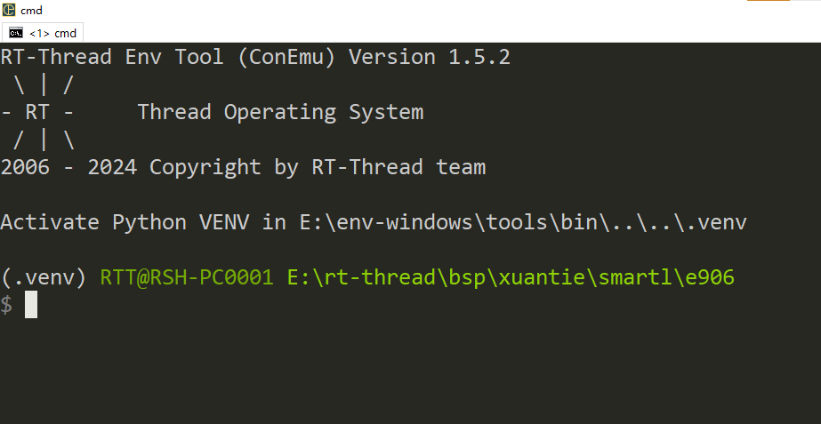

# XuanTie - C906  Series

## 一 简介

### 1. 内核

C906 是基于 RISC-V 指令架构的 64 位超高能效处理器，主要面向安防监控、智能音箱、扫码/刷脸支付等领域。  

### 2.特点

•  RV64IMA[FD]C[V] 指令架构；

• 5 级单发按序执行流水线；

• 一级哈佛结构的指令和数据缓存，大小为 8KB/16KB/32KB/64KB 可配置，缓存行为 64B；

• Sv39 内存管理单元，实现虚实地址转换与内存管理；

• 支持 AXI4.0 128 比特 Master 接口；

• 支持核内中断 CLINT 和中断控制器 PLIC；

• 支持 RISC-V Debug 标准。

• 遵循 RISC-V V 矢量扩展标准（revision 0.7.1）；

• 算力可达 4G Flops（@1GHz）；

• 支持矢量执行单元运算宽度 64 位和 128 位硬件可配置；

• 支持 INT8/INT16/INT32/INT64/FP16/FP32/BFP16 矢量运算；  

### 3.BSP支持情况

- 当前BSP支持下述内核：

  ```asciiarmor
  c906 c906fd c906fdv
  ```

- 当前BSP默认设置的内核是c906，该架构支持[F] [D]扩展，可以通过menuconfig工具使能[F]扩展或者[F] [D] 扩展。

- 当使用其他内核架构时需要修改，rtconfig.py文件中的`MCPU`字段。

### 4.运行QEMU

- BSP根目录下存在`qemu.bat`脚本，生成可执行文件后可点击该脚本直接启动QEMU.

## 二 工具

- 编译器： https://www.xrvm.cn/community/download?id=4433353576298909696
- 模拟器： https://www.xrvm.cn/community/download?id=4397435198627713024

注：若上述链接中的编译器与模拟器不能使用，可以使用下述CDK中的编译器与模拟器

- SDK：https://www.xrvm.cn/community/download?id=4397799570420076544

## 三 调试方法

**下述调试方法以E906举例，本BSP操作方式一致**，搭建完成RT-Thread开发环境，在BSP根目录使用env工具在当前目录打开env。



使用前执行一次**menuconfig**命令，更新rtconfig.h配置，然后在当前目录执行**scons -j12**命令编译生成可可执行文件。


生成可执行文件，可以直接在命令行启动qemu或者配置vscode脚本借助vscode强大的插件进行图形化调试，qemu的相关命令可以查看玄铁qemu的[用户手册](https://www.xrvm.cn/community/download?id=4397435198627713024)，下述是启动qemu的命令，在powershell或命令行可直接执行下述命令，注意qemu需要导出至环境变量或者使用绝对路径。

```shell
qemu-system-riscv64 -machine smartl -nographic -kernel rtthread.elf -cpu e906
```

下述是使用vscode调试的展示。


一起为RISC-V加油！