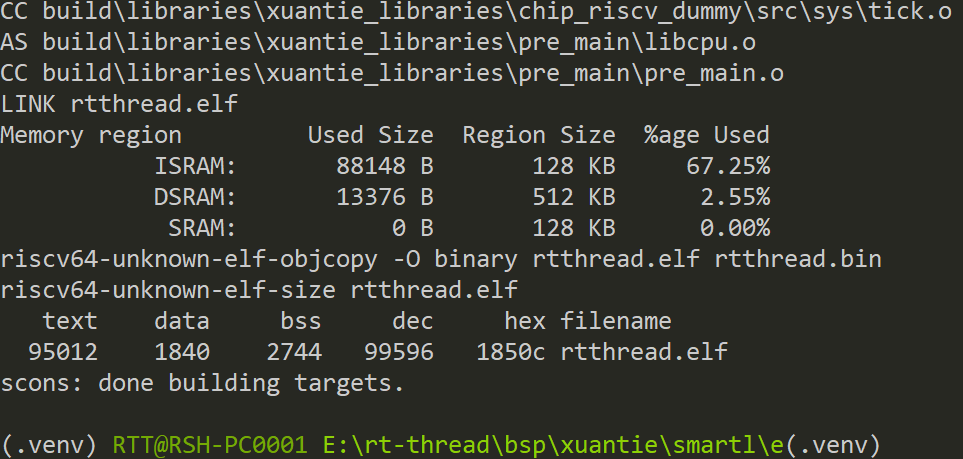

# XuanTie - C908  Series

## 一 简介

### 1. 内核

C907 是一款基于 RISC-V 指令集架构的入门级 AP 处理器，主要面向家庭视觉、人机交互、网络通信
等领域，例如可视门铃、智能门锁、触屏智能家电等产品。  

### 2.特点

• 支持 RV32 与 RV64 架构；
• 支持 RV64GCB + RV32GCB 指令集，兼容 RVA22；
• 支持 XuanTie Turbo 扩展指令集；
• 可选配浮点指令扩展，支持 FP16/BF16/FP32 运算格式；
• 可选配矢量指令扩展，支持 Vector Extention 1.0 版本，支持 INT8/INT16/INT32/INT64 以及
FP16/BF16/FP32 运算格式，使用 chaining 的优化运算带宽技术；
• 可选配矩阵指令扩展，支持 INT4/INT8/FP16/BF16；
• 支持多核 SMP，可支持 1~4 核心可配置
• 按序部分双发 9 级流水线，支持乱序回写；
• 混合分支预测机制，改进版的 G-Shared 分支预测器和 L0 BTB、 RAS；
• 支持指令融合技术；
• 支持指令和数据的 prefetch；
• 指令 cache，四路组相连结构， 64B 缓存行， 8KB-64KB 可配置， VIPT；
• 数据 cache，四路组相连结构， 64B 缓存行， 8KB-64KB 可配置， VIPT 模拟 PIPT；
• 二级 Cache， 64B 缓存行， 128KB~4MB 可配置；
• 支持 L1、 L2 两级 TLB， Sv39/Sv48 可配置，支持 Sv32；

### 3.BSP支持情况

- 当前BSP支持下述内核：

  ```asciiarmor
  c907 c907fd c907fd-rv32 c907fdv c907fdvm c907fdvm-rv32 c907fdv-rv32 c907-rv32
  ```

- 当前BSP默认设置的内核是c907fd，该架构支持[F] [D]扩展，可以通过menuconfig工具使能[F]扩展或者[F] [D] 扩展。

- 当使用其他内核架构时需要修改，rtconfig.py文件中的`MCPU`字段。

### 4.运行QEMU

- BSP根目录下存在`qemu.bat`脚本，生成可执行文件后可点击该脚本直接启动QEMU.

## 二 工具

- 编译器： https://www.xrvm.cn/community/download?id=4433353576298909696
- 模拟器： https://www.xrvm.cn/community/download?id=4397435198627713024

注：若上述链接中的编译器与模拟器不能使用，可以使用下述CDK中的编译器与模拟器

- SDK：https://www.xrvm.cn/community/download?id=4397799570420076544

## 三 调试方法

**下述调试方法以E906举例，本BSP操作方式一致**，搭建完成RT-Thread开发环境，在BSP根目录使用env工具在当前目录打开env。


使用前执行一次**menuconfig**命令，更新rtconfig.h配置，然后在当前目录执行**scons -j12**命令编译生成可可执行文件。



生成可执行文件，可以直接在命令行启动qemu或者配置vscode脚本借助vscode强大的插件进行图形化调试，qemu的相关命令可以查看玄铁qemu的[用户手册](https://www.xrvm.cn/community/download?id=4397435198627713024)，下述是启动qemu的命令，在powershell或命令行可直接执行下述命令，注意qemu需要导出至环境变量或者使用绝对路径。

```shell
qemu-system-riscv64 -machine smartl -nographic -kernel rtthread.elf -cpu e906
```

下述是使用vscode调试的展示。


一起为RISC-V加油！