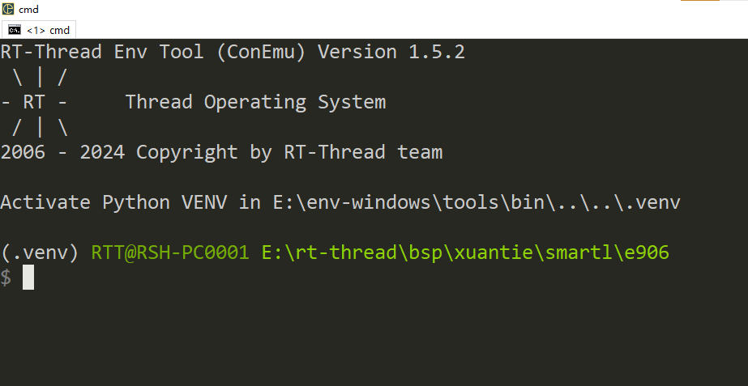

# XuanTie - C910/C920MP Series

当前BSP同时支持C910/C920MP！

## 一 简介

### 1. 内核

C910/C920MP 是基于 RISC-V 指令架构的 64 位高性能多核心处理器，主要面向对性能要求严格的边缘计算领域，如边缘服务器、边缘计算卡、高端机器视觉、高端视频监控、自动驾驶、移动智能终端、5G基站等。C910/C920MP 采用同构多核架构，支持 1~4 个 C910/C920 核心可配置。每个 C910/C920 核心采用自主设计的微体系结构，并重点针对性能进行优化，引入 3 译码 8 执行的超标量架构和多通道的数据预取等高性能技术。此外，C910/C920 核心支持实时检测并关断内部空闲功能模块，降低处理器动态功耗。

### 2.特点

**C910/C920** **核心的主要特点**

• RISC-V 64GC[V] 指令架构；（C910 不支持 Vector）

• 支持小端模式；

• 9~12 级深流水架构；

• 3 译码 8 执行的超标量架构，对软件完全透明；

• 按序取指，乱序发射，乱序完成和按序退休；

• 两级 TLB 内存管理单元，实现虚实地址转换与内存管理；

• 指令高缓和数据高缓大小可配置，支持 32KB、64KB，缓存行为 64B；

• 指令高缓可配置奇偶校验，数据高缓可配置 ECC 或奇偶校验；

• 指令预取功能，硬件自动检测并动态启动；

• 指令高缓路预测的低功耗访问技术；

• 短循环缓存的低功耗执行技术；

• 64Kb 的两级多路并行分支预测器；

• 1024/2048 表项可配置的分支目标缓存器；

• 支持 12 层的硬件返回地址堆栈；

• 256 表项的间接跳转分支预测器；

• 非阻塞发射，投机猜测执行；

• 基于物理寄存器的重命名技术；

• 支持 0 延时 move 指令；

• 双发射、全乱序执行的 load、store 指令；

• 支持读写各 8 路并发的总线访问；

• 支持写合并；

• 支持 8 个通道的数据缓存硬件预取，支持 stride 的预取方式；

• 浮点执行单元可配置，支持半精度、单精度；

### 3.当前BSP支持下述内核：

```asciiarmor
C910V2 C910V3 C920V2 C920V3 
```

- 当前BSP默认设置的内核是c910V2，该架构支持[F] [D]扩展，可以通过menuconfig工具使能[F]扩展或者[F] [D] 扩展。

- 当使用其他内核架构时需要修改，rtconfig.py文件中的`MCPU`字段。

### 4.运行QEMU

- BSP根目录下存在`qemu.bat`脚本，生成可执行文件后可点击该脚本直接启动QEMU.

## 二 工具

- 编译器： https://www.xrvm.cn/community/download?id=4433353576298909696
- 模拟器： https://www.xrvm.cn/community/download?id=4397435198627713024

注：若上述链接中的编译器与模拟器不能使用，可以使用下述CDK中的编译器与模拟器

- SDK：https://www.xrvm.cn/community/download?id=4397799570420076544

## 三 调试方法

**下述调试方法以E906举例，本BSP操作方式一致**，搭建完成RT-Thread开发环境，在BSP根目录使用env工具在当前目录打开env。



使用前执行一次**menuconfig**命令，更新rtconfig.h配置，然后在当前目录执行**scons -j12**命令编译生成可可执行文件。


生成可执行文件，可以直接在命令行启动qemu或者配置vscode脚本借助vscode强大的插件进行图形化调试，qemu的相关命令可以查看玄铁qemu的[用户手册](https://www.xrvm.cn/community/download?id=4397435198627713024)，下述是启动qemu的命令，在powershell或命令行可直接执行下述命令，注意qemu需要导出至环境变量或者使用绝对路径。

```shell
qemu-system-riscv64 -machine smartl -nographic -kernel rtthread.elf -cpu e906
```

下述是使用vscode调试的展示。


一起为RISC-V加油！