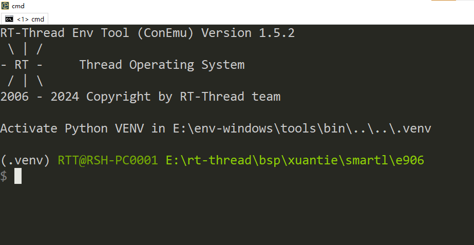
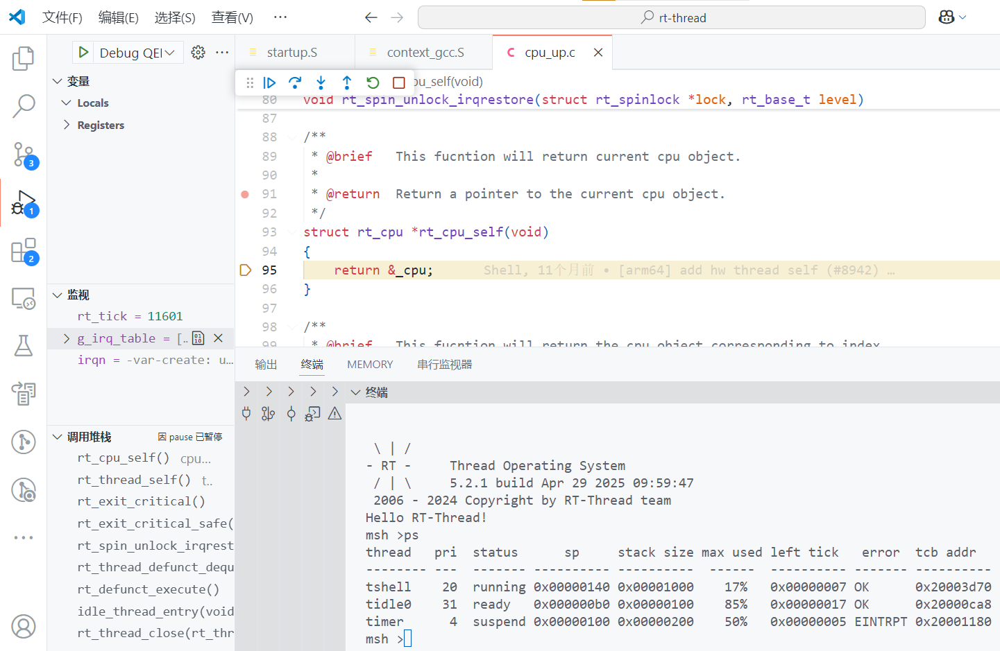

# XuanTie - R920  Series

## 一 简介

### 1. 内核

暂无。

### 2.特点

暂无。

### 3.BSP支持情况

- 当前BSP支持下述内核：

  ```asciiarmor
  r920
  ```

- 当前BSP默认设置的内核是r920，该架构支持[F][D][V]扩展。

- 当需要使用SMP多核时，请使用`scons --menuconfig`使能SMP功能并配置CPU个数。

### 4.运行QEMU

- BSP根目录下存在`qemu.bat`脚本，生成可执行文件后可点击该脚本直接启动QEMU.

- Linux用户可以直接使用`qemu-system-riscv64`命令启动QEMU.
```shell
qemu-system-riscv64 -machine xiaohui -smp cpus=2 -nographic -kernel rtthread.elf -cpu r920
```

## 二 工具

- 编译器： https://www.xrvm.cn/community/download?id=4433353576298909696
- 模拟器： https://www.xrvm.cn/community/download?id=4397435198627713024

注：若上述链接中的编译器与模拟器不能使用，可以使用下述CDK中的编译器与模拟器

- SDK：https://www.xrvm.cn/community/download?id=4397799570420076544

## 三 调试方法

**下述调试方法以E906举例，本BSP操作方式一致**，搭建完成RT-Thread开发环境，在BSP根目录使用env工具在当前目录打开env。



使用前执行一次**menuconfig**命令，更新rtconfig.h配置，然后在当前目录执行**scons -j12**命令编译生成可可执行文件。


下述是使用vscode调试的展示。



一起为RISC-V加油！