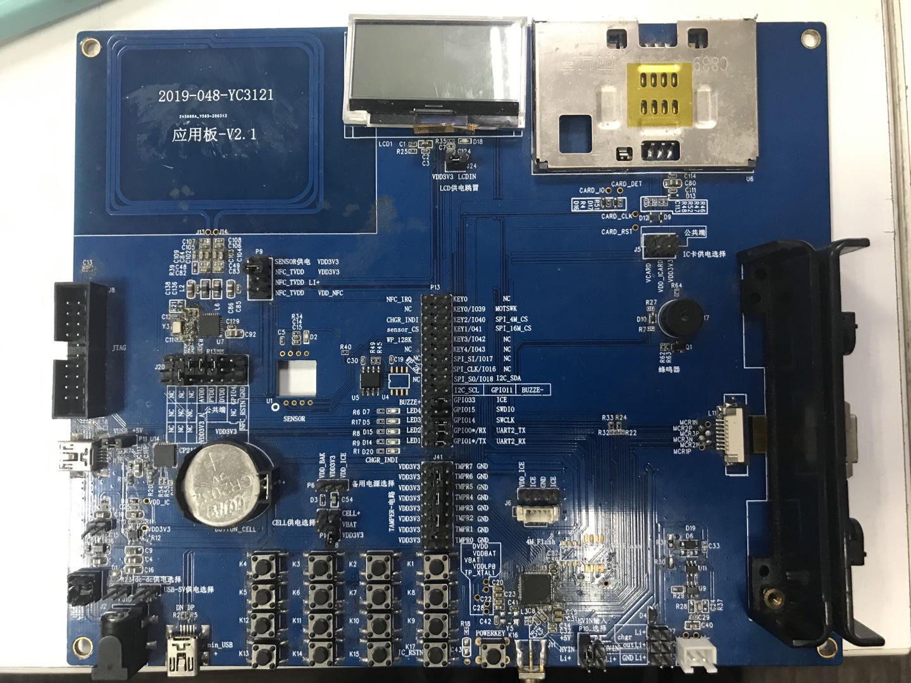

# YC3121-pos 板级支持包 说明

标签： YICHIP、Cortex-M0、YC3121、国产MCU

---

## 1. 简介

本文档为 YC3121-pos 的 BSP(板级支持包) 说明。

通过阅读本文档，开发者可以快速地上手该 BSP，将 RT-Thread 运行在开发板上。

### 1.1  开发板介绍

YC3121-pos 开发板由易兆微提供，可满足基础测试及高端开发需求。

开发板外观如下图所示：

YC3121-pos

YC3121-pos 开发板板载资源如下：

- MCU：YC3121  ARM 32-bit Cortex-M0，主频 96MHz，512KB FLASH ，64KB SRAM
- 常用外设
  - LED：4 个
  - 梯形矩阵键盘
  - 蜂鸣器
  - USB
  - UART
  - SPI LCD
  - SPI NFC
  - 7816接口 （接触IC卡，支持3V , 1.8V）
  - 7811接口 （三轨磁条卡解码模块，支持ISO/ABA AAMVA 及IBM等标准卡）
  - TIMER：9个32bi位 （支持PWM）
  - TRNG：（1个真随机数发生器）
  - 安全加密算法
    - 对称算法：对称算法：DES、TDES、AES-128/192/256、国密IV（SM4）
    - 非对称算法：RSA-1024/2048、国密II（SM2）、ECC
    - HASH 校验算法：SHA-1/224/256/384/512、国密III（SM3）
- 调试接口：SWD / ICE
