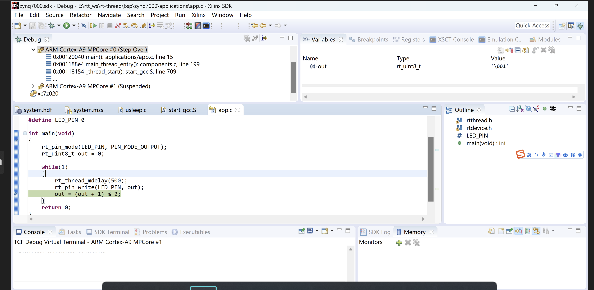
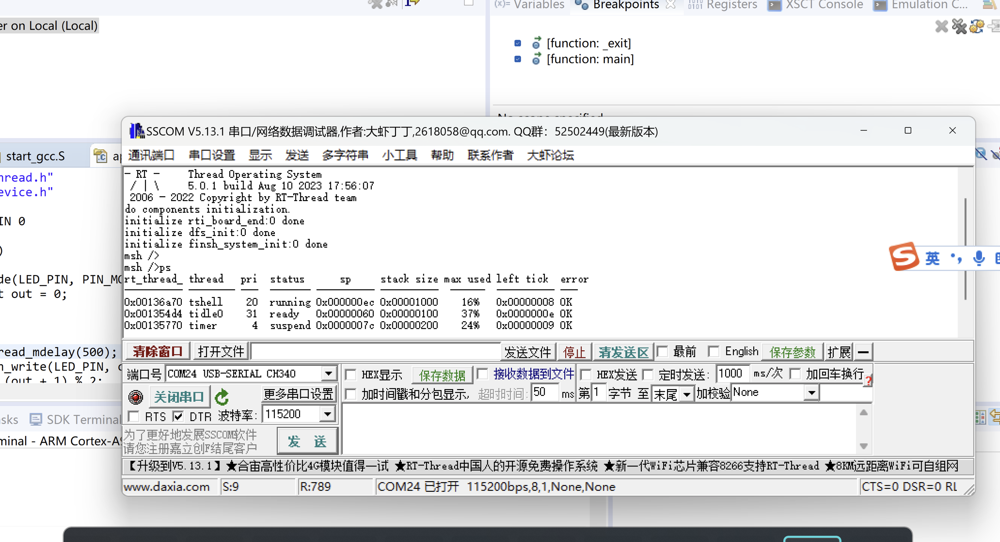

# 正点原子启明星开发板 BSP 说明

## 简介

本文档是为 正点原子启明星开发板提供的 BSP (板级支持包) 说明。

主要内容如下：

- 开发板资源介绍
- 开发流程说明

## 开发板介绍

正点原子开发的基于 zynq7000 生成的开发板, 注: 理论上也可以适用于其它 zynq7000的开发板.


开发板更多详细信息请参考[官方文档](http://www.openedv.com/docs/boards/fpga/zdyz_qimxing(V2).html)。

## 外设支持

本 BSP 目前对外设的支持情况如下：

| **核心**      | **支持情况** | **备注**                              |
| :----------------- | :----------: | :------------------------------------- |
| cortex-a9   |     支持     | 运行系统的为cortex-a9核的CPU0 |
| **板载外设**      | **支持情况** | **备注**                              |
| 无 |          |  |
| **片上外设**      | **支持情况** | **备注**                              |
| GPIO              |     支持     |  |
| UART              |     支持     | UART0,  UART1                           |
| SPI FLASH         |     支持     |  |
| EMMC / SDIO | 即将支持 | |
| CAN | 即将支持 | |

## 使用说明

本 bsp 驱动基于之前的 zynq7000 bsp 的基础上，除了定时器仍然沿用之前的寄存器写法外，其余驱动均基于 vivado sdk 2017.4 生成的驱动库开发。具体开发使用流程如下:

### 1. 创建 vivado 工程 & pl 部分开发

使用 vivado 创建工程, 完成 pl 部分开发, 此部分与 rtt 软件开发无关,
故省略具体说明. 注意 zynq ps 部分必须启用 `MIO`, `UART0` 和 `Quad SPI FLASH`.

### 2. 启动 sdk 生成 bsp 和 fsbl

完成第一步后, 导出硬件到 sdk, 然后启动 sdk, 创建 fsbl 工程


由于后续即将添加的复杂驱动依赖于usleep.c 的接口函数, 故需要对 sdk
中的 `bsp\ps7_cortexa9_0\libsrc\standalone_v6_5\src\usleep.c` 做如下修改:

```DIFF
@@ -63,6 +63,15 @@
 /* Global Timer is always clocked at half of the CPU frequency */
 #define COUNTS_PER_USECOND  (XPAR_CPU_CORTEXA9_CORE_CLOCK_FREQ_HZ / (2U*1000000U))
 
+typedef void (*usleep_hook_t) (unsigned long useconds);
+
+static usleep_hook_t usleep_hook;
+
+void zynq_set_usleep_hook(usleep_hook_t hook)
+{
+	usleep_hook = hook;
+}
+
 /*****************************************************************************/
 /**
 *
@@ -78,6 +87,12 @@
 ****************************************************************************/
 int usleep(unsigned long useconds)
 {
+	if (usleep_hook)
+	{
+		usleep_hook(useconds);
+		return 0;
+	}
+
 	XTime tEnd, tCur;
 
 	XTime_GetTime(&tCur);

```

修改完成后保存文件，等待sdk 自动完成编译.

### 3. 拷贝 sdk 下的 bsp, 完成 app 编译

拷贝 sdk bsp 文件夹下的 `include` 和 `lib` 文件夹到 [bsp](bsp) 文件夹下


然后 scons 编译app, 得到 `rtthread-zynq7000.elf`

### 4. 调试运行

#### 方式1: sdk 调试运行

1. 点击 SDK `Run` -> `Debug Configurations...`


2. 右键 new 创建新的 debug


3. 配置 debug, 选择 app 所在路径


4. 随后点击 debug 就可以运行了.效果如下图所示:



#### 方式2: 生成 BOOT.BIN 拷贝到 sd 卡运行

参见 vivado bootgen 使用方法，将 app 换成
scons 编译生成的 `rtthread-zynq7000.elf` 即可

## 联系人信息

维护人:

- [a1012112796](https://github.com/a1012112796)
